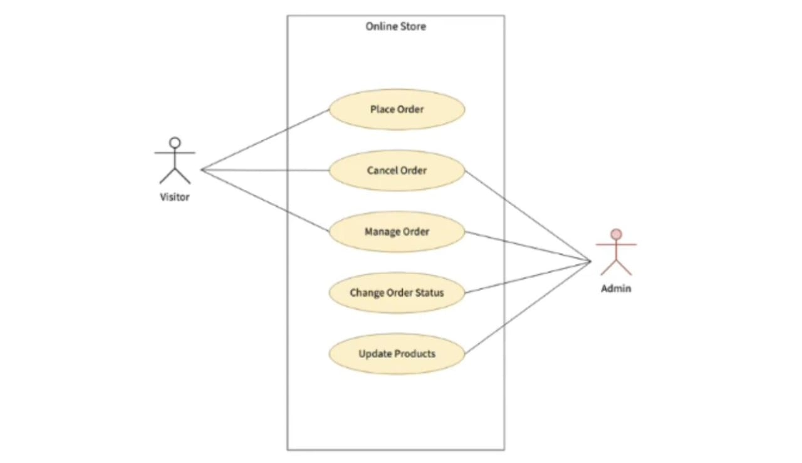
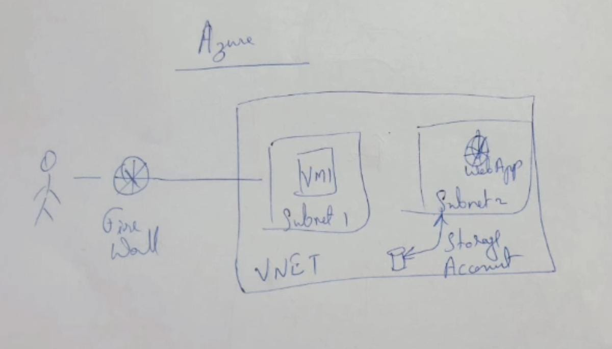

# **GitHub Copilot Vision in IntelliJ**

## **Overview**

GitHub Copilot Vision enables developers to turn images and diagrams directly into working code using GitHub Copilot's AI capabilities, integrated into IntelliJ IDEA. 

---

## **Table of Contents**

- [**GitHub Copilot Vision in IntelliJ**](#github-copilot-vision-in-intellij)
  - [**Overview**](#overview)
  - [**Table of Contents**](#table-of-contents)
  - [**Introduction to Copilot Vision**](#introduction-to-copilot-vision)
  - [**Setup Instructions**](#setup-instructions)
    - [**Requirements:**](#requirements)
    - [**How to Use:**](#how-to-use)
  - [**Demo Breakdown**](#demo-breakdown)
    - [**Demo 1: Analyze Architecture Diagrams**](#demo-1-analyze-architecture-diagrams)
      - [**High-level System Architecture Diagram**](#high-level-system-architecture-diagram)
    - [**Demo 2: Generate Class Files from Class Diagrams**](#demo-2-generate-class-files-from-class-diagrams)
      - [**UML Class Diagram**](#uml-class-diagram)
    - [**Demo 3: Generate APIs and Models from Use Case Diagrams**](#demo-3-generate-apis-and-models-from-use-case-diagrams)
      - [**Use case Diagram**](#use-case-diagram)
    - [**Demo 4: Data Modeling from ER Diagrams**](#demo-4-data-modeling-from-er-diagrams)
      - [**Entity Relationship Diagram**](#entity-relationship-diagram)
    - [**Demo 5: Generate Test Cases from Visual Flows**](#demo-5-generate-test-cases-from-visual-flows)
    - [**Demo 6: Parse Network Topology to Generate Config Scripts**](#demo-6-parse-network-topology-to-generate-config-scripts)
      - [**Network Topology Diagram**](#network-topology-diagram)
    - [**Demo 7: Screen Design to Frontend Code**](#demo-7-screen-design-to-frontend-code)
      - [**Wireframe/Mockup of a UI Screen**](#wireframemockup-of-a-ui-screen)
    - [**Demo 8: Modify Existing Code Based on a Diagram**](#demo-8-modify-existing-code-based-on-a-diagram)
      - [**Updated Component Diagram**](#updated-component-diagram)
    - [**Demo 9: Hand-Drawn Diagram to Code**](#demo-9-hand-drawn-diagram-to-code)
      - [**Code Scaffolding and Suggestions**](#code-scaffolding-and-suggestions)
  - [**Conclusion**](#conclusion)

---

## **Introduction to Copilot Vision**

GitHub Copilot Vision is an AI tool that allows developers to interact with visual inputs (images/diagrams) inside the IntelliJ IDE. Instead of writing boilerplate code manually, developers can upload or paste a diagram and prompt Copilot to generate relevant code.

---

## **Setup Instructions**

### **Requirements:**

* IntelliJ IDEA (latest version recommended)
* GitHub Copilot plugin installed
* GitHub Copilot subscription
* Enable Vision capabilities under Copilot Labs (Beta)

### **How to Use:**

1. Open IntelliJ and install the GitHub Copilot plugin.
2. Log in with your GitHub credentials.
3. Drag and drop an image or diagram into the editor.
4. Use `Ask Copilot` or `/` to trigger Vision analysis.

---

## **Demo Breakdown**

### **Demo 1: Analyze Architecture Diagrams**

#### **High-level System Architecture Diagram**

**Identified Key Components**
- The system design layout will highlight all the key components that have been identified through the analysis of the diagram.

**Proposed System Design Layout**
- A coherent system design layout will be proposed, showcasing how the identified components interact with each other.

**Analytical Capabilities**
- The output demonstrates the analytical capabilities of GitHub Copilot Vision in processing and interpreting complex diagrams.

* **Upload a system or architecture diagram**


**Example Prompt:**
* Ask Copilot in your IDE


**Copilot Output:**
* Copilot generates a summary explaining components, flow, and interactions.
  


**Example Prompt:**
* Ask Copilot in your IDE


**Copilot Output:**


### **Demo 2: Generate Class Files from Class Diagrams**

#### **UML Class Diagram**

* **Upload UML class diagram**


**Example Prompt:**
* Ask Copilot in your IDE


**Copilot Output:**


### **Demo 3: Generate APIs and Models from Use Case Diagrams**

#### **Use case Diagram**

* **Upload use case diagram showing actors and use cases**


**Example Prompt:**
* Ask Copilot in your IDE


**Copilot Output:**


### **Demo 4: Data Modeling from ER Diagrams**

#### **Entity Relationship Diagram**

* **Upload ERD with entities and relationships**


**Example Prompt:**
* Ask Copilot in your IDE


**Copilot Output:**


```sql
CREATE SCHEMA Sales;

CREATE TABLE Sales.Products (
    ProductID INT PRIMARY KEY,
    ProductName NVARCHAR(255) NOT NULL,
    SupplierID INT,
````

### **Demo 5: Generate Test Cases from Visual Flows**

* Upload logic or decision flowchart.
* Copilot generates unit tests covering decision paths.
* Example: Login validation tests.

### **Demo 6: Parse Network Topology to Generate Config Scripts**

#### **Network Topology Diagram**

* **Upload AWS/Azure network diagram**
  !\[alt text]\(../images/aws web app network diagram.jpg)

**Example Prompt:**

* Ask Copilot in your IDE


**Copilot Output:**


```hcl
resource "aws_lambda_function" "api_backend" {
    function_name = "backend"
    ...
}
```

### **Demo 7: Screen Design to Frontend Code**

#### **Wireframe/Mockup of a UI Screen**

* **Upload UI design (mockup, Figma export, sketch)**
  

**Example Prompt:**

* Ask Copilot in your IDE


**Copilot Output:**


```html
<!DOCTYPE html>
<html lang="en">
<head>
    <meta charset="UTF-8">
    <meta name="viewport" content="width=device-width, initial-scale=1.0">
    <title>Accommodations</title>
    <link rel="stylesheet" href="styles.css">
</head>
```


### **Demo 8: Modify Existing Code Based on a Diagram**

#### **Updated Component Diagram**

* **Provide current code + updated diagram**
  

**Example Prompt:**

* Ask Copilot in your IDE


**Copilot Output:**


### **Demo 9: Hand-Drawn Diagram to Code**

#### **Code Scaffolding and Suggestions**

* **Upload a photo of a whiteboard sketch**
  

**Example Prompt:**

* Ask Copilot in your IDE


**Copilot Output:**


---

## **Conclusion**

**Simplifies Coding Process**

* GitHub Copilot Vision revolutionizes coding by converting visuals into code instantly, making development more efficient.

**Integration with IntelliJ**

* The integration of GitHub Copilot Vision with IntelliJ enhances productivity and streamlines the coding workflow for developers.

**Fostering Collaboration**

* GitHub Copilot Vision encourages collaboration between designers and developers, bridging the gap in the development process.


