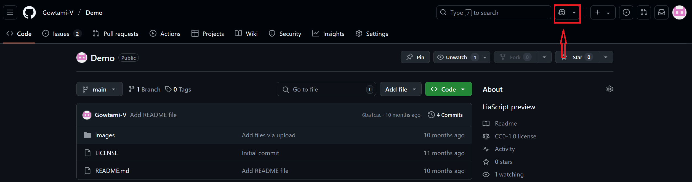
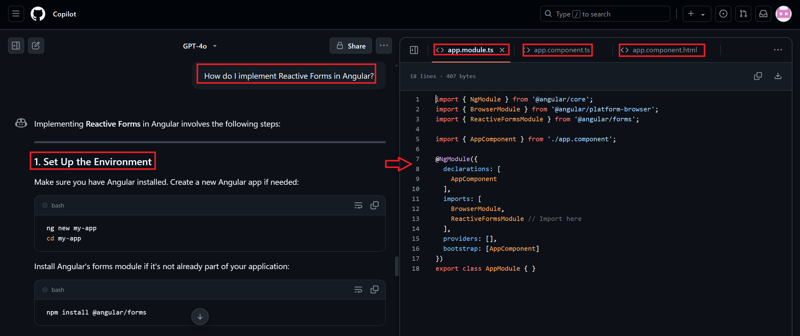
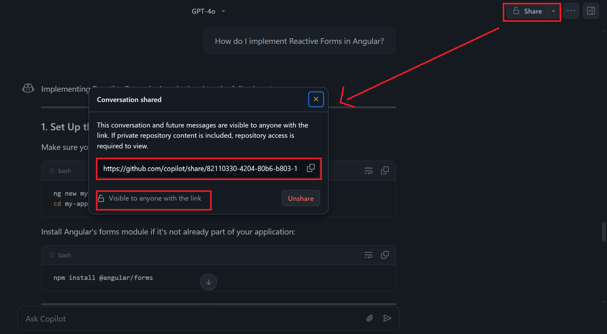
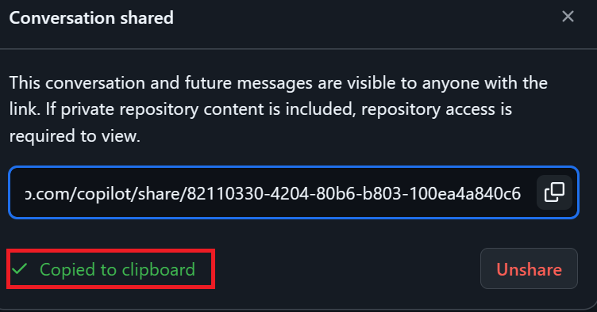

# **How to Share GitHub Copilot Chat Conversations**

## **Prerequisites**

* You must have access to [GitHub Copilot Chat](https://github.com/features/copilot) (currently available in [public preview](https://github.com/features/copilot/chat) via GitHub's **Immersive View**).
* Use the **web version of GitHub** (not VS Code for this feature).
* Ensure your chat is not tied to a **private repository**, or if it is, that your teammates also have access.

---

### **Steps to Share a Chat Conversation**

#### **Step1: Open Copilot Chat in Immersive View**

* Go to `GitHub.com`.
* Navigate to **Copilot Chat** via the left menu or search bar.

* Click on **"Open in Immersive View"** to get the full-screen chat experience.

#### **Stpe2: Have a Chat With Copilot**

* Ask your question (e.g., "How do I implement Reactive Forms in Angular?")
* Let Copilot respond with suggestions or code snippets.
* Continue the chat as needed.

#### **Stpe3: Click on “Share” and Generate Shareable Link**

* At the top right of the chat window, click the **Share** button (🔗 icon).
* A dialog box will appear.
* Click **“Share”** again in the dialog box to generate the unique URL.

#### **Step4: Send the Link to a Teammate**
* Copy the URL to your clipboard.

* Paste the link in Slack, Teams, email, or wherever your team collaborates.
* The teammate will be able to **view the full conversation**.

---

### **What Happens Next**

#### **Teammate View**

* When your teammate opens the link, they will:

  * See the **entire Copilot conversation**.
  * Have the option to **continue the chat** from that point.

#### **Private Forking**

* As soon as the teammate **asks their own question** in the shared conversation:

  * The chat becomes **private to them**.
  * Further messages will **not be visible** to the original sharer.

---

### **Important Notes on Access**

* If your chat references a **private repository**, the recipient must have access, or they'll get an **access denied** error.
* If the chat is **not tied to any repo**, it’s freely shareable.

---

### **Managing Shared Conversations**

* You can revisit Copilot Chat and manage your shared conversations:

  * **Copy the link again**
  * **Unshare** the conversation if needed

