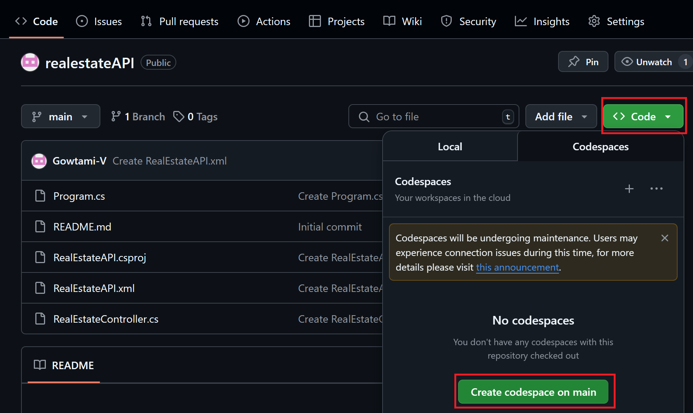
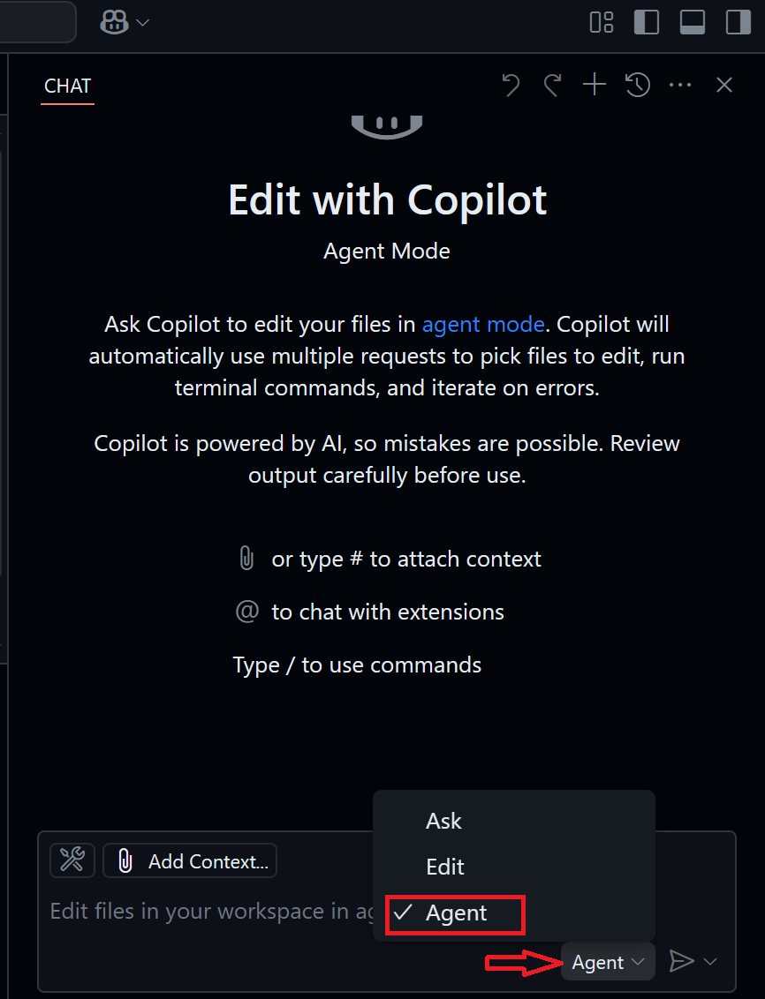
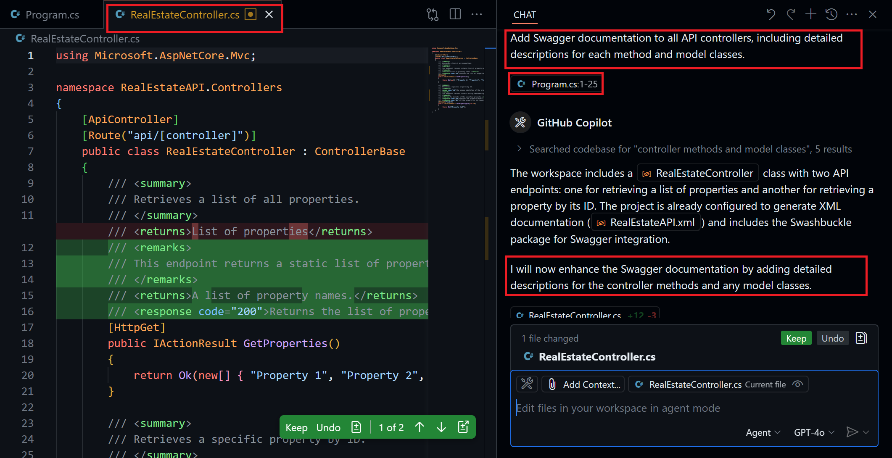
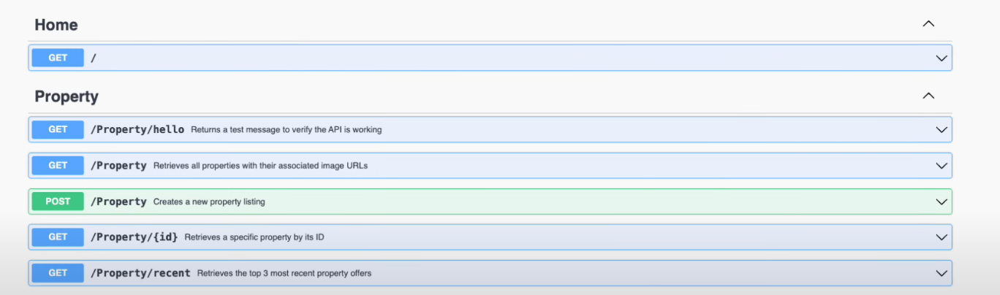

# **GitHub Copilot Agent Mode for Auto-Generating Swagger Docs - Step-by-Step Guide**

## **Introduction**

This guide will walk you through the process of using GitHub Copilot Agent Mode to automatically generate Swagger documentation for your .NET API project. Swagger is an open-source toolset that helps design, document, and test RESTful APIs. By leveraging GitHub Copilot’s Agent Mode, you can quickly add and maintain comprehensive API documentation with minimal manual effort.

## **Prerequisites**

* A GitHub account with access to GitHub Copilot.
* A .NET API project (C#) set up in a GitHub repository.
* Basic knowledge of .NET and Swagger.
* GitHub Codespaces enabled for your repository.

## **Step 1: Set Up Your Project in GitHub**

1. Go to your GitHub repository where your .NET API project is hosted.
2. Ensure your project is correctly structured, with API controllers and model classes clearly defined.

## **Step 2: Open GitHub Codespaces**

1. Click the **"Code"** button in your GitHub repository.
2. Select **"Open with Codespaces"**.
3. Wait for the Codespace environment to launch.
   

## **Step 3: Enable GitHub Copilot Agent Mode**

1. Inside your Codespace, click on the **GitHub Copilot panel** (usually on the right side).
2. Choose **"Agent Mode"**.
3. Select the model (GPT-4 or GPT-3.5) based on your preference.
   

## **Step 4: Generate Swagger Documentation**

1. Open your project’s `Program.cs` file (for .NET 6 and above) or `Startup.cs` (for older versions).
2. In the Copilot Agent prompt, enter the following instruction:

   ```
   Add Swagger documentation to all API controllers, including detailed descriptions for each method and model classes.
   ```
3. The agent will automatically:
   
   * Install the `Swashbuckle.AspNetCore` package if missing.
   * Configure Swagger in `Program.cs` or `Startup.cs`.
   * Add XML documentation for controllers, methods, and model classes.
  
     

   * Created The workspace includes a RealEstateController class with two API endpoints: one for retrieving list of properties and another for retrieving a property by its ID

## **Step 5: Review and Adjust Generated Documentation**

1. Review the XML comments added to your controllers and models.
2. Make any necessary corrections for clarity and accuracy.

## **Step 6: Build and Run Your API**

1. Use the following command to build and run your API:

   ```bash
   dotnet build
   dotnet run
   ```
2. Access the Swagger UI by navigating to `https://localhost:<port>/swagger` in your web browser.
3. Verify that the API documentation is displayed correctly.
   
  
## **Step 7: Maintain Swagger Documentation**

* Use Copilot Agent Mode for any future updates to your API documentation.
* Regularly review and update the documentation for accuracy.

## **Conclusion**

By using GitHub Copilot Agent Mode, you can automate the process of generating and maintaining Swagger documentation for your .NET API. This approach not only saves time but also ensures consistent and well-documented APIs for your projects.
