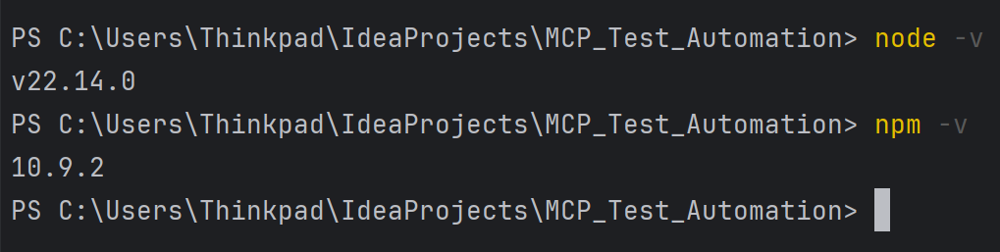
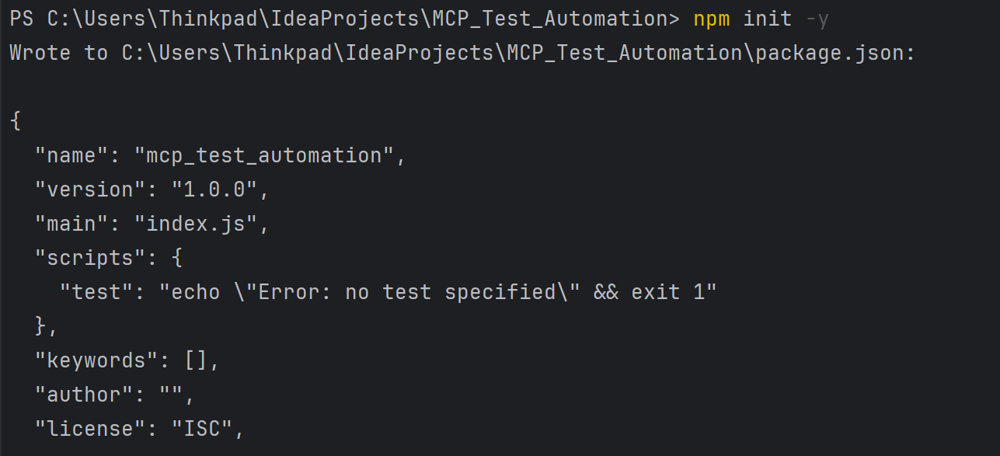
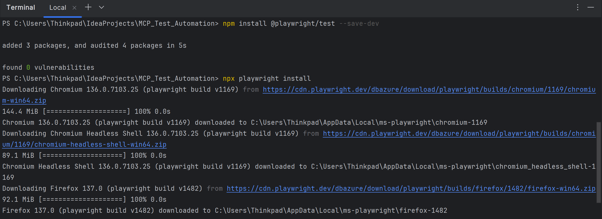
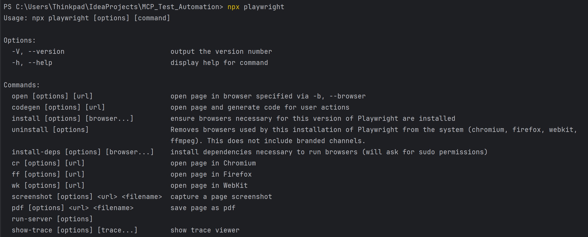
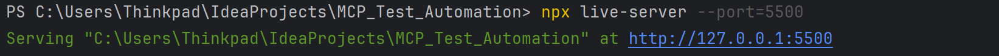
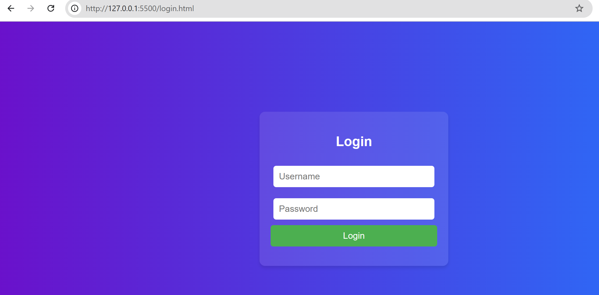
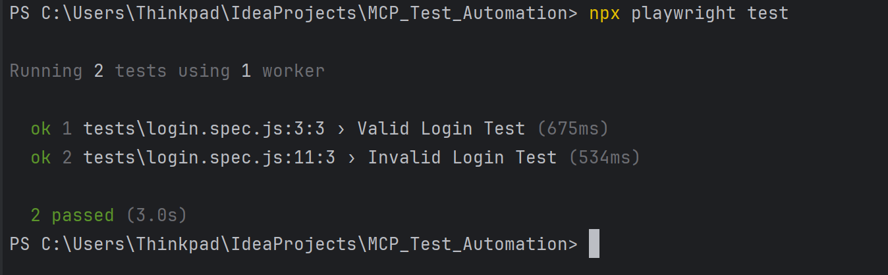
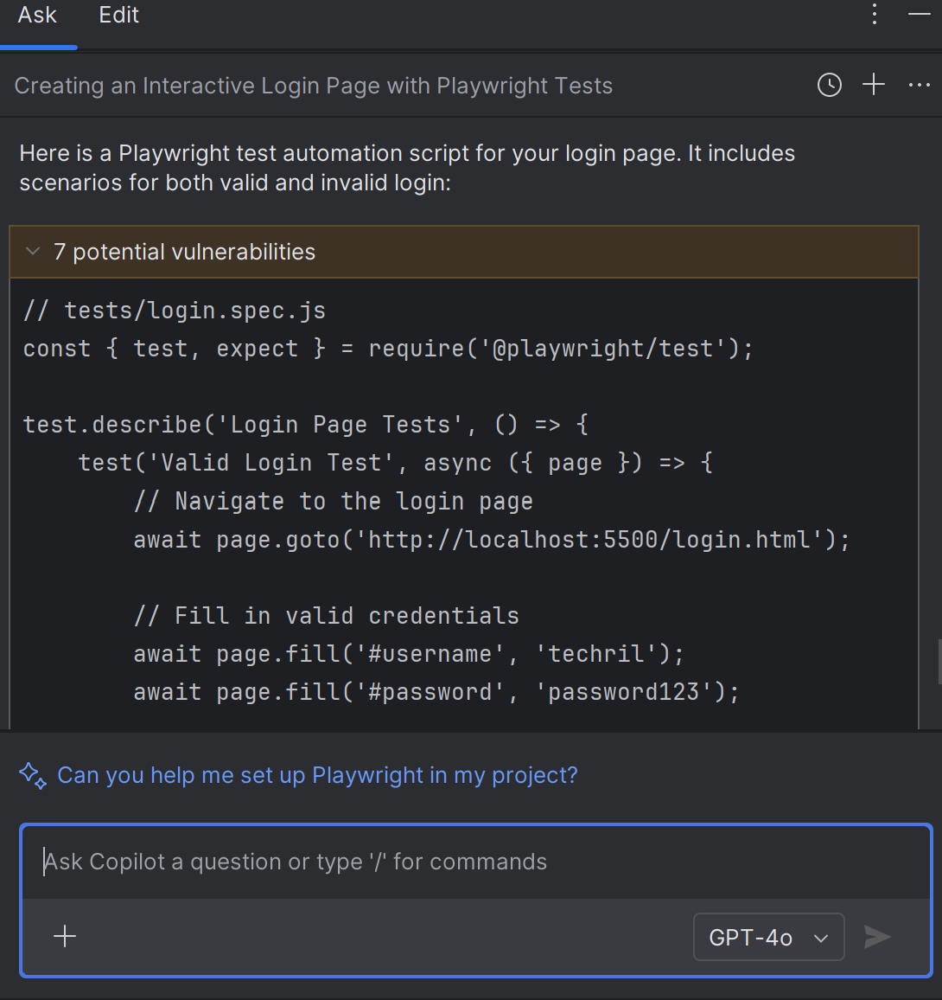

### **Step-by-Step Guide: GitHub Copilot + Playwright MCP for UI Test Automation**


## **Introduction: What is Playwright?**

**Playwright** is an open-source end-to-end testing framework developed by Microsoft. It is designed for automating modern web applications across multiple browsers, including:

* **Chromium (Google Chrome)**
* **Firefox**
* **WebKit (Safari)**

### **Key Features of Playwright:**

* **Cross-Browser Support:** Test on Chromium, Firefox, and WebKit with a single API.
* **Multiple Device Emulation:** Simulate mobile and desktop devices.
* **Headless Testing:** Run tests without a GUI for faster performance.
* **Network Interception:** Mock network responses, modify requests, and monitor network activity.
* **Advanced UI Testing:** Supports Shadow DOM, Iframes, and complex CSS selectors.

### **Why Use Playwright with GitHub Copilot?**

Combining **Playwright with GitHub Copilot** (MCP - Multi-Client Proxy) enhances automation by leveraging AI to generate, debug, and optimize test scripts. This setup offers:

* **Fast Test Script Generation:** Copilot can automatically generate test scenarios.
* **Accurate Testing:** Copilot helps identify and fix issues in test scripts.
* **Simplified Debugging:** Direct assistance from Copilot for any test errors.

---

## **1. Prerequisites**

* **VS Code Installed**: Make sure you have Visual Studio Code (VS Code) installed on your system.
* **Node.js Installed**: Ensure that Node.js (LTS version) is installed.
* **GitHub Copilot Enabled**: You must have access to GitHub Copilot and its agent mode.
* **GitHub Account**: Logged in with your GitHub account in VS Code.
* **Basic Understanding of Playwright**: Familiarity with Playwright’s basic concepts.

---

## **2. Install Node.js and NPM**

* Download and install Node.js from the [official website](https://nodejs.org/).
* Verify the installation:

  ```bash
  node -v
  npm -v
  ```
  

---

## **3. Setup VS Code with GitHub Copilot**

* Open VS Code.
* Go to Extensions (`Ctrl+Shift+X`) and install **GitHub Copilot**.
* Ensure you are signed in with your GitHub account.
* Go to settings and enable **Copilot Agent Mode**.

---

## **4. Initialize a Playwright Project**

* Open a new folder in IntelliJ (for example: `MCP_Test_Automation`).
* Open the terminal (\`Ctrl+\`\`) and run:

  ```bash
  npm init -y
  npm install @playwright/test --save-dev
  npx playwright install
  ```
  

* This will set up a basic Playwright project with browser support (Chromium, Firefox, WebKit).
  

---

## **5. Setup Playwright MCP (Multi-Client Proxy)**

* Create an `mcp.json` file in your project directory with the following configuration:

  ```json
  {
    "playwright": {
      "command": "npx playwright",
      "mode": "vision",
      "version": "latest"
    }
  }
  ```
* This configuration ensures that the latest version of Playwright MCP is used.

---

## **6. Launch MCP Server**

* Start the MCP Server by running:

  ```bash
  npx playwright
  ```
* Ensure that the MCP Server is running.
  

---

## **7. Create a Sample Web Application for Testing**

* For this guide, we will use a simple login page.
* Create an HTML file (`login.html`) with the following content:

  ```html
  <!DOCTYPE html>
  <html>
  <head>
      <title>Login Page</title>
  </head>
  <body>
      <form id="loginForm">
          <input type="text" id="username" placeholder="Username" required>
          <input type="password" id="password" placeholder="Password" required>
          <button type="submit">Login</button>
      </form>
      <p id="message"></p>
  </body>
  <script>
      document.getElementById("loginForm").onsubmit = function(event) {
          event.preventDefault();
          const username = document.getElementById("username").value;
          const password = document.getElementById("password").value;

          if (username === "techril" && password === "password123") {
              document.getElementById("message").innerText = "Login Successful";
          } else {
              document.getElementById("message").innerText = "Invalid Credentials";
          }
      };
  </script>
  </html>
  ```

---

## **8. Configure Playwright Test Cases**

* Create a folder named `tests` and inside it, create a file `login.spec.js`:

  ```javascript
  const { test, expect } = require('@playwright/test');

  test('Valid Login Test', async ({ page }) => {
      await page.goto('http://localhost:5500/login.html');
      await page.fill('#username', 'techril');
      await page.fill('#password', 'password123');
      await page.click('button');
      await expect(page.locator('#message')).toHaveText('Login Successful');
  });

  test('Invalid Login Test', async ({ page }) => {
      await page.goto('http://localhost:5500/login.html');
      await page.fill('#username', 'wrongUser');
      await page.fill('#password', 'wrongPass');
      await page.click('button');
      await expect(page.locator('#message')).toHaveText('Invalid Credentials');
  });
  ```

---

## **9. Run Playwright Tests**

* Start a local server for the HTML file:

  ```bash
  npx live-server --port=5500
  ```
  
  

  

* Run the Playwright tests:

  ```bash
  npx playwright test
  ```
* This will execute both the valid and invalid login tests.
  

---

## **10. Automate Test Generation Using GitHub Copilot**

* Go to the GitHub Copilot Chat (Ctrl+Alt+C).
* Set the mode to `GPT-4` with `Agent Mode`.
* Provide the following prompt:

  ```plaintext
  Create a UI test automation script using Playwright for my login page, 
  with scenarios for both valid and invalid login.
  ```

  

---

## **11. Debugging with Copilot**

* If any test fails, you can ask Copilot for suggestions:

  ```plaintext
  Why is my test failing?
  ```
* Copilot will provide debugging suggestions.

---

## **Conclusion**

In this guide, we explored how to efficiently set up UI test automation using Playwright combined with GitHub Copilot (MCP). By leveraging Playwright's robust cross-browser support and GitHub Copilot's AI-powered code generation, you can rapidly build, maintain, and optimize your test automation suite.

From installation and configuration to creating and executing test cases, this guide provided a hands-on approach to automating web application testing. With the added benefit of GitHub Copilot's ability to auto-generate and debug test scripts, you can significantly reduce manual effort while maintaining high-quality test coverage.

This combination empowers developers and QA engineers to quickly validate web applications, ensure consistent functionality, and accelerate their development workflows. Start exploring advanced scenarios with Playwright and Copilot to further enhance your automation capabilities.
