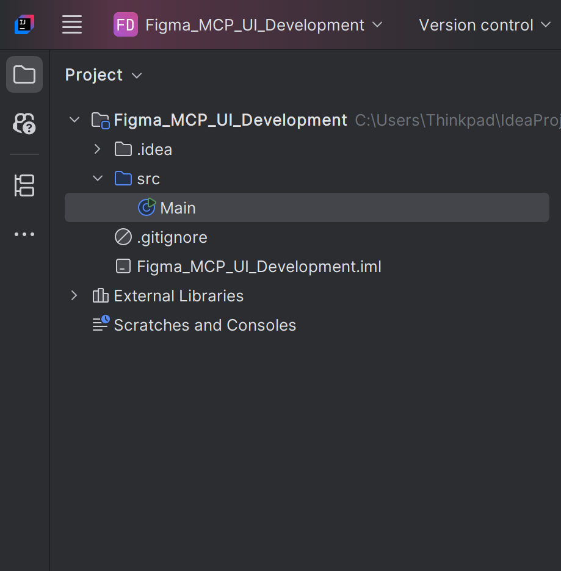
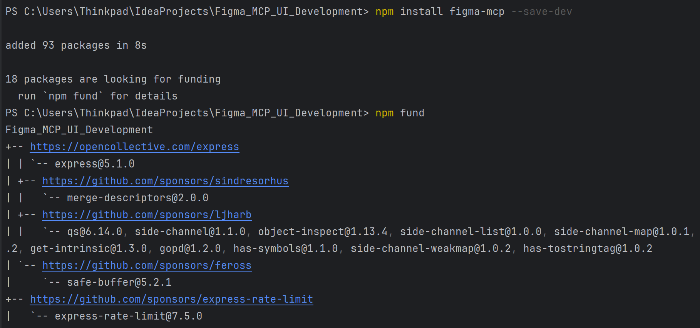
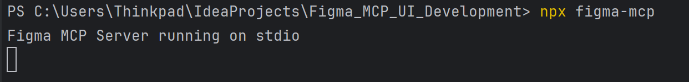
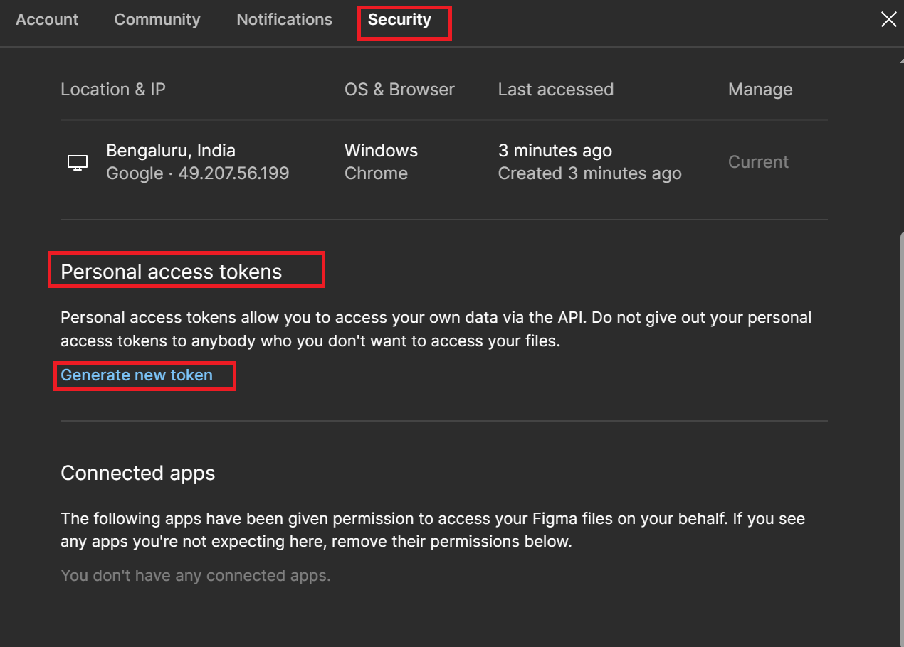
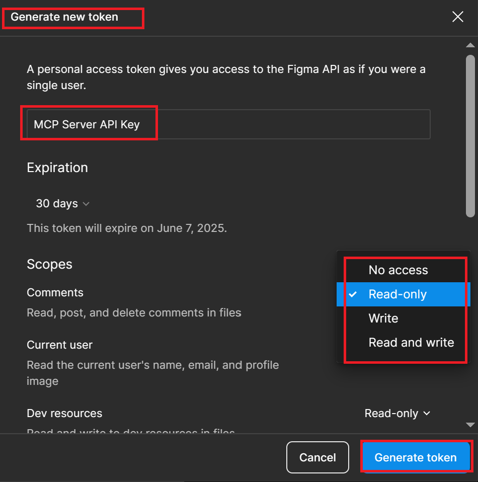

# **GitHub Copilot Agent + Figma MCP Server for AI-Powered UI Development**

## **Introduction to GitHub Copilot Agent + Figma MCP Server**

### **What is GitHub Copilot Agent?**
GitHub Copilot is an AI-powered code assistant that helps developers generate, debug, and optimize code directly within their code editor. The GitHub Copilot Agent is an enhanced mode where it can directly interact with design tools and automate development tasks.

### **What is Figma MCP Server?**
Figma MCP (Multi-Client Proxy) Server is an integration layer that connects Figma, a popular UI design tool, with GitHub Copilot. It allows GitHub Copilot to directly access Figma designs, understand them, and generate corresponding UI code (HTML, CSS, JavaScript) based on those designs.

### **Why Use GitHub Copilot with Figma MCP Server?**
* **Faster UI Development:** Automatically generate code for UI components directly from Figma designs.
* **Improved Accuracy:** Minimize manual design-to-code translation errors.
* **Enhanced Collaboration:** Designers and developers can work seamlessly with shared design-to-code workflows.

---

## **Prerequisites**

* **GitHub Account:** Ensure you have an active GitHub account.
* **Figma Account:** Have a Figma account with design files ready.
* **VS Code Installed:** Use Visual Studio Code as your code editor.
* **GitHub Copilot Enabled:** Make sure you have access to GitHub Copilot.
* **Node.js Installed:** Make sure Node.js (LTS version) is installed.
* **Basic Understanding of HTML, CSS, and JavaScript:** To understand the generated code.

---

## **Install Node.js and NPM**

* Download and install Node.js from the [official website](https://nodejs.org/).
* Verify the installation using:

  ```bash
  node -v
  npm -v
  ```

---

## **Setup IntelliJ with GitHub Copilot**

1. **Open IntelliJ**
2. Go to Extensions (`Ctrl+Shift+X`) and install **GitHub Copilot**.
3. Sign in with your GitHub account.
4. Go to settings and enable **Copilot Agent Mode**.
5. Ensure you have GitHub Copilot’s latest version.

---

## **Set Up Figma MCP Server**

### **Create a New Project Directory**

* Open **IntelliJ**.
* Create a new folder for your project (e.g., `Figma_MCP_UI_Development`).
* Open this project in intelliJ.
  

### **Initialize MCP Server Configuration**

* In your project folder, create an `mcp.json` file with the following content:

  ```json
  {
    "figma": {
      "command": "npx figma-mcp",
      "mode": "vision",
      "version": "latest"
    }
  }
  ```

### **Install Figma MCP Server**

* In the terminal, run:

  ```bash
  npm install figma-mcp --save-dev
  ```

  

### **Start the Figma MCP Server**

* Run the server using:

  ```bash
  npx figma-mcp
  ```

  

* The server will prompt for an API key. Provide your Figma API key (you can generate this from your Figma account settings).

---

## **Configure Figma MCP Server in GitHub Copilot**

### **How to Generate a Free Figma API Key**

**1. Log in to Figma:**

   * Go to [Figma.com](https://www.figma.com/) and log in with your account.
   * If you don’t have an account, create a free one.

**2. Access Account Settings:**

   * Click on your profile icon (top-right corner).
   * Select **"Settings"**.
   * Dialog box will appear Select Secutiry.
  
     

   * Scroll down to the **"Personal Access Tokens"** section.
   * Click on **"Create a new personal access token"**.
   * Provide a name for your token (e.g., "MCP Server API Key").
     

   * Set the neccessary permissions.
   * Click **"Generate"**.
   * A new token will be displayed. **Copy it immediately**.
   * This is your API key, and you won't be able to view it again.
   * Save the API key securely, such as in a password manager or a secure file.

### **Use Your API Key with MCP Server**

* In your `mcp.json` file in your project:

  ```json
  {
    "figma": {
      "command": "npx figma-mcp",
      "apiKey": "<YOUR_FIGMA_API_KEY>",
      "mode": "vision"
    }
  }
  ```

* Save and close the file.

---

## **Design Your UI in Figma**
To follow these steps, you should copy the **Figma design URL** of your UI design.

**How to Get the Figma Design URL:**

1. **Open Your Figma Project:**

   * Go to [Figma.com](https://www.figma.com/) and open your design project.

2. **Select the Design File:**

   * Click on the specific design file you want to generate code for.

3. **Copy the Design URL:**

   * Click on the **"Share"** button at the top right corner.
   * Make sure the sharing settings are set to **"Anyone with the link"** (optional, but recommended).
   * Click **"Copy link"**.


* Open Figma and design your UI (e.g., a web application with a hero section, product cards, and footer).
* Make sure the design is well-structured with properly named layers (e.g., `Header`, `Main Content`, `Footer`).
* Copy the Figma design URL.

---

## **Generate UI Code Using GitHub Copilot Agent**

### **Access Figma Data**

* In VS Code, ask GitHub Copilot Agent to access the Figma design using:

  ```plaintext
  Generate an HTML and CSS-based web page using the design at <Figma URL>.
  ```

* Copilot will access the design, download the images, and start generating the corresponding HTML and CSS.

### **Customize the Generated Code**

* GitHub Copilot will create an `index.html` and `styles.css` file based on your Figma design.
* You can modify the code directly using Copilot’s suggestions. For example:

  ```plaintext
  Adjust the hero image to take 50% width of the page.
  Make all product cards the same size.
  ```

---

## **Make Adjustments Based on Design Changes**

* If you make changes to the Figma design (e.g., change colors, modify text, or update layout):

  1. Copy the new Figma URL.
  2. In VS Code, ask Copilot:

     ```plaintext
     Update the HTML and CSS based on the new Figma design at <New Figma URL>.
     ```

* Copilot will automatically adjust the existing code based on the updated design.

---

## **Debugging and Optimization**

* If any issues occur with the generated UI (e.g., incorrect alignment, broken images):

  1. Use GitHub Copilot’s chat to debug:

     ```plaintext
     Why is the footer not aligning properly?
     ```

  2. Apply the suggested fixes.

---

## **Testing Your UI**

* Use a live server to preview your HTML and CSS:

  ```bash
  npx live-server --port=5500
  ```

* Make sure the UI looks exactly like your Figma design.

---

## **Conclusion**

By following this guide, you have successfully integrated GitHub Copilot with Figma MCP Server to automate your UI development workflow. This setup enables you to quickly generate, optimize, and maintain UI code directly from Figma designs, reducing manual work and minimizing design-to-code errors.
