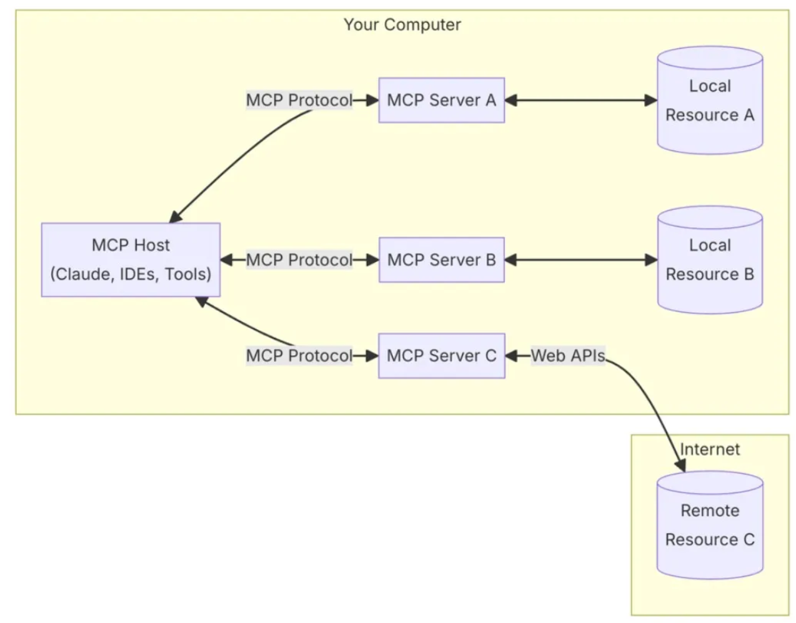

# **Setting Up GitHub MCP Server with GitHub Copilot**

## **Introduction**

The MCP (Modern Code Platform) is a platform designed to improve the development process by offering a set of tools and services that streamline workflows. This section introduces the purpose and functionality of MCP and its role in modern software development.

**Key Topics:**

* Overview of MCP and its applications.
* Benefits and use cases of the platform.
* Introduction to the architecture and server setup.

---

### **What is MCP?**

MCP (Modern Code Platform) is a platform designed to simplify and optimize the development process. It provides a suite of tools for managing code, deployment, collaboration, and AI-powered development assistance.

**Details:**

* MCP integrates various services and features for enhancing the developer experience.
* It helps streamline the coding and collaboration processes.
* It incorporates AI-powered assistants, such as GitHub Copilot, to assist developers by providing code suggestions and automating repetitive tasks.

**Benefits of MCP:**

* Increased development efficiency.
* Seamless integration with existing tools.
* AI-driven code suggestions that improve code quality and reduce errors.

---

### **Why MCP?**

MCP is beneficial because it helps developers with faster and more efficient workflows, especially when integrating AI assistants and streamlining the development pipeline.

* **Streamlined Workflow:** MCP reduces time spent on repetitive tasks by providing intelligent tools that handle many common coding scenarios.
* **Collaboration Tools:** Supports effective teamwork by integrating communication tools, version control, and collaboration systems.
* **AI Assistance:** The platform integrates AI (such as GitHub Copilot) to help developers write cleaner and more efficient code.


---

## **MCP Architecture Diagram**

The architecture of MCP is built on modular components that support various functionalities like version control, code management, AI-based suggestions, and server communication.

**Key Components in MCP Architecture:**
* **Client (VS Code or IntelliJ Insider)**: User interacts with Copilot.
* **MCP Server**: Acts as a proxy between the client and GitHub Copilot.
* **GitHub Copilot**: Provides AI-powered code suggestions.

```
(Client) <-----> (MCP Server) <-----> (GitHub Copilot)
```

MCP (Model, Context Protocol) architecture allows creation of three interdependent components that allow AI agents to function in a more human-like and intelligent manner.


---

### **Step 1: Creating a Personal Access Token (PAT)**

1. **Log in to GitHub:** Go to [GitHub.com](https://github.com) and log in with your account.
2. **Access Settings:** Click on your profile picture in the top-right corner and select **Settings**.
3. **Navigate to Developer Settings:** Scroll down on the left sidebar and click **Developer settings**.
4. **Choose Personal Access Tokens:** Click **Personal access tokens (classic)** and then **Generate new token**.
   
   

5. **Configure Token Permissions:**

   * Set the token name (e.g., "MCP Server Token").
   * Set expiration date as per your requirement.
   * Under **Scopes**, select the permissions you need (e.g., `repo`, `workflow`, `user`).
6. **Generate Token:** Click **Generate token**.
7. **Copy and Secure the Token:** Copy the generated token immediately, as it will not be shown again.
   

### **Step 2: Understanding the MCP Server Setup**

* MCP (Multi-client Protocol) Server is an advanced configuration for GitHub Copilot, allowing integration with external tools and automation.
* The MCP Server can be configured using the `MCP.json` file, which stores the connection and authentication details.

---

### **Step 3: Setting Up the MCP.json Configuration File**


1. **Create an MCP.json File:**

   * Go to your project directory (local system).
   * Create a new file named `MCP.json`.

2. **Configure the MCP.json File:**

   * Add the following basic structure to the file:

```json
{
    "server": "GitHub",
    "authentication": {
        "token": "YOUR_PERSONAL_ACCESS_TOKEN"
    }
}
```

3. **Secure Your Personal Access Token (PAT):**

   * Never store your PAT in plain text within your project.
   * Add `MCP.json` to your `.gitignore` file to prevent it from being accidentally committed to version control.

4. **Alternative Configuration:**

   * You can also edit the MCP configuration through the GitHub Copilot settings in your GitHub account.

---

### **Step 4: Connecting to the GitHub MCP Server**

1. **Open the Command Line or Terminal.**
2. **Run the MCP Command:**

```bash
npx -y model-context-protocol/server-github -e GITHUB_TOKEN=YOUR_PERSONAL_ACCESS_TOKEN
```

* This command starts the GitHub MCP Server using your personal access token.

3. **Verify Connection:**

   * If the server starts successfully, it should display connection details.

---

### **Step 5: Using GitHub MCP Server in Copilot Chat**

1. **Launch GitHub Copilot in your IDE (VS Code or IntelliJ).**

2. **Access Copilot Chat (Agent Mode):**

   * Navigate to Copilot Chat.
   * Ensure the Agent Mode is enabled.

3. **Use MCP Commands:**

   * Type a prompt, such as 
     ```plain text
     create a new repo called 'dashboard' and add a new issue for implementing sample dashboard using top 5 IT company data. Update the repo with implementation of this requirement using html, css and JS. update the issue with progress comments as part of implementation. create a PR
     ```

   * GitHub Copilot will use the MCP server to perform actions such as creating repositories, generating code, and managing issues.
  
   

   * Observe the commands being executed (creating a repo, adding files, generating PRs).

---

### **Step 6: Security Best Practices**

* Always store sensitive data like your PAT in environment variables or secure vaults.
* Regularly rotate your access tokens for security.
* Use `.gitignore` to prevent `MCP.json` from being committed.

---

### **Step 6: Troubleshooting MCP Server**

* If the server does not start, ensure that your PAT has sufficient permissions.
* Verify that the MCP.json file is correctly formatted.
* Check the MCP server logs for any error messages.

---
