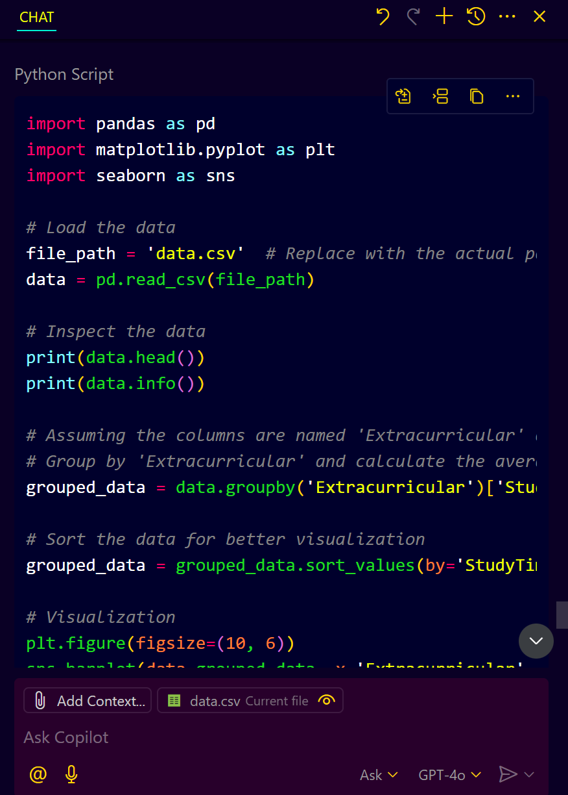
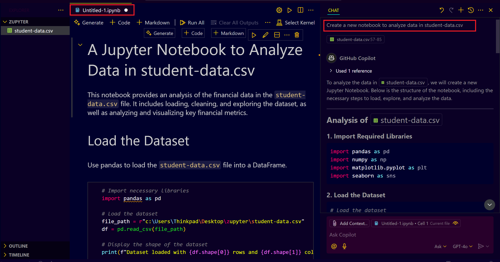

# **GitHub Copilot Notebook Support in VS Code**

## **Introduction**

This guide demonstrates how to use GitHub Copilot's new Notebook support in VS Code (Insiders). With this feature, you can create, edit, and enhance Jupyter notebooks using Copilot Edits, making data analysis and visualization faster and more efficient.

---

## **Prerequisites**

* Installed **VS Code (Insiders)** with **GitHub Copilot** extension.
* A GitHub account with an active GitHub Copilot subscription.
* A basic understanding of Jupyter notebooks.

---

## **Setting Up VS Code (Insiders) with GitHub Copilot**

* Open **VS Code (Insiders)**.
* Go to **Extensions** (left sidebar) and search for **"GitHub Copilot"**.
* Install the **GitHub Copilot extension**.
* Sign in to GitHub and ensure your Copilot subscription is active.

---

## **Creating and Editing Jupyter Notebooks with Copilot**

* Open an empty project in **VS Code**.
* Create a new **CSV file** (e.g., data.csv) with some sample data.
* Use Copilot Edits to create a new Jupyter Notebook.
* Type a natural language prompt describing the notebook's purpose (e.g., "Analyze data from data.csv").
* GitHub Copilot will generate the necessary code for data loading, analysis, and visualization.
  
### **Example 1: Data Analysis with CSV**

* **Prompt:** "Analyze the data from data.csv using pandas and visualize Extracurricular by study time weekly."
  
* **Copilot Response:**
  
    
  * create a Automatically generates Python code to read the CSV file, perform analysis, and plot a salary distribution graph.

* **Execute the generated code** block by block.
  

---

## **Advanced Usage: Modifying Notebook with Copilot Edits**

### **To modify your notebook, use Copilot Edit:**

* **Prompt:** "Show descriptive statistics for all columns."
  
* **Copilot Response:**
  
   

### **Example 2: Creating a New Notebook**

* **Prompt:** "Create a new notebook to analyze data in city.csv."
* **Copilot Response:**
   
  * Generates a new notebook with code for data loading, basic statistics, and visualizations.

### **Edit multiple notebooks at once using Copilot Edits:**

* **Prompt:** "Add correlation analysis between YearsExperience and StudentID in both notebooks."
* **Copilot Response:**
  

  * Adds correlation analysis blocks in all selected notebooks.

---

## **Conclusion**

You have successfully set up and used GitHub Copilot Notebook support in VS Code. This powerful feature enhances your data analysis workflow by automating code generation, data visualization, and analysis directly within your notebooks. 