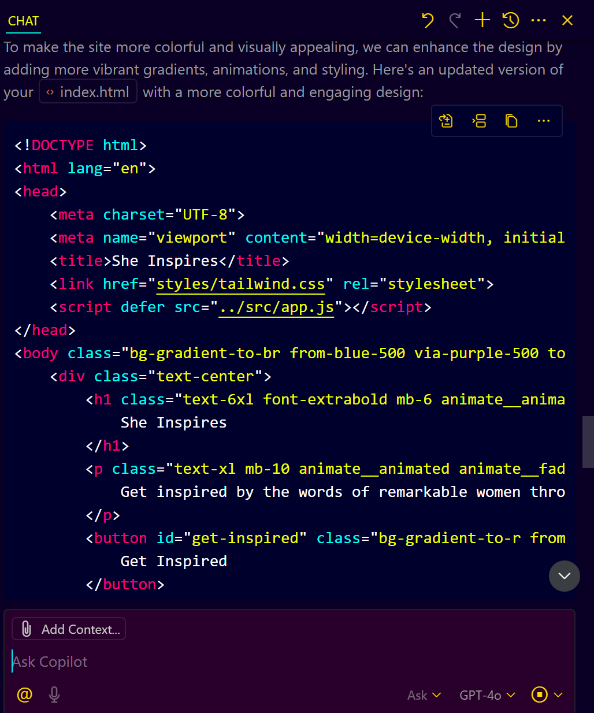

# **Step-by-Step Guide: Build "She Inspires" Quote Generator**

Here's a **step-by-step guide** to help you recreate the **"She Inspires" Quote Generator Web App** using **HTML**, **JavaScript**, **Tailwind CSS**, and **GitHub Copilot Agent**.

---

### **Step 1: Prerequisites**

**Make sure you have the following installed:**

* [VS Code (Insiders version)](https://code.visualstudio.com/insiders/) for Copilot Agent
* [GitHub Copilot Chat](https://github.com/features/copilot) with agent mode enabled
* A basic understanding of HTML, JS, and Tailwind CSS

---

###  **Step 2: Set Up Your Project Folder**

**Create a folder:**

   ```bash
   mkdir shequote
   ```

---

### **Step 3: Enable GitHub Copilot Agent**

1. Open the **Copilot Chat sidebar**.
2. Click on **“Enable Agent Mode”**.
3. Type your prompt:

   ```
   Generate an HTML and JavaScript-based quote generator web app named 'She Inspires.' The app should have a visually stunning landing screen with an elegant UI, using Tailwind CSS for styling. It should fetch motivational quotes from an API featuring inspiring women in history, tech, and leadership. The app should also include: A beautiful landing page with animations. A 'Get Inspired' button that fetches and displays a new quote dynamically. A chatbot-like assistant that can share a daily quote and fun facts. Smooth UI transitions and responsiveness for mobile and desktop. A modern and clean design that enhances user experience. Ensure that the JavaScript fetches quotes from a public API, manages UI updates efficiently, and provides a delightful user experience with animations.
   ```

---

### 🧾 **Step 4: Let Copilot Generate the Core Files**

**Copilot Agent will automatically create:**



* `index.html` – for structure
* `app.js` – for quote fetching logic
* `style.css` – for additional styling if needed

> If it doesn't, create them manually and ask Copilot for help.

---

### **Step 5: Customize `index.html`**

**Here’s a basic structure you can use:**

```html
<!DOCTYPE html>
<html lang="en">
<head>
  <meta charset="UTF-8" />
  <meta name="viewport" content="width=device-width, initial-scale=1.0" />
  <title>She Inspires</title>
  <script src="app.js" defer></script>
  <link href="https://cdn.jsdelivr.net/npm/tailwindcss@2.2.19/dist/tailwind.min.css" rel="stylesheet">
</head>
<body class="bg-gradient-to-r from-pink-300 via-purple-300 to-indigo-400 text-center h-screen flex flex-col justify-center items-center">
  <h1 class="text-4xl font-bold mb-4">She Inspires 💫</h1>
  <button id="getQuote" class="bg-white text-black font-semibold px-6 py-2 rounded-full shadow-lg hover:bg-pink-200 transition">
    Get Inspired
  </button>
  <p id="quote" class="mt-6 max-w-xl text-lg font-medium italic"></p>
</body>
</html>
```

---

### **Step 6: Add Logic in `app.js`**

**Here’s a basic JS file to fetch and display quotes:**

```javascript
const quotes = [
  "The future belongs to those who believe in the beauty of their dreams. – Eleanor Roosevelt",
  "I have learned over the years that when one's mind is made up, this diminishes fear. – Rosa Parks",
  "Grace Hopper invented the first compiler and coined the term ‘debugging’.",
  "We need to accept that we won’t always make the right decisions. – Michelle Obama"
];

document.getElementById("getQuote").addEventListener("click", () => {
  const quote = quotes[Math.floor(Math.random() * quotes.length)];
  document.getElementById("quote").innerText = quote;
});
```

> You can replace this with an API call later. For now, it's offline-friendly.

---

### **Step 7: Animate the Background (Optional)**

**Ask Copilot:**

> “Add an animated rainbow gradient background to the body using Tailwind CSS or custom CSS.”

**Example with CSS:**

```css
/* style.css */
body {
  animation: gradientBG 10s ease infinite;
  background-size: 400% 400%;
}

@keyframes gradientBG {
  0% { background-position: 0% 50%; }
  50% { background-position: 100% 50%; }
  100% { background-position: 0% 50%; }
}
```

**Add the link in your HTML:**

```html
<link rel="stylesheet" href="style.css">
```

---

### **Step 8: Debug and Enhance with Copilot Agent**

**Use prompts like:**

* “Fix error in app.js line 25”
* “Avoid repeating the same quote consecutively”
* “Use a quote API with fallback URLs”
* “Make the design responsive on mobile”

---

### **Step 9: Test Your App**

1. Open `index.html` in your browser.
2. Click **"Get Inspired"** and see the quote change.
3. Use Developer Tools (F12) to inspect and debug if needed.
   


---

### **Step 10: Optional Enhancements**

* Integrate a real quote API like [ZenQuotes](https://zenquotes.io/) or [TheySaidSo](https://theysaidso.com/)
* Add a "Share on Twitter" button
* Use localStorage to store favorite quotes
