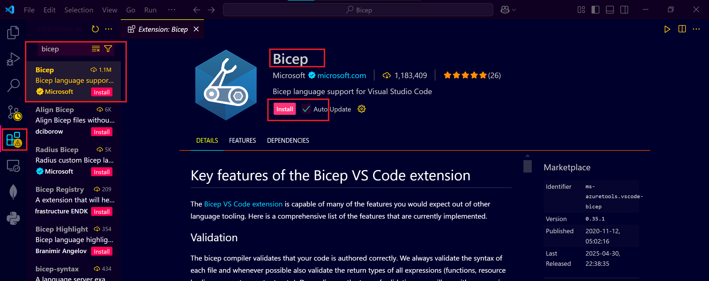
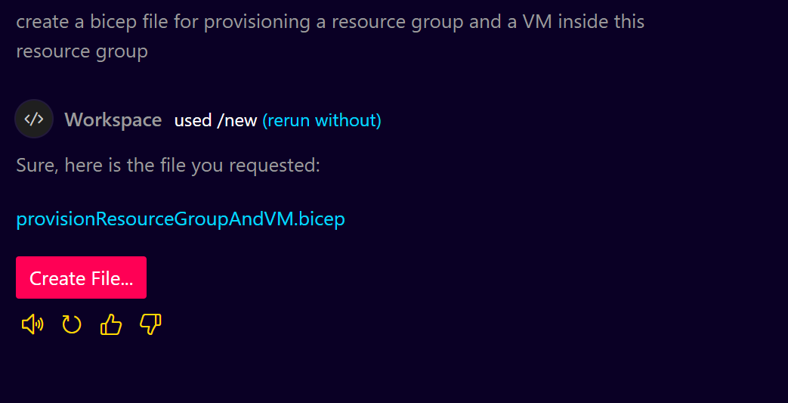
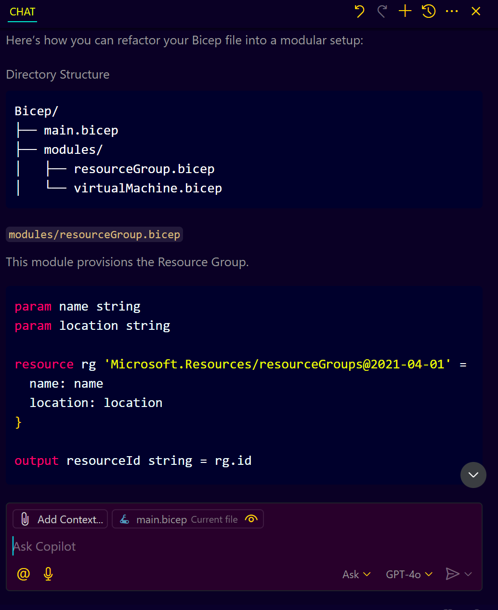
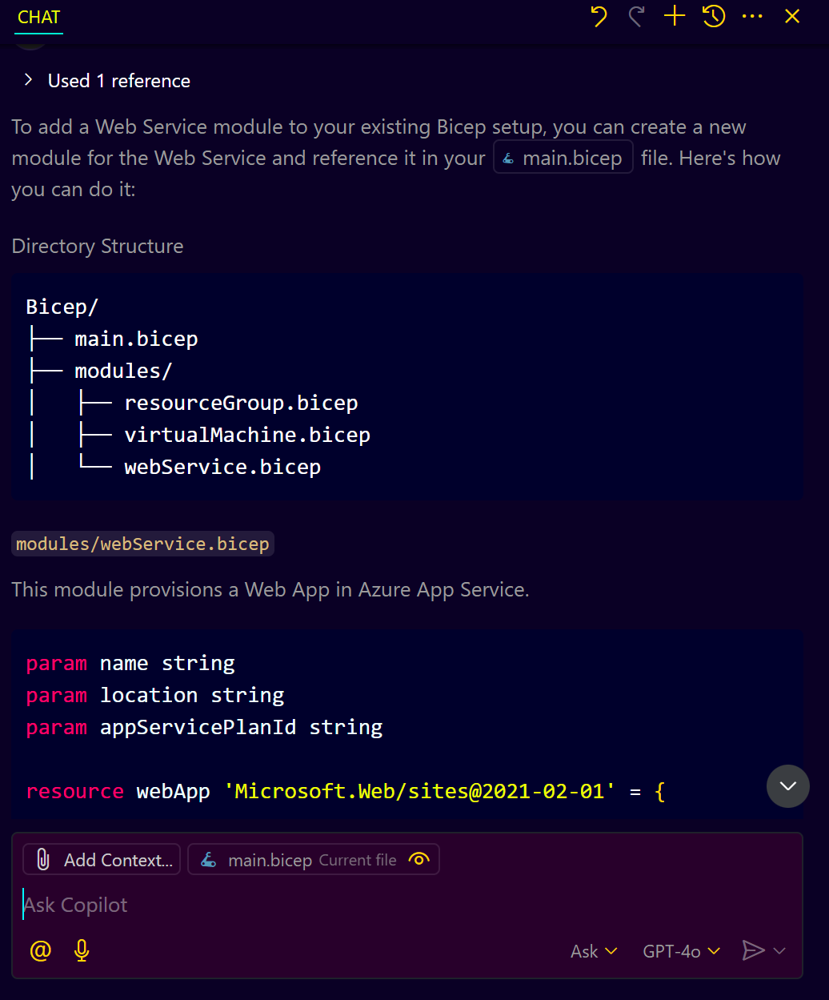
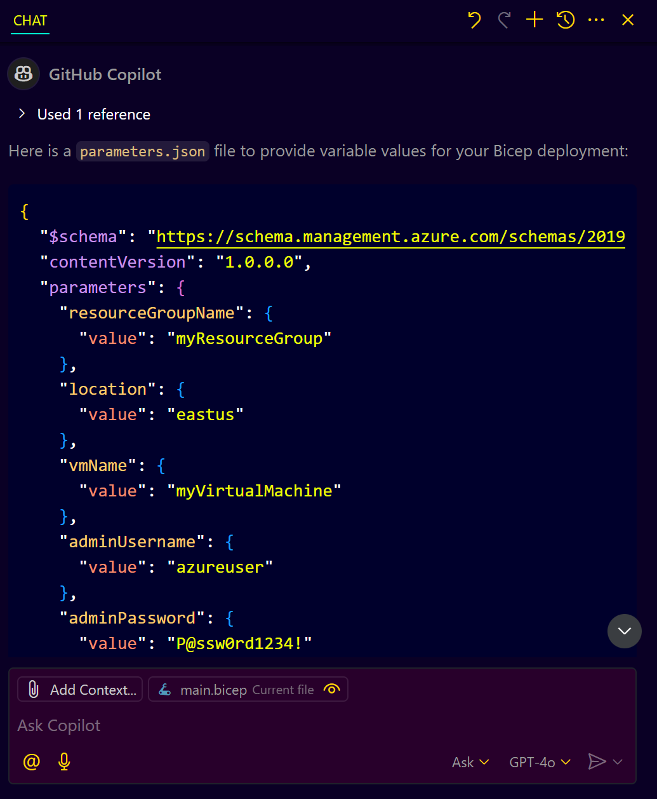
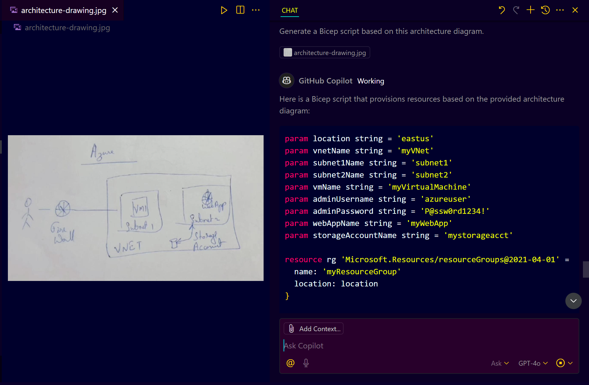
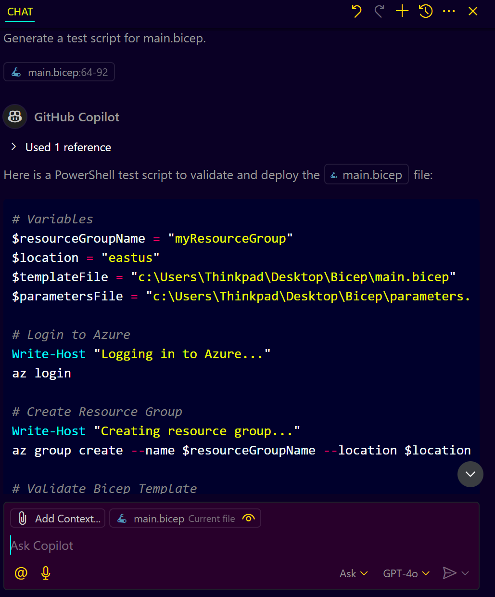
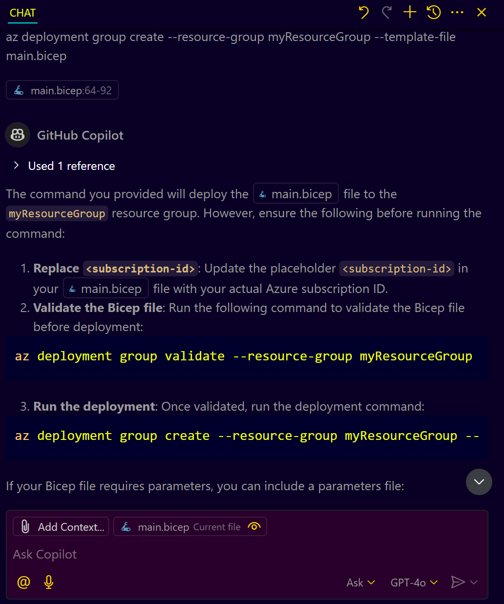

# **GitHub Copilot with Bicep**

## **Introduction**

GitHub Copilot, an AI-powered code assistant, can significantly streamline Bicep development, making it faster and more efficient. This guide provides a comprehensive, step-by-step walkthrough for leveraging GitHub Copilot to create, enhance, and manage Bicep scripts for Azure infrastructure.

---

## **Prerequisites**

* Visual Studio Code (VS Code) installed.
* GitHub Copilot extension installed and active in VS Code.
* Bicep extension for VS Code.


---

## **GitHub Copilot with Bicep - Step-by-Step Guide**

### **Step 1: Setting Up the Bicep Environment**

1. Open VS Code.
2. Ensure the GitHub Copilot extension is installed and enabled.
3. Install the Bicep extension from the VS Code marketplace.
   

---

### **Step 2: Creating a Simple Bicep File**

1. Create a new Bicep file named `main.bicep`.
2. In the empty file, type a simple prompt for Copilot:

   ```plaintext
   create a bicep file for provisioning a resource group and a VM inside this resource group
   ```
3. GitHub Copilot will automatically suggest a complete Bicep script for you.
   

---

### **Step 3: Modularizing Bicep with Copilot**

1. To ensure modularity, request Copilot to split the script into modules:

   ```plaintext
   Create a modular Bicep setup with a Resource Group and a VM.
   ```
2. Copilot will generate two separate Bicep files (modules) for the Resource Group and VM.
   

3. Adjust the main Bicep file (`main.bicep`) to use these modules.


---

### **Step 4: Expanding with Additional Modules**

1. If needed, you can ask Copilot to add more modules, such as:

   ```plaintext
   Add a Web Service module to the existing Bicep setup.
   ```
2. Copilot will automatically create and integrate the new module.
   


---

### **Step 5: Parameterizing the Bicep Scripts**

1. Extract hardcoded values into a parameters file by asking Copilot:

   ```plaintext
   Create a parameters.json file for variable values.
   ```
2. Copilot will generate a `parameters.json` file, making the script more flexible.
   

---

### **Step 6: Visualizing Bicep with Copilot**

1. Use Copilot's vision feature to generate Bicep scripts based on an architecture diagram. This feature allows you to convert visual representations of your infrastructure into code, making it easier to translate complex designs into deployable scripts.
2. Upload a diagram to VS Code and request:
   

   ```plaintext
   Generate a Bicep script based on this architecture diagram.
   ```
   By providing a clear and detailed architecture diagram, Copilot can analyze the components and relationships in the diagram to generate a corresponding Bicep script. This eliminates the need for manual coding and ensures the script aligns with the intended design.

3. Copilot will provide a complete Bicep script matching the diagram. Review the generated script to ensure it accurately reflects the architecture and make any necessary adjustments.
   

---

### **Step 7: Testing and Deploying Bicep Scripts**

1. Use Copilot to create test scripts:
   
   ```plaintext
   Generate a test script for main.bicep.
   ```
   Testing is a critical step to validate the correctness of your Bicep script before deployment. Copilot can generate test scripts that simulate the deployment process, helping you identify potential issues such as syntax errors, missing parameters, or misconfigured resources.

   

2. Deploy the Bicep file using Azure CLI:
   
   ```bash
   az deployment group create --resource-group <YourResourceGroup> --template-file main.bicep
   ```
   This command deploys the resources defined in your Bicep script to the specified Azure resource group. Replace `<YourResourceGroup>` with the name of your resource group. Ensure that you have the Azure CLI installed and authenticated with the correct subscription. After running the command, monitor the deployment process for any errors or warnings.
   
   

   Once deployed, verify that the resources have been created as expected in the Azure portal or using Azure CLI commands.
---

### **Conclusion**

Using GitHub Copilot with Bicep significantly accelerates Infrastructure as Code (IaC) development. This guide covers everything from setup to advanced usage, making you proficient in using Copilot with Bicep efficiently.
