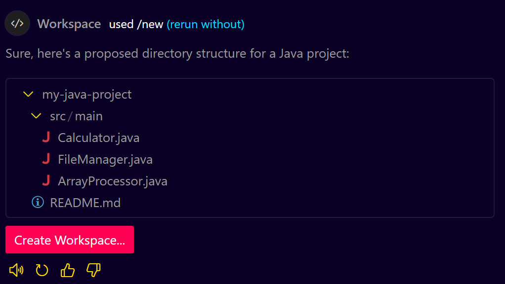
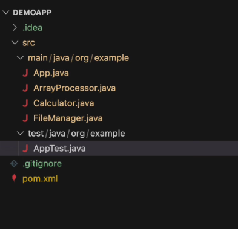
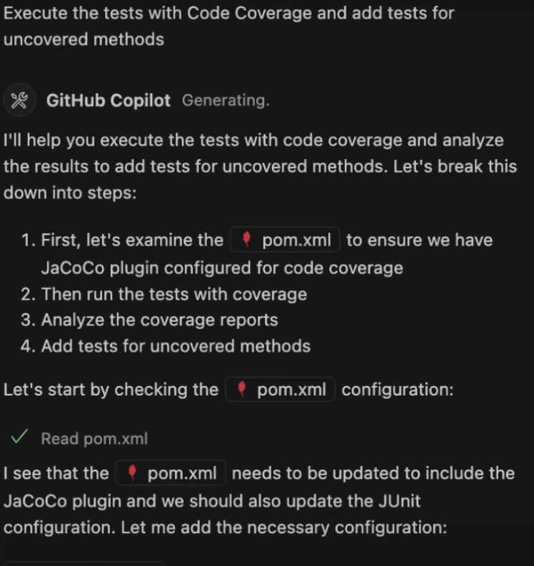
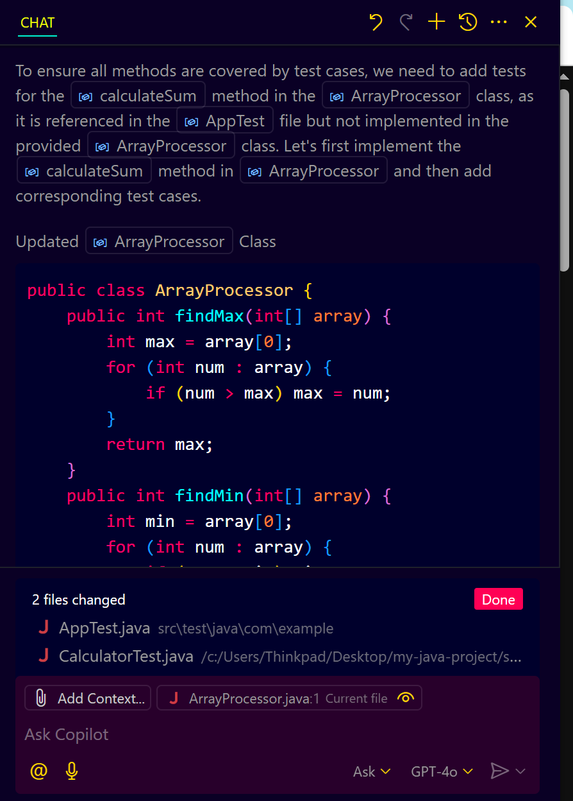
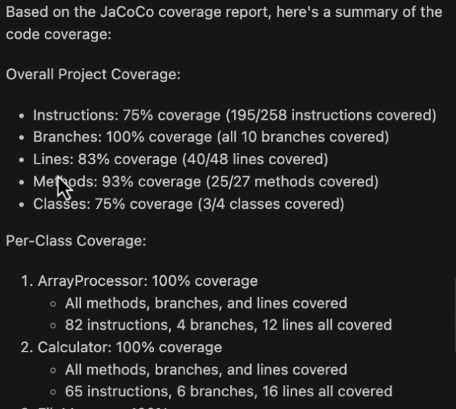
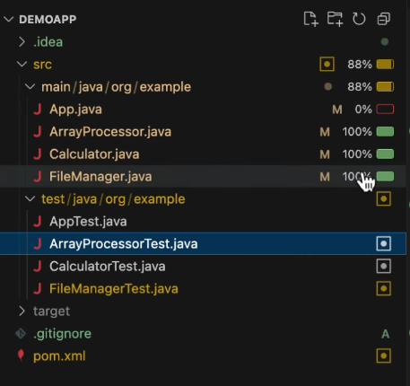

# **GitHub Copilot Agent Mode for Java**

## **Introduction**

This guide will walk you through using GitHub Copilot in Agent Mode to generate and enforce test coverage for a Java application. We will use VS Code Insider (since Agent Mode is available there) and cover the entire process, from setting up your Java project to generating and verifying code coverage.

---

## **Prerequisites**

* Visual Studio Code Insider installed
* Java Development Kit (JDK) installed
* GitHub Copilot subscription
* Basic knowledge of Java
* Existing Java project or a new Java project (we will use a simple example)

---

## **GitHub Copilot Agent Mode for Java - Step-by-Step Guide**

### **Step 1: Install and Configure GitHub Copilot**

1. Open Visual Studio Code Insider.
2. Go to Extensions (left sidebar).
3. Search for **GitHub Copilot** and click **Install**.
4. Log in with your GitHub account.
5. Ensure that the **Agent Mode** option is enabled.

---

### **Step 2: Create or Open a Java Project**

1. If you do not have a Java project, create a new one:

   ```bash
   mkdir demoapp
   code .
   ```
2. Create a `src` folder with the following structure:

   ```plaintext
   src/
   └── main/
       └── java/
           └── com/
               └── example/
                   └── App.java
                   └── Calculator.java
                   └── FileManager.java
                   └── ArrayProcessor.java
   └── test/
       └── java/
           └── com/
               └── example/
                   └── AppTest.java
   ```
3. Add sample code to the `Calculator.java`, `FileManager.java`, and `ArrayProcessor.java` classes (simple functions like addition, file reading, array sorting).




---

### **Step 3: Enable Agent Mode in GitHub Copilot**

1. In VS Code Insider, open the Command Palette (`Ctrl + Shift + P`).
2. Search for **"GitHub Copilot: Toggle Agent Mode"** and ensure it is enabled.

---

### **Step 4: Generate Unit Tests Using GitHub Copilot Agent Mode**

1. Open the `AppTest.java` file (this will be the test file).
   
2. Use the following prompt:

   ```plaintext
   Generate test cases for all uncovered methods in Calculator, FileManager, and ArrayProcessor classes.
   ```
3. GitHub Copilot Agent Mode will analyze your code and automatically generate unit tests for each uncovered method.
   
---

### **Step 5: Ensure Code Coverage with JaCoCo**

1. If you do not have JaCoCo configured in your project, Copilot will prompt to add it.
2. If not, manually add JaCoCo to your `pom.xml` (Maven) or `build.gradle` (Gradle) file.
3. Run the tests using the following command:

   ```bash
   mvn test
   ```
4. Ensure that a coverage report is generated (usually in `target/site/jacoco` for Maven).

---

### **Step 6: Review the Coverage Report**

1. Open the generated coverage report (HTML file) in your browser.
2. Verify that all classes have high coverage (ideally 100%).

---

### **Step 7: Enhance Coverage with GitHub Copilot Agent**

1. If coverage is not 100%, prompt Copilot again:

   ```plaintext
   Add test cases for any remaining uncovered methods.
   ```
2. This will ensure any remaining uncovered methods are tested.
   
---

### **Step 8: Generate a Coverage Summary**

1. Prompt Copilot with:

   ```plaintext
   Summarize the code coverage from JaCoCo Report.
   ```
2. Copilot will provide a clear summary of the coverage achieved.
   

   

---

### **Step 9: Continuous Improvement**

* Keep using Agent Mode to maintain coverage as your project grows.
* Regularly check the coverage report and add tests as needed.

---

## **Conclusion**

You have successfully used GitHub Copilot Agent Mode to generate, enforce, and verify test coverage for a Java application. Keep using this approach to ensure high code quality and maintainability in your Java projects.
