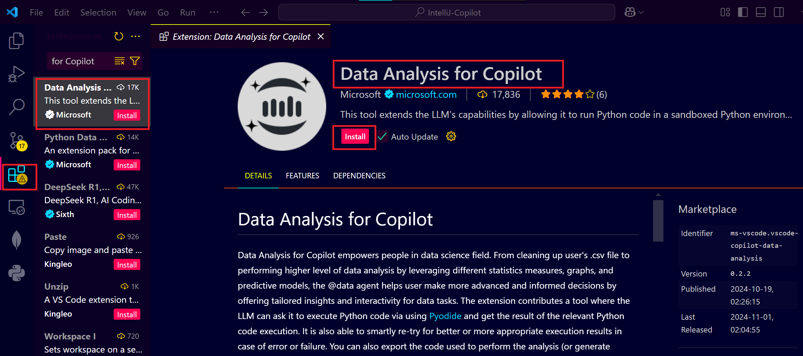
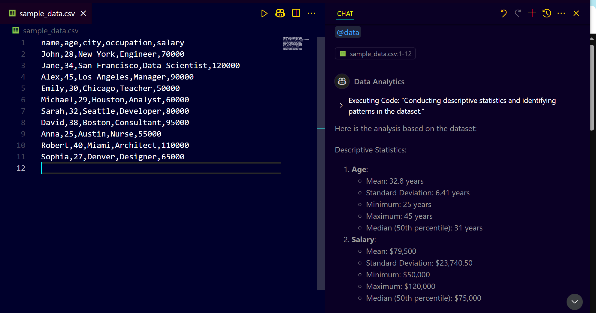
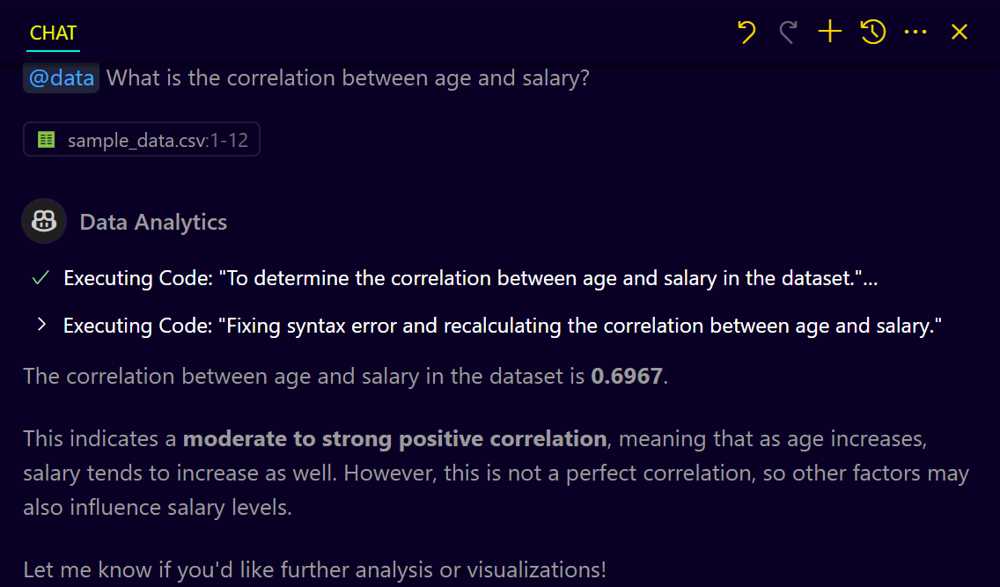
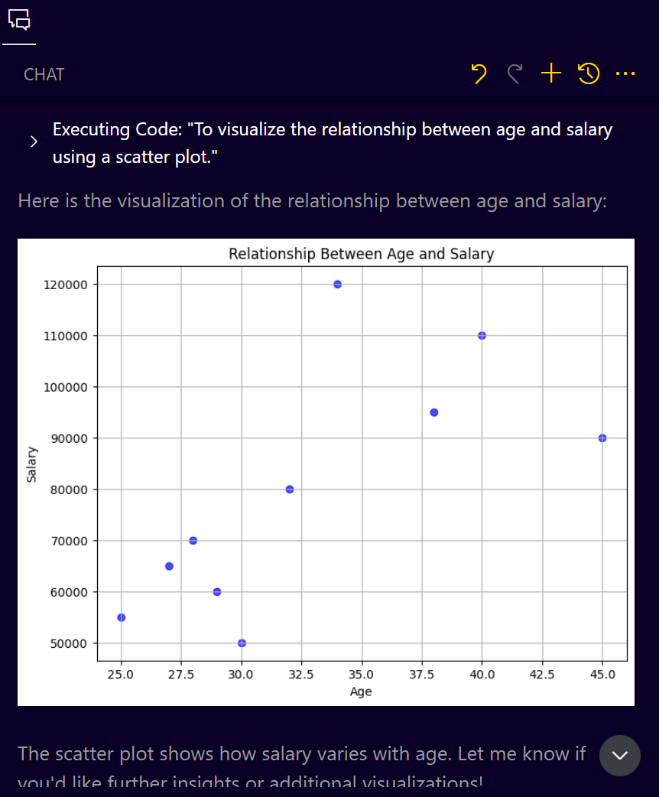
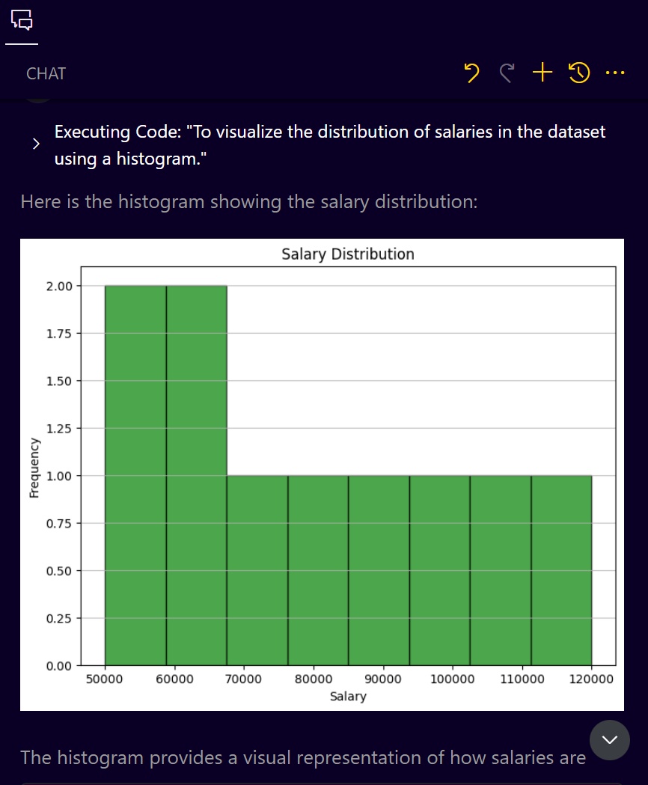
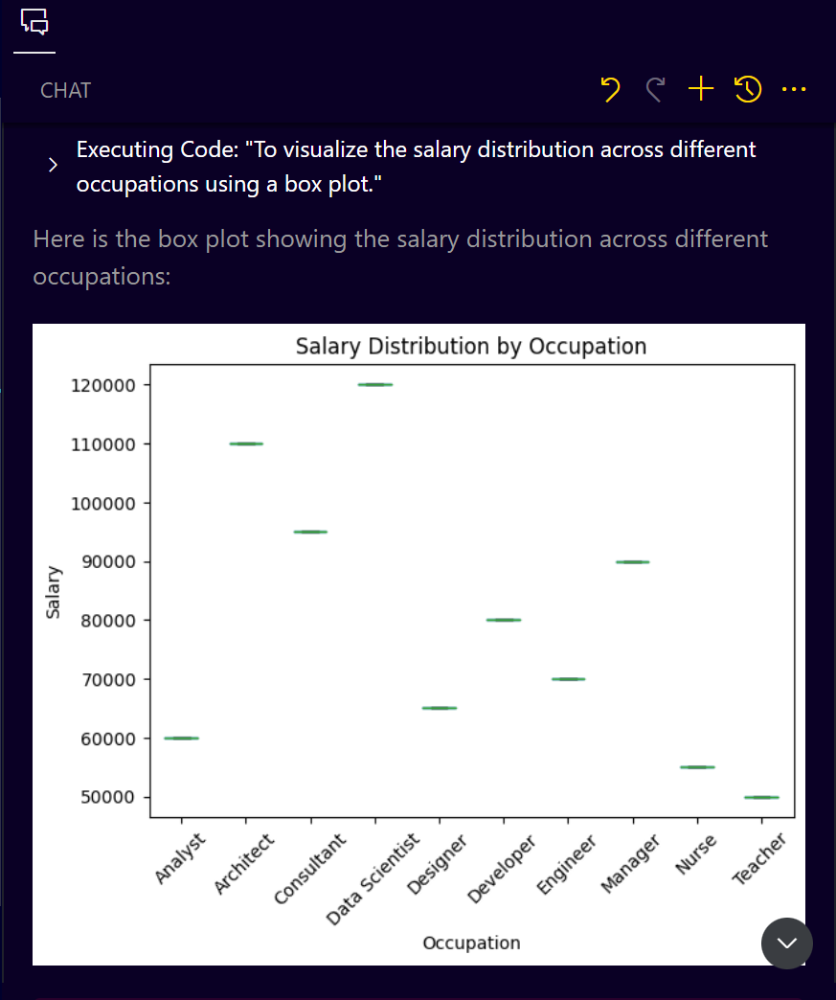
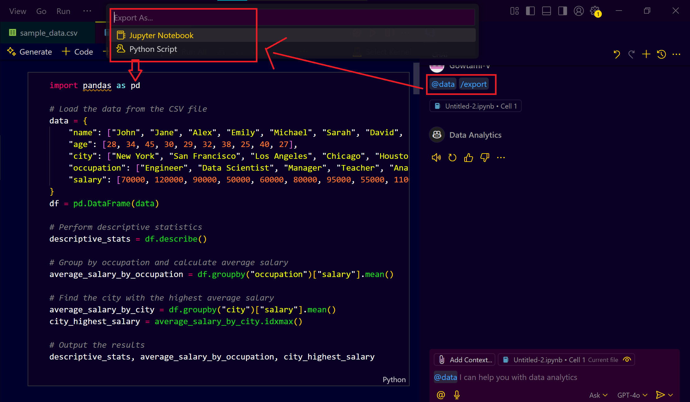

# **Using GitHub Copilot for Data Analysis with VS Code**

## **Install VS Code and Set Up GitHub Copilot**

* Make sure you have **Visual Studio Code (VS Code)** installed on your system.

* Ensure that you have a **GitHub account** and have set up **GitHub Copilot** with your VS Code.
  * Go to **Extensions (Ctrl+Shift+X)** in VS Code.
  * Search for **"GitHub Copilot"** and install the extension.
  * Sign in with your **GitHub account**.

---

#### **Install the Data Analysis Extension**

* In VS Code:

  * Go to **Extensions (Ctrl+Shift+X)**.
  * Search for **"Data Analysis for Copilot"**.
    

  * Install the extension developed by **Microsoft**.

---

#### **Load Your CSV Data**

* Prepare your **CSV file** with your data. Example data structure:

  ```
  name,age,city,occupation,salary
  John,28,New York,Engineer,70000
  Jane,34,San Francisco,Data Scientist,120000
  Alex,45,Los Angeles,Manager,90000
  ```
* Save your CSV file (e.g., `sample_data.csv`).

---

#### **Open CSV File with the Data Analysis Extension**

* In VS Code, open your **CSV file**.
* Click the **"@" symbol** or use the **Data Analysis for Copilot Command**:

  * Press **`Ctrl+P`**.
  * Type **`@data`** and press **Enter**.
* This will activate the Data Analysis extension.
  
---

#### **Perform Basic Data Analysis (Querying)**

* With the Data Analysis extension active, you can start asking data questions directly:

  * **Query 1: Find the relationship between age and salary**

    ```
    What is the correlation between age and salary?
    ```
  * The extension will calculate and display the correlation value.
    
---

#### **Visualize Data Directly**

* Use the Data Analysis extension to generate visualizations:

  * **Query 2: Visualize age vs. salary**

    ```
    Visualize the relationship between age and salary.
    ```
  * The extension will automatically generate a scatter plot.
    


* **Query 3: Create a Histogram for Salary Distribution**

  ```
  Plot a histogram of salary distribution.
  ```

  * A histogram chart will be displayed.
    


* **Query 4: Generate a Box Plot for Salary by Occupation**

  ```
  Plot a box plot of salary distribution across different occupations.
  ```

  * A box plot visualization will be created.
    

---

#### **Export Your Analysis Results**

* You can export the analysis and visualizations as Python or Jupyter Notebook code:
  
  * Use the command:

    ```
    Export to Python script.
    ```
  * Or:

    ```
    Export to Jupyter Notebook.
    ```
* Choose the desired format:

  * Python Script (`.py`)
  * Jupyter Notebook (`.ipynb`)
    

---

#### **Save and Run Exported Code**

* Save the exported Python file as `analysis.py` or Jupyter Notebook as `analysis.ipynb`.
* If you exported as a Python script:

  * Run the script directly in VS Code Terminal:

    ```bash
    python analysis.py
    ```
* If you exported as a Jupyter Notebook:

  * Open the notebook in VS Code.
  * Run each cell to see the results.
    
---

#### **Advanced Analysis (Heatmap, Filtering, etc.)**

* You can perform more advanced analysis using the extension:

  * **Query 5: Generate a Heatmap for Correlation**

    ```
    Plot a heatmap showing the correlation between age and salary.
    ```
  * **Query 6: Find Age Group with Highest Salary Concentration**

    ```
    Which age group has the highest concentration of high earners?
    ```
  * **Query 7: Analyze Average Salary by City**

    ```
    What is the average salary by city?
    ```

---

#### **Clean Up Data Using the Extension**

* The extension also supports basic data cleaning:

  * **Query 8: Clean Missing Values**

    ```
    Remove rows with missing values.
    ```
  * **Query 9: Standardize Salary Values**

    ```
    Normalize salary values.
    ```

---

#### **Integrate with Your Projects**

* Use the exported Python script or Jupyter Notebook code in your existing data science or machine learning projects.
* Make modifications to the code as needed.

---

#### **Save and Document Your Analysis**

* Always save your analysis files (`.py` or `.ipynb`).
* Document your analysis in the form of comments in your Python script or markdown cells in Jupyter Notebook.
