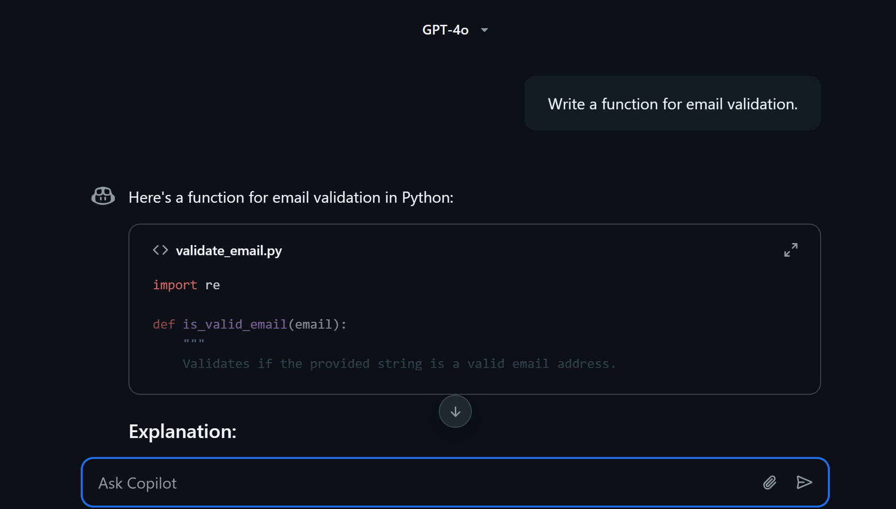
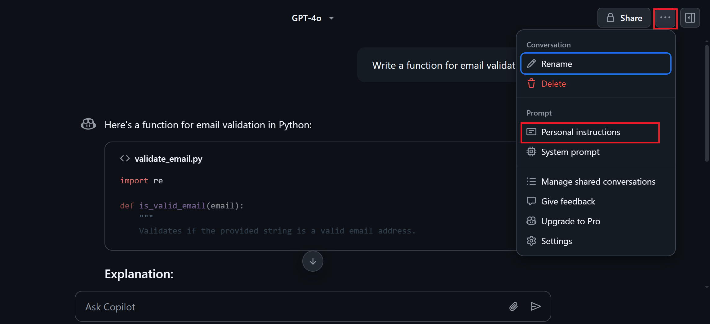
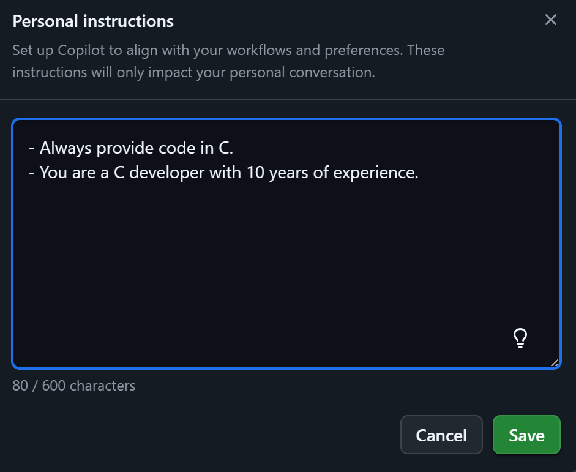
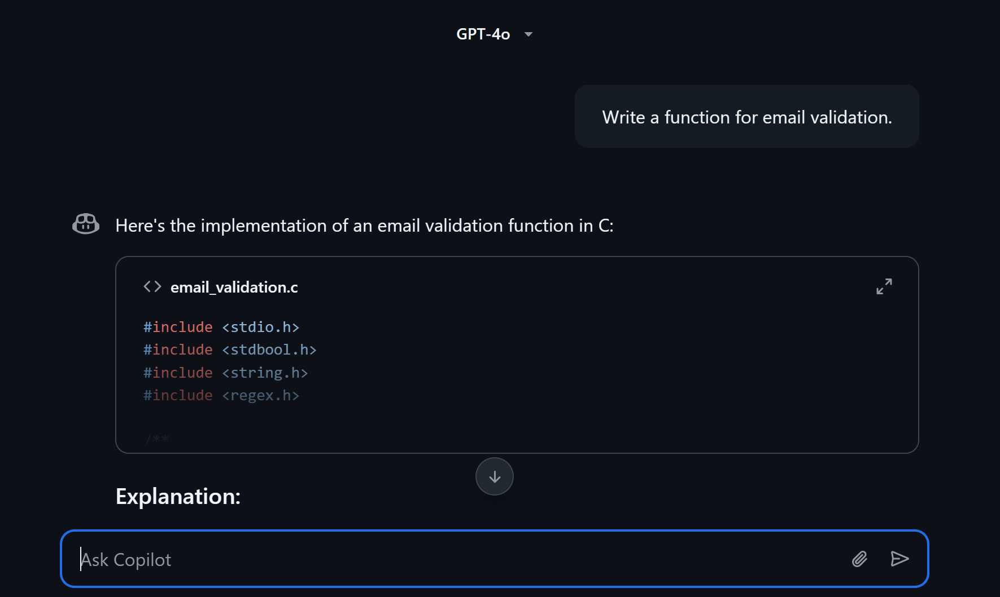
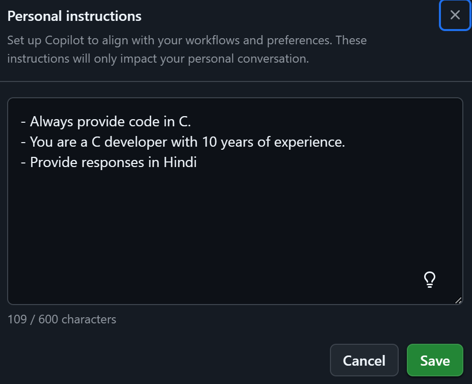

# **Personalize GitHub Copilot on GitHub.com**

## **Introduction**

This guide will walk you through how to personalize GitHub Copilot directly on GitHub.com, allowing you to tailor the chat experience, coding style, and behavior of Copilot to suit your needs.

---

## **Prerequisites**

* A GitHub account.
* GitHub Copilot enabled for your account.

---

## **Steps to Personalize GitHub Copilot on GitHub.com**

### **Step 1: Accessing GitHub Copilot on GitHub.com**

1. Go to [GitHub.com](https://github.com) and log in to your account.
2. Navigate to any repository or your dashboard.
3. Locate the GitHub Copilot chat interface (either through the immersive view or within a repository).
4. You can access the immersive chat view or use the chat functionality directly within your repositories.

---

### **Step 2: Asking Questions**
   - Start by asking a question in the chat, such as:
     ```
     Write a function for email validation.
     ```
   - Copilot will respond with code suggestions in a default language (e.g., Python).
     

---

### **Step 3: Setting Personal Preferences**
   - To personalize Copilot Chat:
     1. Click on the **three dots** in the chat interface.
     2. Select **Personal Instructions**
        

     3. Add your preferences, such as:
        - Preferred programming language (e.g., C, Java, PHP).
        - Role-based instructions (e.g., "You are a C developer with 10 years of experience").
     4. Save your instructions.
        

---

### **Step 4: Testing Personalization**
   - After setting preferences, ask the same question again:
     ```
     Write a function for email validation.
     ```
   - Copilot will now respond based on your preferences (e.g., providing code in C).
     

---

### **Step 5. Adding More Instructions**
   - You can further customize Copilot by:
     - Asking it to explain code in detail.
     - Using a mix of languages for explanations (e.g., English and your native language).
     - Adding instructions to provide responses in Hindi:
       ```
       Provide responses in Hindi.
       ```
       
       
       - After setting preferences, ask the same question again:
         ```
         Write a function for email validation.
         ```
       - Copilot will now respond based on your preferences.
         

     - Adding fun elements like smileys to make interactions more engaging.
  
---

## **Using Copilot Across Repositories**
   - Personalization settings apply across all repositories and organizations.
   - You can ask Copilot to explain files or code in your preferred style and language.

---

## **Advanced Customization**
   - To add advanced instructions:
     1. Click on the **idea icon** in the Personal Instructions window.
     2. Add:
        - **Code Preferences**: Specify libraries, patterns, or coding styles.
        - **Role Instructions**: Define Copilot's role (e.g., expert in a specific domain).
     3. Save and test your updates.

---

## **Examples of Personalization**
   - **Language Preference**: "Explain in French."
   - **Role-Based Interaction**: "Act as a teacher explaining new technology."
   - **Fun Interaction**: "Add smileys to make coding fun."

