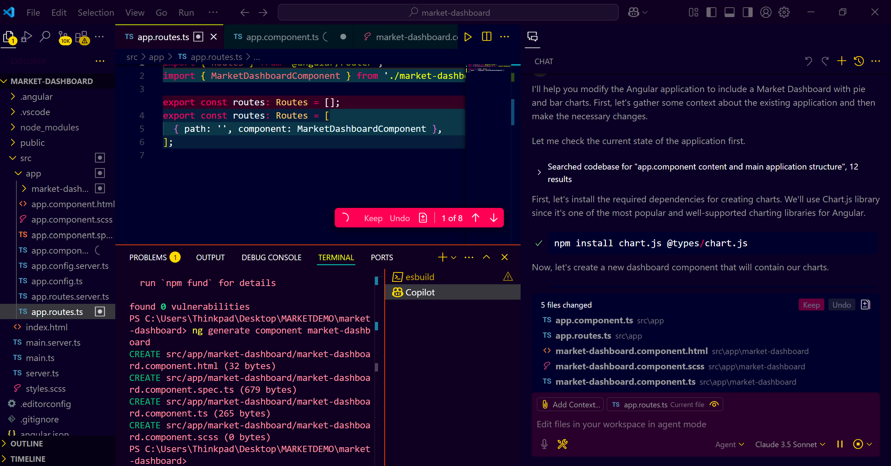

# **GitHub Copilot Agent Mode: Build an Angular Market Share Dashboard with Self-Healing AI**

## **Introduction**

GitHub Copilot Agent Mode is an advanced feature of GitHub Copilot available in VS Code Insiders, providing a more interactive and autonomous coding experience. It not only generates code based on your requests but also iterates on the code, detects errors, and automatically fixes them. This guide will walk you through how to use Agent Mode in GitHub Copilot to build a complete Angular Market Share Dashboard.

---

## **Prerequisites**

* A GitHub account with Copilot enabled.
* VS Code Insiders installed on your system.
* Node.js and npm installed.
* Basic knowledge of Angular.

---

## **Step-by-Step Guide: Using GitHub Copilot Agent Mode**

### **Step 1: Enabling GitHub Copilot Agent Mode**

1. **Open VS Code Insiders** and ensure GitHub Copilot is enabled.
2. Go to **Settings (Ctrl + ,)**.
3. Search for **"Copilot Agent"**.
4. Toggle the option to **"Enable Agent Mode"**.

---

### **Step 2: Starting a New Angular Project**

1. **Open a Blank Folder** in VS Code Insiders.
2. Open the **Copilot Chat** by clicking the Copilot icon.
3. In the chat, ask:

   ```plaintext
   How do I create a new Angular application named "Market Dashboard"?
   ```
   

4. Copilot will guide you through creating a new Angular project:
   * It will ask for CSS or styling preferences.
   * It will handle the Angular project scaffolding.
     
     
   **Choose Stylesheet Format:**

   * Use the **arrow keys** on your keyboard to navigate the options.
   * Select **Sass (SCSS)** by pressing **Enter**.
     

   **Angular Project Creation:**

   * The Angular CLI will now generate the project files and install necessary packages.
   * You will see a series of installation messages, including:

     ```plaintext
     ✔ Packages installed successfully.
     ✔ Angular project "Market Dashboard" created successfully.
     ```  
     
     

5. Once the project is created:
     
   * Close the current folder.
   * Open the newly created Angular project folder.

---

### **Step 3: Installing Dependencies**

1. Open a **new terminal** in VS Code Insiders.
2. Run the following command to install Angular dependencies:

   ```bash
   npm install
   ```
   
3. Once installation is complete, start the Angular application:

   ```bash
   ng start
   ```
   

   

4. The application should open on `http://localhost:4200` with the default Angular welcome screen.

   
---

### **Step 4: Enabling GitHub Copilot Agent Mode for Development**

1. Ensure **Agent Mode** is enabled (refer to Step 1).
2. Go to the **Copilot Edits** section.
3. Switch to **"Agent Mode"**.
4. Ensure the **Cloud AI Model** is selected.
   

---

### **Step 5: Creating the Market Dashboard**

1. In Copilot Chat, provide the following prompt:

   ```plaintext
   Modify this Angular application to include a Market Dashboard that displays market share details using a pie chart and bar chart.
   ```
2. GitHub Copilot Agent will:
 
   * Install any necessary dependencies (e.g., `chart.js`).
   * Generate a `market-share.json` file with sample market data.
   * Create an Angular Service (`MarketDataService`) to fetch data from this file.
   * Create a `MarketDashboard` component to display the data.
   * Set up routing and add a navigation link to the dashboard.
     

---

## **Step 6: Reviewing the Generated Code**
   


1. Check the `market-share.json` file in the `src/assets` folder.
2. Review the `MarketDataService` service:

   * Located in the `src/app/services` folder.
   * Contains methods to fetch market data.
3. Review the `MarketDashboard` component:

   * Located in the `src/app/components` folder.
   * Includes logic for rendering the pie chart and bar chart.
4. Ensure the routing has been set up in `app-routing.module.ts` for the dashboard.
   
---

### **Step 7: Testing the Dashboard**

1. Restart the Angular server:

   ```bash
   ng serve --open
   ```
2. Navigate to the Market Dashboard using the link in the navigation bar.
3. Verify that:
   
     
   * The pie chart and bar chart display the market share data.
   * The charts are interactive and properly styled.

---

### **Step 8: Iterating and Fixing Errors with Agent Mode**

1. If any errors are detected (either in the code or the console), GitHub Copilot Agent will:

   * Automatically identify the error.
   * Suggest a fix or directly apply the fix.
2. You can continue to refine the dashboard by asking Copilot:

   ```plaintext
   Make the pie chart display percentage values for each segment.
   ```
3. Copilot will update the chart logic accordingly.
   

---

### **Step 9: Enhancing the Dashboard (Optional)**

* Add more data fields to `market-share.json`.
* Use Agent Mode to create an additional line chart for historical market trends.
* Customize the dashboard's layout and style using CSS.

---

## **Conclusion**

You have successfully used GitHub Copilot's Agent Mode to create and refine an Angular Market Share Dashboard. This powerful feature allows you to iterate, detect, and fix errors automatically, streamlining the development process.
