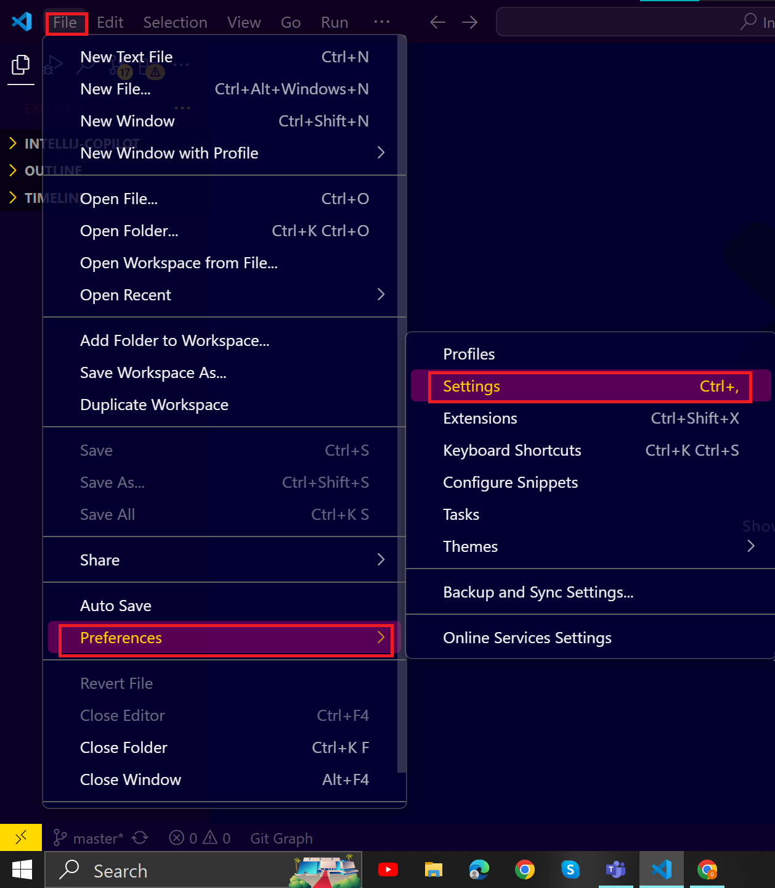
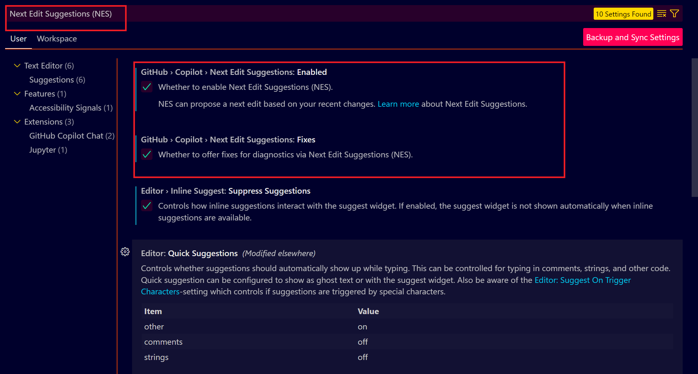
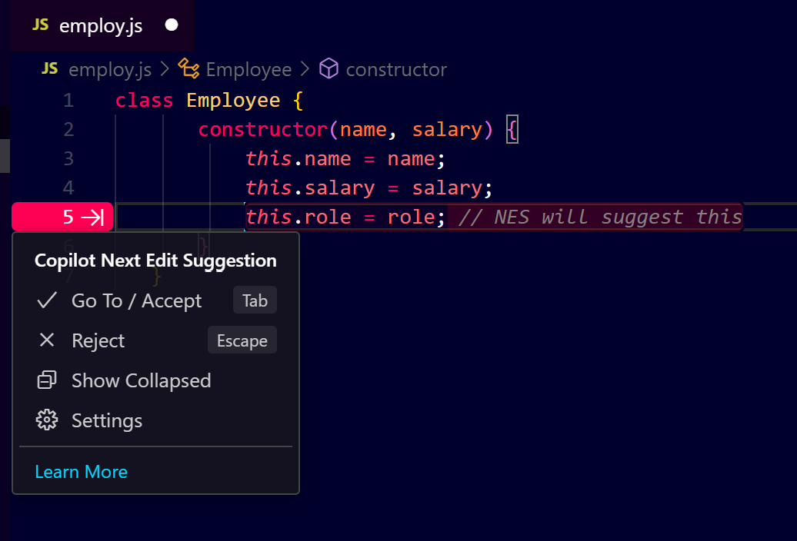
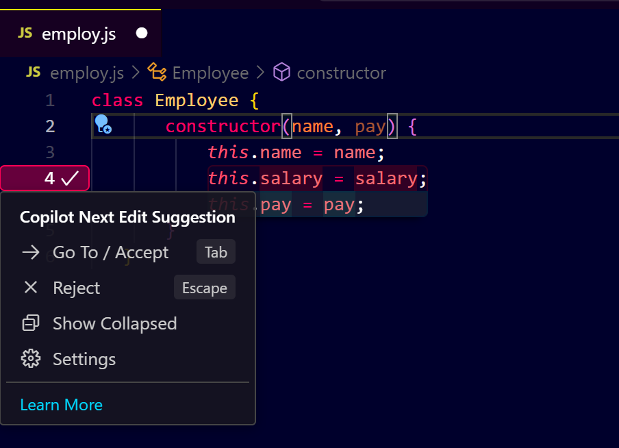
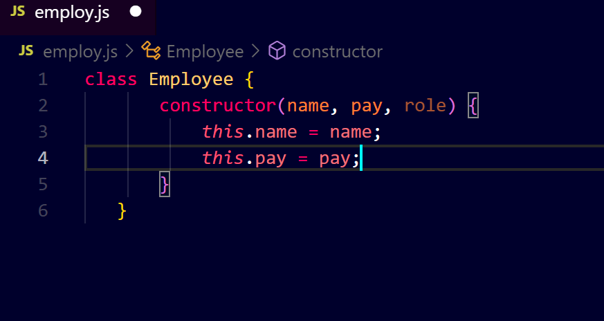
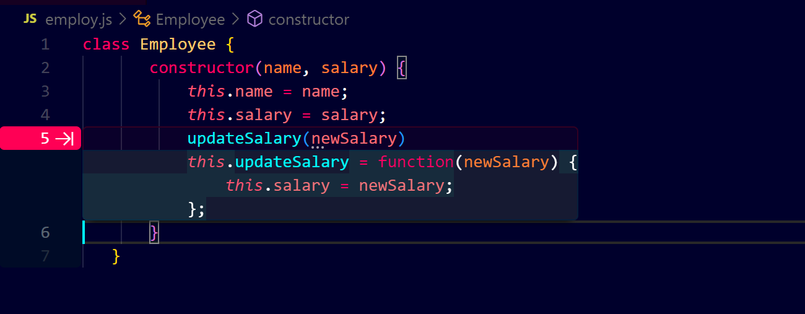

# **Using GitHub Copilot Next Edit Suggestions (NES) in VS Code**

## **Prerequisites**

* Make sure you have **Visual Studio Code (VS Code)** installed.
* Ensure you have **GitHub Copilot** installed and configured in VS Code.
* Sign in to your **GitHub account** with Copilot enabled.

---

## **Enabling GitHub Copilot Next Edit Suggestions (NES)**

### **Step 1: Open VS Code**

* Launch **Visual Studio Code (VS Code)** on your computer.

### **Step 2: Access GitHub Copilot Settings**

* Click on **`File > Preferences > Settings`** (or press `Ctrl + ,`).
  

* Alternatively, use the **Settings icon (⚙️)** in the bottom left corner.
  

### **Step 3: Search for GitHub Copilot**

* In the search bar, type **`GitHub Copilot`**.
* Locate the **GitHub Copilot Settings** section.

### **Step 4: Enable NES**

* Look for **`Next Edit Suggestions (NES)`** or **`Next Edit Suggestions or NES`**.
* Ensure the toggle is set to **`Enabled`**.
  


### **Step 5: Set Scope**

* Choose the scope:

  * **User:** Only for your current user profile.
  * **Workspace:** Applies to the entire workspace (recommended for team projects).

---

## **Understanding NES Functionality**

### **What is GitHub Copilot NES?**

* **NES (Next Edit Suggestions)** is an advanced feature that helps you:

  * Predict and suggest changes as you **edit existing code**.
  * Provide context-aware suggestions for **adding, modifying, or deleting code**.
* These suggestions appear in a **highlighted blue text** format.

---

## **How to Use NES (With Examples)**

### **Example 1: Adding a New Field in a Class**

1. Create a simple **JavaScript class**:

   ```javascript
   class Employee {
       constructor(name, salary) {
           this.name = name;
           this.salary = salary;
       }
   }
   ```
2. Add a new field (like **`role`**) below the existing ones:

   ```javascript
   class Employee {
       constructor(name, salary, role) {
           this.name = name;
           this.salary = salary;
           this.role = role; // NES will suggest this
       }
   }
   ```
   


3. NES will automatically suggest adding the new field wherever it's necessary (like in `displayDetails` or other functions).

---

### **Example 2: Modifying an Existing Field**

1. Modify an existing field name, for example, change **`salary`** to **`pay`**:

   ```javascript
   class Employee {
       constructor(name, pay) { // Modify salary to pay
           this.name = name;
           this.pay = pay;
       }
   }
   ```
2. NES will suggest changing the field name in all other instances (like methods or usage).
   

---

### **Example 3: Deleting a Field**

1. Delete an existing field, like **`role`**:

   ```javascript
   class Employee {
       constructor(name, pay) {
           this.name = name;
           this.pay = pay;
       }
   }
   ```
2. NES will suggest removing the field from other places, such as:
     
   * The constructor.
   * Any functions using that field.
     

---

### **Example 4: Updating a Function Parameter**

1. Modify a function that uses the `salary` field:

   ```javascript
   updateSalary(newSalary) {
       this.pay = newSalary; // NES will suggest updating this
   }
   ```
2. NES will detect and suggest changing all related instances.
   

---

## **Tips for Using NES Effectively**

* **Always review suggestions:** NES tries to help, but you are the final decision-maker.
* **Use `Tab` to accept** suggestions and `Esc` to reject them.
* If a suggestion isn't correct, simply delete it or modify it.

---

## **Disabling NES (If Needed)**

* Go back to **`Settings > GitHub Copilot`**.
* Toggle off **`Next Edit Suggestions (NES)`**.

