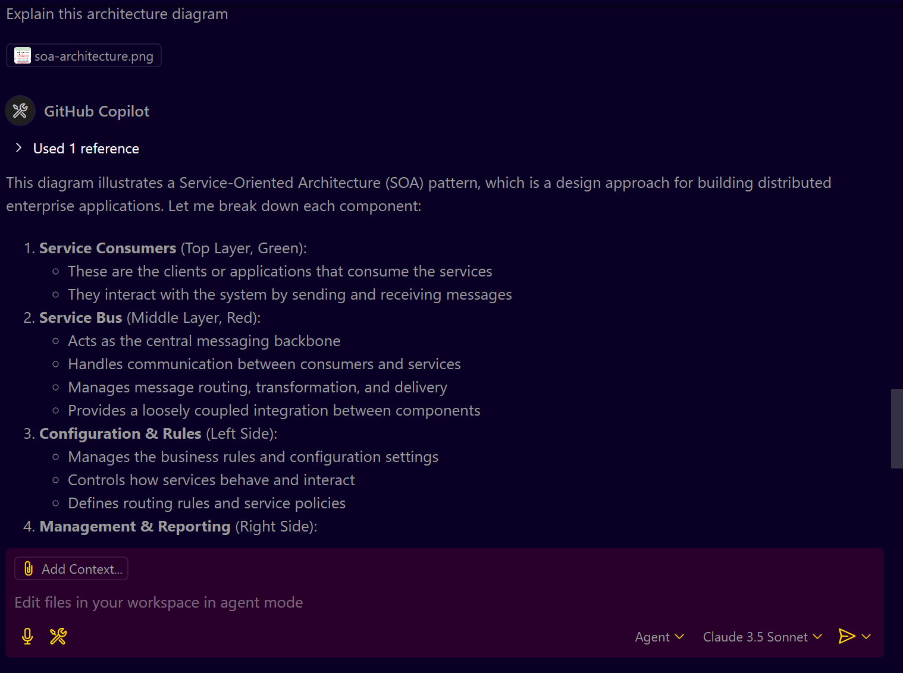
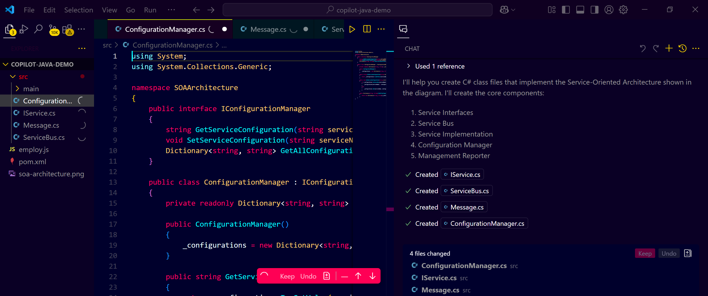

# **GitHub Copilot Vision: AI Image Processing & Diagram-to-Code Magic!**

## **Prerequisites:**

**1. VS Code Insiders:**

   * Download and install **VS Code Insiders** (not the stable version).
   * [Download VS Code Insiders](https://code.visualstudio.com/insiders/)

**2. GitHub Copilot Subscription:**

   * Make sure you have an active **GitHub Copilot subscription**.
   * Sign in to GitHub Copilot using your GitHub account.

**3. Enable GitHub Copilot Vision:**

   * Go to **Settings** > **GitHub Copilot**.
   * Make sure **"Enable Vision"** is enabled for image processing.

---

## **Step-by-Step Guide: Using GitHub Copilot Vision in VS Code Insiders**

### **Step 1: Set Up GitHub Copilot in VS Code Insiders**

* Launch **VS Code Insiders**.
* Go to **Extensions (Ctrl+Shift+X)**.
* Install the **GitHub Copilot** extension (if not already installed).
* Sign in to your GitHub account.

---

### **Step 2: Test GitHub Copilot Vision with Image Processing Using Basic Use Cases**

**Basic Use Cases of GitHub Copilot Vision**

* **Interpreting Architecture Diagrams:** Analyzes architecture diagrams, identifies key components, and suggests scalability and security improvements.

* **Generating Class Code from Class Diagrams:** Converts UML class diagrams into complete class files in languages like C#, Java, or Python.

* **Creating Database Schema from ER Diagrams:** Transforms ER diagrams into SQL `CREATE TABLE` statements for quick database setup.

* **Understanding and Analyzing Network Diagrams:** Explains network topologies and suggests security enhancements, like MFA or encryption.

* **Transforming Workflow Diagrams into Code:** Converts workflow diagrams into CI/CD configurations or API code.

* **Automating UI Code Creation from Design Images:** Generates HTML, CSS, and JavaScript code directly from UI design images.

**1. Drag and Drop an Image:**

   * Open a new file in VS Code Insiders.
   * Drag and drop an image (JPG, PNG, GIF, or WebP) into the editor.

**2. Prompt GitHub Copilot for Image Analysis:**

   * Use a prompt in the editor (comment or plain text) to describe your request.
   * Examples:

     * 👉 `// Explain this architecture diagram`
       
      

     * 👉 `// create C# class files for an attached diagram
       

     * 👉 `// Generate SQL schema based on this ER diagram`
     * 👉 `// Create Terraform code for this network diagram`

 
---

### **Step 3: Using Advanced Features**

**You can try the following use cases:**

  * **Architecture Diagram:**

     * Drag and drop an architecture diagram (like a cloud network).
     * Prompt: `// Explain this architecture diagram and suggest improvements.`

  * **Class Diagram:**

     * Drag and drop a class diagram (UML).
     * Prompt: `// Generate class files (C++, Java, or Python) based on this class diagram.`

  * **ER Diagram (Database Schema):**

     * Drag and drop an ER diagram.
     * Prompt: `// Generate SQL create statements for this ER diagram.`

  * **Network Diagram (Infrastructure as Code):**

     * Drag and drop a network topology diagram.
     * Prompt: `// Generate Terraform code for this network configuration.`

  * **Business Process Diagram:**

     * Drag and drop a business process diagram.
     * Prompt: `// Generate API controllers based on this business process diagram.`

  * **Hand-Drawn Diagram:**

     * Even hand-drawn diagrams can be processed.
     * Prompt: `// Explain this hand-drawn network diagram.`

---

### **Step 4: Validate and Customize Generated Code**

* Review the generated code or explanations.
* Make changes as needed to match your use case.
* You can ask GitHub Copilot to refine or correct the code.

---

### **Step 5: Advanced Prompt Engineering**

* You can combine multiple prompts for more complex use cases:

  * 👉 `// Generate Terraform code for this architecture and suggest security improvements.`
  * 👉 `// Compare this ER diagram with an existing SQL schema.`

---

### **Step 6: Save and Use the Generated Code**

* Save the generated code in your project.
* Modify it as needed for your specific requirements.
