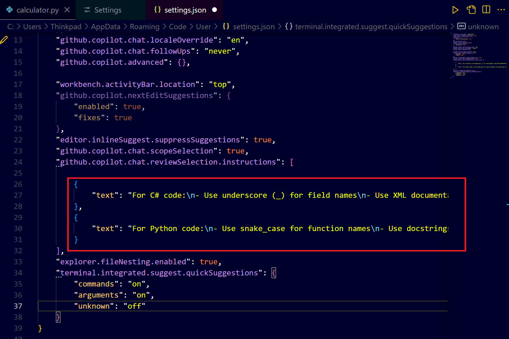
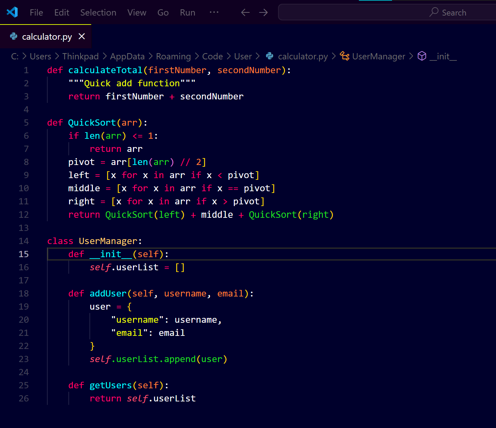
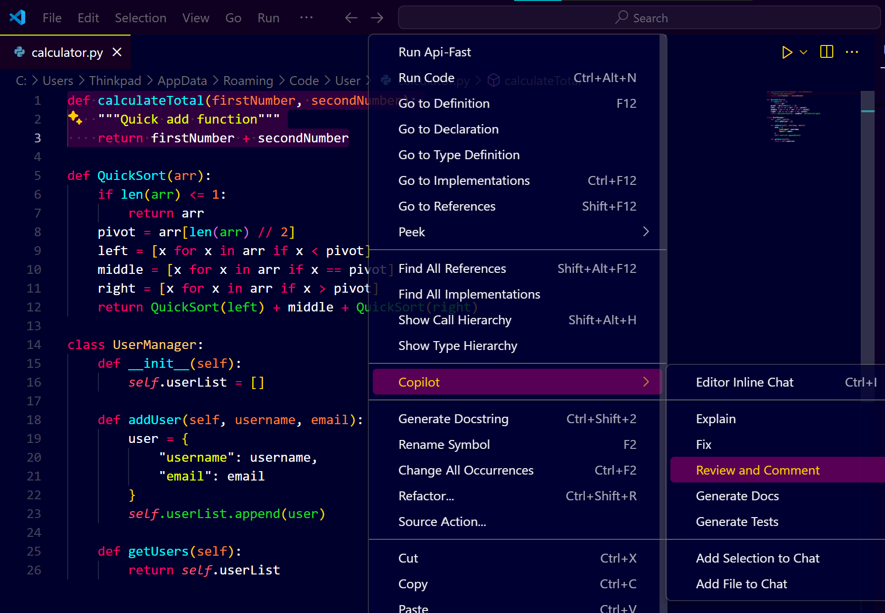
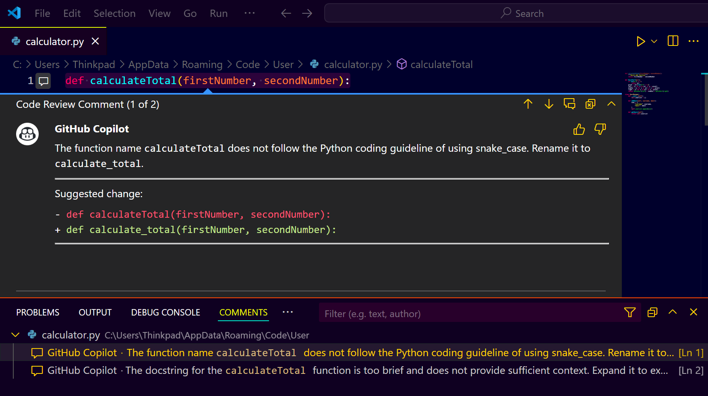
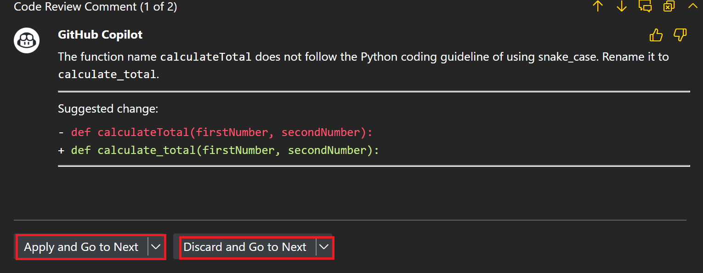
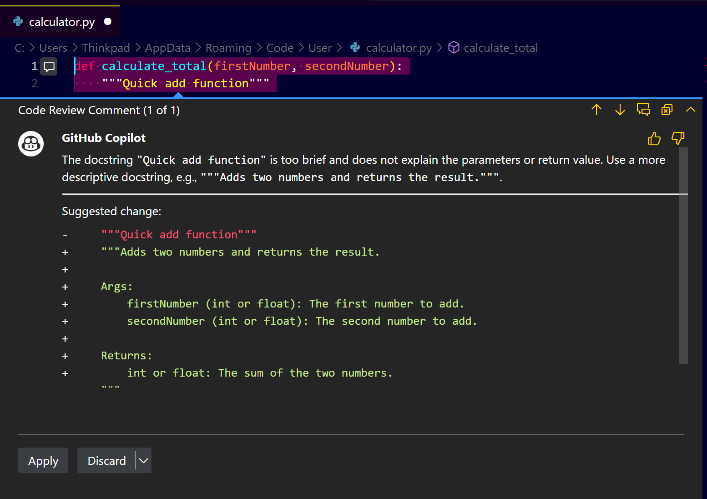

# **Step-by-Step Guide: Setting Up and Using GitHub Copilot Review Guidelines in VS Code**

## **Step 1: Install GitHub Copilot Extension in VS Code**

1. **Open VS Code:** Launch your Visual Studio Code application.
2. **Go to Extensions:** Click on the Extensions icon (🧩) on the left sidebar.
3. **Search for GitHub Copilot:** Type "GitHub Copilot" in the search bar.
4. **Install the Extension:** Click the "Install" button to add GitHub Copilot to your VS Code.

---

## **Step 2: Access GitHub Copilot Settings**

**1. Open Settings:** Go to `File > Preferences > Settings` or use the shortcut (`Ctrl + ,`).
**2. Search for Copilot Settings:** Type "GitHub Copilot" in the search bar.
**3. Open Copilot Settings:** You will see multiple settings for GitHub Copilot. Locate **"GitHub Copilot Chat Review Instructions"**.

---

## **Step 3: Set Up Review Guidelines**

* **Locate Review Settings:**

   * Go to **"GitHub Copilot Chat Review Selection Instructions."**
   * This is where you will define review guidelines for code.

* **Add Review Instructions:**

   * You can directly enter text instructions for Copilot to follow when reviewing code.
   * Example Review Instructions:

     * For **C# Code:**

       * Use **underscore `_`** for field names.
       * Use **XML documentation comments** for all public methods.
     * For **Python Code:**

       * Use **snake\_case** for function names.
       * Use **docstrings** for documentation.

* **Sample Settings Configuration:**

   ```plaintext
   - For C# code, use underscore for field names.
   - Use XML documentation for all public methods.
   - For Python code, use snake_case for function names.
   - Use docstrings for Python method documentation.
   ```
  

---

## **Step 4: Review Code with GitHub Copilot in VS Code**

* **Open a Code File:** Open any C# or Python file you want to review.
  

* **Select Code for Review:** Highlight the code segment you want Copilot to review.
  
* **Right-Click and Choose Review:**

   * Right-click the selected code.
   * Select **"Copilot: Review and Comment"**.
     

* **Review Suggestions:**
  

   * GitHub Copilot will analyze the code and provide review comments based on the instructions you set.
   * It can suggest:

     * Correcting naming conventions (snake\_case, underscore).
     * Adding missing documentation (XML for C#, docstring for Python).
     * Improving code structure.

---

## **Step 5: Apply or Discard Copilot Suggestions**

* **Review Each Suggestion:**
  

   * You can either **Accept, Modify, or Discard** each suggestion.
   
   
   * If a suggestion is helpful, click **"Accept"**.
   * If not, click **"Discard"**.

* **Multiple Suggestions Handling:**
   * If Copilot provides multiple suggestions, you can choose to apply them one by one or discard all.
     
---

## **Step 6: Customize Review Guidelines as Needed**

* **Refine Instructions:**

   * If the review instructions do not align with your expectations, return to the settings.
   * Add or modify the instructions based on your coding standards.

* **Advanced Settings:**

   * You can specify different instructions for different languages.
   * Example:

     * For **JavaScript:** Use camelCase for variable names.
     * For **Java:** Use PascalCase for class names.

---

## **Step 7: Review Python Code with Copilot**

* **Select Python Code:** Highlight a Python function or class.
* **Right-Click and Select "Review and Comment."**
* **Observe Suggestions:**

   * Function names should follow snake\_case.
   * Missing docstrings will be suggested.
   * Variable names can be optimized.

---

## **Step 8: Review C# Code with Copilot**

* **Select C# Code:** Highlight a C# method or class.
* **Right-Click and Select "Review and Comment."**
* **Observe Suggestions:**

   * Field names should use an underscore `_`.
   * Missing XML documentation will be suggested for public methods.
   * Inconsistent naming will be corrected.

---

## **Step 9: Save and Manage Your Review Settings**

* **Save Settings:** Ensure you save any changes you make in the GitHub Copilot settings.
* **Backup Settings:** Consider copying your review guidelines to a separate file for backup.

---

## **Step 10: Explore Advanced Review Scenarios**

* **Try Reviewing Commit Changes:**

   * In the Source Control panel, right-click a commit and select **"Review with Copilot."**
* **Review Multiple Files:**

   * You can also select multiple files or a folder and perform a bulk review.

---

## **Tips and Best Practices**

* Keep review guidelines consistent with your team’s coding standards.
* Regularly update the guidelines to match evolving best practices.
* Use clear and specific instructions for better Copilot review performance.
* Test your settings with different languages (Python, C#, JavaScript) to ensure they work as expected.
