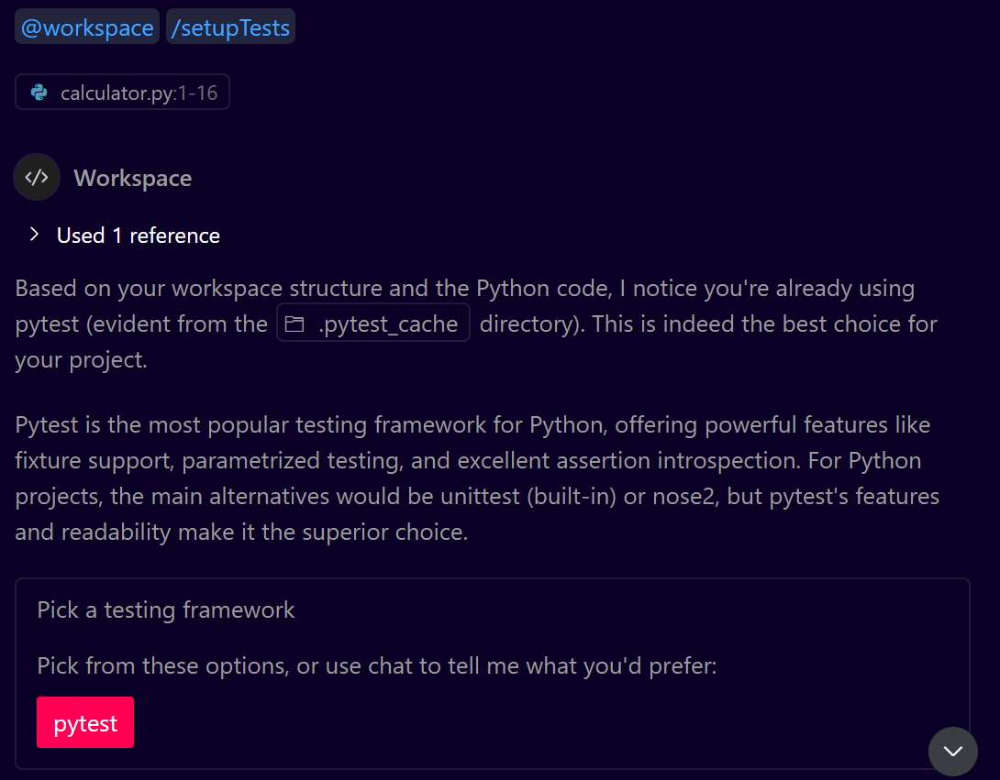
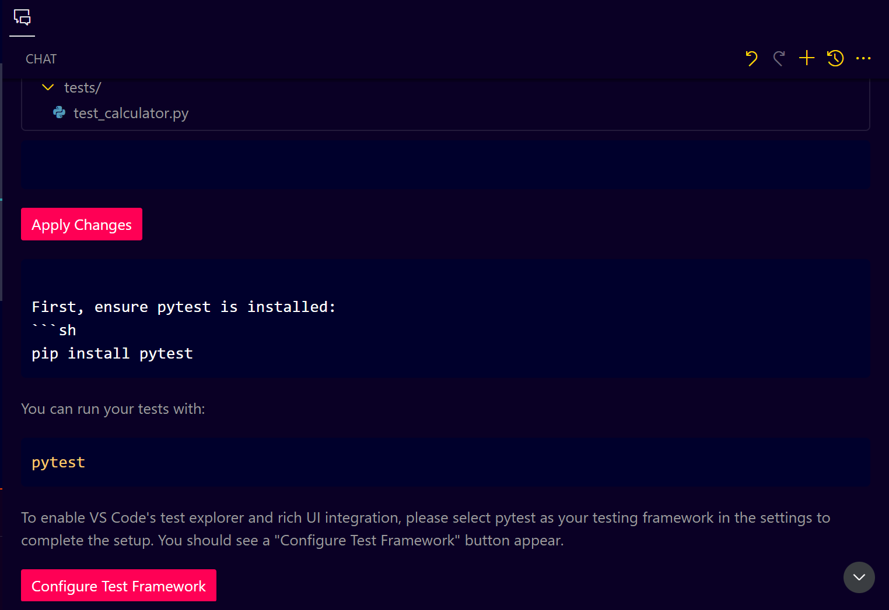
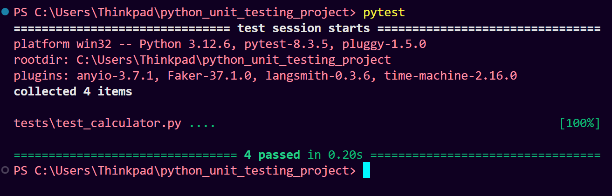
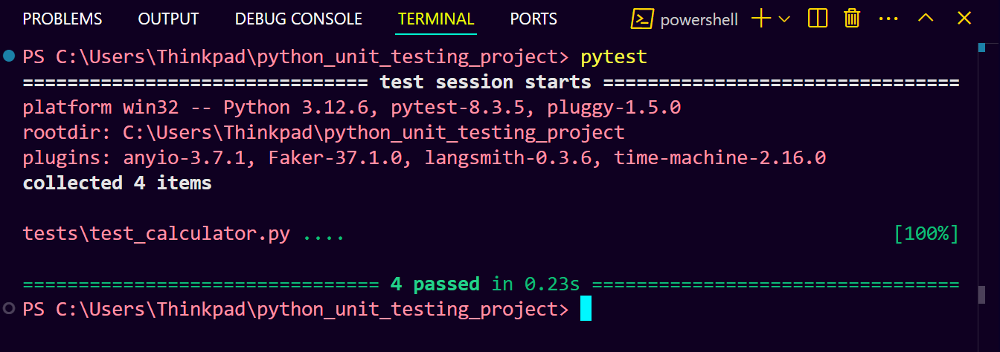
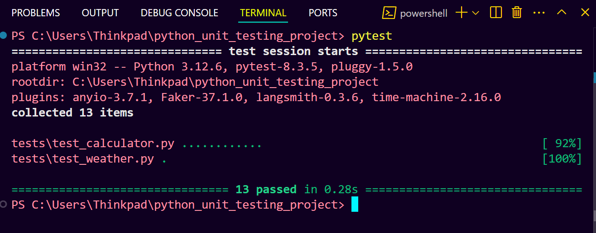
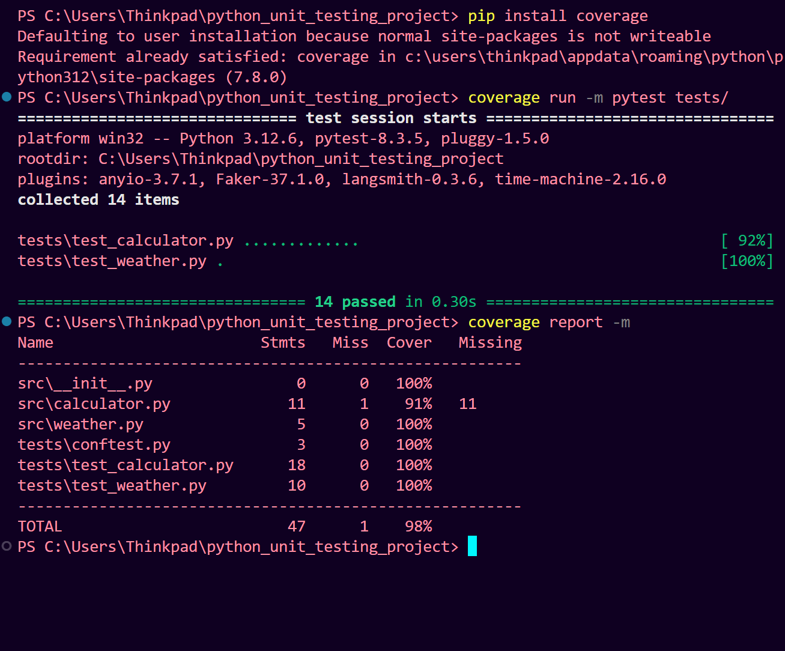

# **Step-by-Step Guide: Python Unit Testing with Pytest**

## **Step 1: Initial Setup**

1. **Create Project Structure:**
   ```powershell
   mkdir python_unit_testing_project
   cd python_unit_testing_project
   ```

2. **Create Virtual Environment:**
   ```powershell
   python -m venv venv
   .\venv\Scripts\activate  # Windows
   ```

3. **Install Required Packages:**
   ```powershell
   pip install pytest
   ```

4. **Create Project Files and Directories:**
   ```
   python_unit_testing_project/
   ├── src/
   │   ├── __init__.py     # Empty file
   │   └── calculator.py
   ├── tests/
   │   ├── __init__.py     # Empty file
   │   ├── conftest.py     # For test configuration
   │   └── test_calculator.py
   └── setup.py            # For package installation
   ```

## **Step 2: Configure Python Package**

1. **Create `setup.py`:**
   ```python
   # setup.py
   from setuptools import setup, find_packages

   setup(
       name="calculator",
       packages=find_packages(),
       version="0.1",
       install_requires=[],
   )
   ```

2. **Create `conftest.py`:**
   ```python
   # tests/conftest.py
   import os
   import sys
   sys.path.insert(0, os.path.abspath(os.path.join(os.path.dirname(__file__), '..')))
   ```

3. **Install Package in Development Mode:**
   ```powershell
   pip install -e .
   ```

## **Step 3: Create Calculator Class**

```python
# src/calculator.py
class Calculator:
    def add(self, a: float, b: float) -> float:
        return a + b

    def subtract(self, a: float, b: float) -> float:
        return a - b

    def multiply(self, a: float, b: float) -> float:
        return a * b

    def divide(self, a: float, b: float) -> float:
        if b == 0:
            raise ValueError("Cannot divide by zero.")
        return a / b
```

## **Step 4: Write Test Cases**

```python
# tests/test_calculator.py
import pytest
from src.calculator import Calculator

calc = Calculator()

def test_add():
    assert calc.add(2, 3) == 5
    assert calc.add(-1, 1) == 0
    assert calc.add(0, 0) == 0

def test_subtract():
    assert calc.subtract(5, 3) == 2
    assert calc.subtract(0, 1) == -1

def test_multiply():
    assert calc.multiply(2, 3) == 6
    assert calc.multiply(5, 0) == 0

def test_divide():
    assert calc.divide(6, 2) == 3
    with pytest.raises(ValueError):
        calc.divide(5, 0)
```

---

## **Step 5: Run Tests**

1. **Set Up Test Framework with Copilot:**
   - Open Copilot Chat in your workspace
   - Type the following command:
     ```
     @workspace/setupTests
     ```
   - Select **pytest** from the available testing frameworks
   

   - Follow the configuration wizard to set up the test framework:
   

2. **Run from Project Root:**
   ```powershell
   cd python_unit_testing_project
   pytest
   ```

3. **Expected Output:**
   

---

## **Step 6: Additional Testing Features**

1. **Run with Verbose Output:**
   ```powershell
   pytest -v
   ```

2. **Run Specific Test:**
   ```powershell
   pytest tests/test_calculator.py::test_add
   ```

3. **Show Print Statements:**
   ```powershell
   pytest -s
   ```

---

### **Troubleshooting**

If you encounter import errors:
1. Verify all `__init__.py` files exist
2. Ensure you're running pytest from project root
3. Confirm package is installed with `pip list`
4. Check virtual environment is activated


> **Note:** Always run tests from the project root directory to avoid import issues.


---

## **Step 7: Advanced Unit Testing with Data-Driven Tests**

1. **Refactor the Test File to Use Data-Driven Testing:**

   ```python
   # tests/test_calculator.py
   import pytest
   from src.calculator import Calculator

   calc = Calculator()

   @pytest.mark.parametrize("a, b, expected", [
       (2, 3, 5),
       (-1, 1, 0),
       (0, 0, 0),
   ])
   def test_add(a, b, expected):
       assert calc.add(a, b) == expected

   @pytest.mark.parametrize("a, b, expected", [
       (5, 3, 2),
       (0, 1, -1),
   ])
   def test_subtract(a, b, expected):
       assert calc.subtract(a, b) == expected
   ```

2. **Run Tests Again:**

   ```bash
   pytest tests/
   ```

   

---

## **Step 6: Handling Exception Scenarios**

1. **Add Tests for Exception Handling (Division by Zero):**

   ```python
   # tests/test_calculator.py

   def test_divide_exceptions():
       with pytest.raises(ValueError, match="Cannot divide by zero."):
           calc.divide(10, 0)
   ```

---

## **Step 7: Mocking External Dependencies (Advanced)**

1. **Create an External API Client in `src/weather.py`:**

   ```python
   # src/weather.py
   import requests

   class Weather:
       def get_weather(self, city: str) -> dict:
           response = requests.get(f"https://api.weatherapi.com/v1/current.json?q={city}")
           return response.json()
   ```

2. **Test the Weather API with Mocking:**

   ```python
   # tests/test_weather.py
   import pytest
   from src.weather import Weather
   from unittest.mock import patch

   @patch("src.weather.requests.get")
   def test_get_weather(mock_get):
       mock_response = {
           "location": {"name": "London"},
           "current": {"temp_c": 20}
       }
       mock_get.return_value.json.return_value = mock_response

       weather = Weather()
       response = weather.get_weather("London")
       assert response["location"]["name"] == "London"
       assert response["current"]["temp_c"] == 20
   ```

3. **Run Tests to Verify Mocking Works:**

   ```bash
   pytest 
   ```

   

---

## **Step 8: Automating with GitHub Copilot**

* Use GitHub Copilot to generate additional test cases:

  * Type `# test` at the top of any function.
  * Use prompt commands like `Generate unit test cases for this function.`
  * Customize the test cases as needed.

---

## **Step 9: Managing Test Coverage**

1. **Install Coverage Tool:**

   ```bash
   pip install coverage
   ```

2. **Run Coverage Analysis:**

   ```bash
   coverage run -m pytest tests/
   coverage report -m
   ```
   

---

### **Best Practices for Effective Unit Testing**

* **Write Small, Isolated Tests:** Each test should only focus on one functionality.
* **Use Data-Driven Tests:** For functions with multiple scenarios.
* **Test for Exceptions:** Ensure edge cases are handled.
* **Mock External APIs:** To avoid network calls during testing.
* **Automate Test Runs:** Set up GitHub Actions for Continuous Integration (CI).

