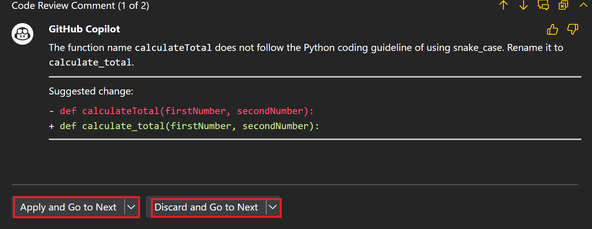
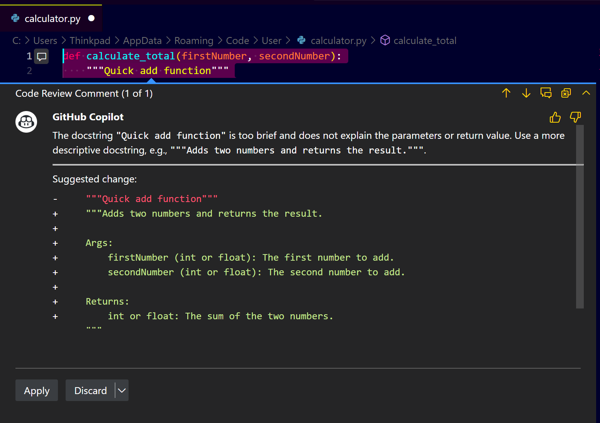

# **Step-by-Step Guide: Setting Up and Using GitHub Copilot Review Guidelines in VS Code**

## **Step 1: Install GitHub Copilot Extension in VS Code**

1. **Open VS Code:** Launch your Visual Studio Code application.
2. **Go to Extensions:** Click on the Extensions icon (🧩) on the left sidebar.
3. **Search for GitHub Copilot:** Type "GitHub Copilot" in the search bar.
4. **Install the Extension:** Click the "Install" button to add GitHub Copilot to your VS Code.

---

## **Step 2: Access GitHub Copilot Settings**

**1. Open Settings:** Go to `File > Preferences > Settings` or use the shortcut (`Ctrl + ,`).
**2. Search for Copilot Settings:** Type "GitHub Copilot" in the search bar.
**3. Open Copilot Settings:** You will see multiple settings for GitHub Copilot. Locate **"GitHub Copilot Chat Review Instructions"**.

---

## **Step 3: Set Up Review Guidelines**

* **Locate Review Settings:**

   * Go to **"GitHub Copilot Chat Review Selection Instructions."**
   * This is where you will define review guidelines for code.

* **Add Review Instructions:**

   * You can directly enter text instructions for Copilot to follow when reviewing code.
   * Example Review Instructions:

     * For **C# Code:**

       * Use **underscore `_`** for field names.
       * Use **XML documentation comments** for all public methods.
     * For **Python Code:**

       * Use **snake\_case** for function names.
       * Use **docstrings** for documentation.

* **Sample Settings Configuration:**

   ```plaintext
   - For C# code, use underscore for field names.
   - Use XML documentation for all public methods.
   - For Python code, use snake_case for function names.
   - Use docstrings for Python method documentation.
   ```
  

---

## **Step 4: Review Code with GitHub Copilot in VS Code**

* **Open a Code File:** Open any C# or Python file you want to review.
  

* **Select Code for Review:** Highlight the code segment you want Copilot to review.
  
* **Right-Click and Choose Review:**

   * Right-click the selected code.
   * Select **"Copilot: Review and Comment"**.
     

* **Review Suggestions:**
  

   * GitHub Copilot will analyze the code and provide review comments based on the instructions you set.
   * It can suggest:

     * Correcting naming conventions (snake\_case, underscore).
     * Adding missing documentation (XML for C#, docstring for Python).
     * Improving code structure.

---

## **Step 5: Apply or Discard Copilot Suggestions**

* **Review Each Suggestion:**
  

   * You can either **Accept, Modify, or Discard** each suggestion.
   
   
   * If a suggestion is helpful, click **"Accept"**.
   * If not, click **"Discard"**.

* **Multiple Suggestions Handling:**
   * If Copilot provides multiple suggestions, you can choose to apply them one by one or discard all.
     
---

## **Step 6: Customize Review Guidelines as Needed**

* **Refine Instructions:**

   * If the review instructions do not align with your expectations, return to the settings.
   * Add or modify the instructions based on your coding standards.

* **Advanced Settings:**

   * You can specify different instructions for different languages.
   * Example:

     * For **JavaScript:** Use camelCase for variable names.
     * For **Java:** Use PascalCase for class names.

---

## **Step 7: Review Python Code with Copilot**

* **Select Python Code:** Highlight a Python function or class.
* **Right-Click and Select "Review and Comment."**
* **Observe Suggestions:**

   * Function names should follow snake\_case.
   * Missing docstrings will be suggested.
   * Variable names can be optimized.

---

## **Step 8: Review C# Code with Copilot**

* **Select C# Code:** Highlight a C# method or class.
* **Right-Click and Select "Review and Comment."**
* **Observe Suggestions:**

   * Field names should use an underscore `_`.
   * Missing XML documentation will be suggested for public methods.
   * Inconsistent naming will be corrected.

---

## **Step 9: Save and Manage Your Review Settings**

* **Save Settings:** Ensure you save any changes you make in the GitHub Copilot settings.
* **Backup Settings:** Consider copying your review guidelines to a separate file for backup.

---

## **Step 10: Explore Advanced Review Scenarios**

* **Try Reviewing Commit Changes:**

   * In the Source Control panel, right-click a commit and select **"Review with Copilot."**
* **Review Multiple Files:**

   * You can also select multiple files or a folder and perform a bulk review.

---

## **Tips and Best Practices**

* Keep review guidelines consistent with your team’s coding standards.
* Regularly update the guidelines to match evolving best practices.
* Use clear and specific instructions for better Copilot review performance.
* Test your settings with different languages (Python, C#, JavaScript) to ensure they work as expected.

---

## **Step 11: Reviewing Pull Requests (PRs) with GitHub Copilot**
GitHub Copilot can also help you review code changes in pull requests (PRs) directly from the GitHub website.

### **1. Create a New Branch for Code Changes**

* Go to your GitHub repository.
* Create a **new branch**:

  ```bash
  git checkout -b feature/code-review
  ```

### **2. Make Code Changes**

* Modify any file (e.g., `calculator.py`).
* Save the file.

### **3. Commit and Push Changes**

* Commit your changes:

  ```bash
  git add .
  git commit -m "Added new function with Copilot review"
  git push -u origin feature/code-review
  ```

### **4. Create a Pull Request (PR)**

* Go to your GitHub repository.
* Click **“Pull Requests > New Pull Request”**.
* Choose your new branch (`feature/code-review`) as the source.
* Click **“Create Pull Request”**.
    

  

### **5. Start the Review Process**

* Go to the **“Files Changed”** tab to view the code changes in the PR.

### **6. Activate GitHub Copilot Review**

* In the PR page, look for the **“Review with GitHub Copilot”** button (may appear on the right side).
* Click **“Review with GitHub Copilot”**.

### **7. Analyze Copilot’s Suggestions**

* Copilot will automatically analyze the code changes and provide feedback.
* The feedback may include:

  * Code quality improvements.
  * Security vulnerabilities.
  * Best practices for the language being used.
  * Performance optimization suggestions.

### **8. Accept, Reject, or Modify Suggestions**

* Each Copilot suggestion will appear as a comment in the PR.
* You can:

  * **Accept** the suggestion by clicking **“Apply Suggestion”**.
  * **Reject** it by choosing **“Dismiss”**.
  * **Modify** it by clicking the **“Edit”** button.

### **9. Complete the Review**

* After reviewing, you can:

  * Click **“Approve”** if everything is good.
  * Click **“Request Changes”** if you want the contributor to fix something.
  * Click **“Comment”** to leave general feedback.

---

## **Step 12: Setting Up GitHub Copilot Review for New PRs (Auto Review)**

### **1. Go to GitHub Actions**

* In your repository, click on the **“Actions”** tab.

### **2. Create a New Workflow**

* Click **“New Workflow”**.
* Choose **“Set up a workflow yourself”**.

### **3. Set Up Copilot Review Workflow**

* Use the following configuration for automated review:

```yaml
name: GitHub Copilot Code Review

on:
  pull_request:
    types: [opened, reopened, synchronize]

jobs:
  review:
    runs-on: ubuntu-latest

    steps:
      - name: Checkout Code
        uses: actions/checkout@v3

      - name: GitHub Copilot Review
        uses: github/copilot-review-action@v1
        with:
          github_token: ${{ secrets.GITHUB_TOKEN }}
```

### **4. Save and Commit Workflow**

* Save the file as **“copilot-review\.yml”** in the **“.github/workflows”** directory.
* Commit directly to the main branch.

### **5. Test the Workflow**

* Create a new PR in your repository.
* GitHub Copilot will automatically review the PR and add comments.

---

## **Step 13: Customizing Copilot Review Comments**

### **1. Define Custom Comments for Specific Languages**

* You can specify review comments based on the programming language.

### **2. Example Custom Review Instructions (Python):**

```plaintext
- Ensure functions follow snake_case naming convention.
- Use docstrings for all functions and classes.
- Check for error handling in try/except blocks.
- Use list comprehensions for efficient list creation.
- Optimize imports (remove unused imports).
```

### **3. Example Custom Review Instructions (JavaScript):**

```plaintext
- Use camelCase for variable and function names.
- Ensure async/await is used for asynchronous operations.
- Add comments for complex logic.
- Use strict equality (===) for comparisons.
```

### **4. Modify Review Guidelines in VS Code**

* Go to **“Settings > GitHub Copilot > Review Instructions”**.
* Add these custom instructions.

---

## **Step 14: Reviewing Code in a Collaborative Team Environment**

### **1. Set Up Review Standards with Your Team**

* Ensure all team members use the same review guidelines.
* Share a common set of review instructions for Copilot.

### **2. Use Branch Protection Rules (Optional)**

* Enforce code reviews using branch protection rules:

  * Go to **“Settings > Branches”**.
  * Click **“Add Branch Protection Rule”**.
  * Set the rule to require at least one review before merging.

### **3. Review with Multiple Reviewers**

* When a team member submits a PR, ensure multiple reviewers, including Copilot, provide feedback.

### **4. Integrate Copilot with Code Review Tools (Optional)**

* If your team uses tools like **JIRA, Azure DevOps, or GitHub Projects**, ensure Copilot review results are linked to these tools for tracking.

---

## **Step 15: Understanding Copilot Review Limitations**

### **1. Copilot is Not a Replacement for Human Review**

* Use Copilot as an assistant, not a complete replacement for human reviewers.

### **2. Be Aware of Copilot’s Language Limitations**

* Copilot may not fully understand the context of your code, especially for complex logic.

### **3. Regularly Update Copilot Review Guidelines**

* Ensure that the review instructions are up-to-date with your team’s best practices.

