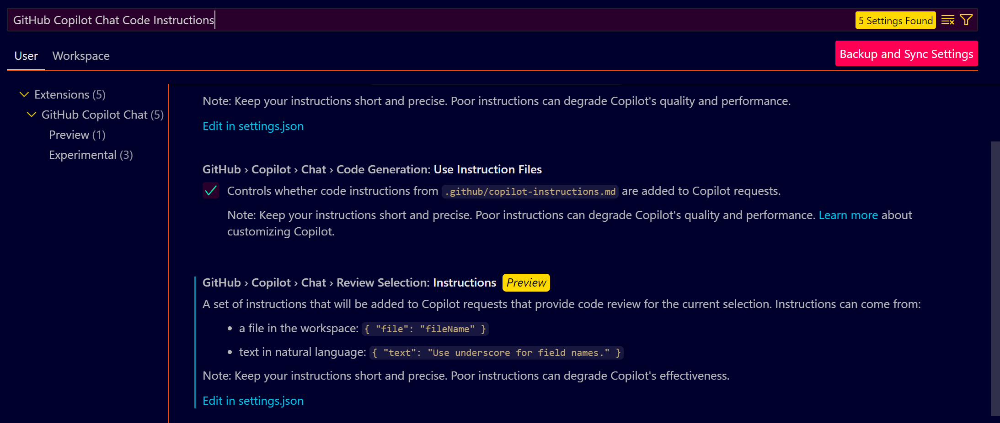
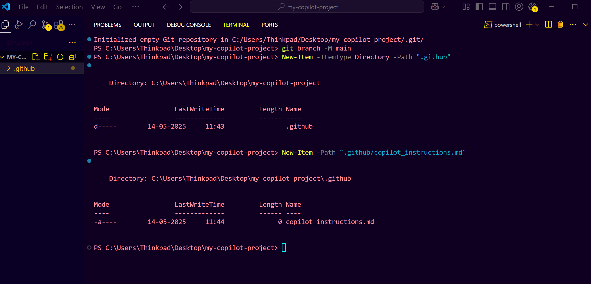
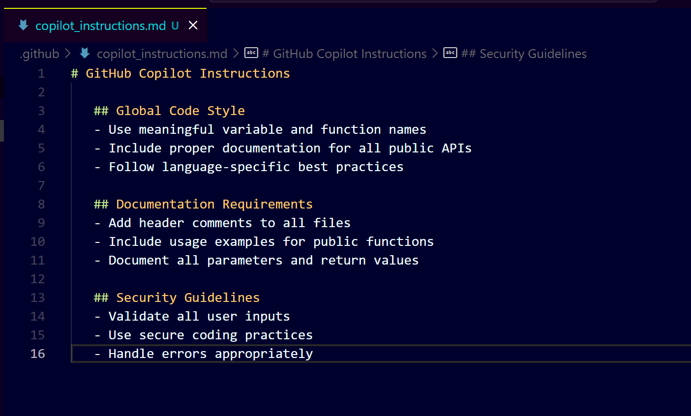
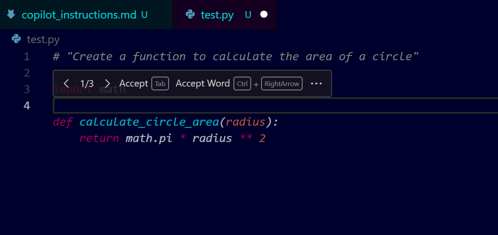
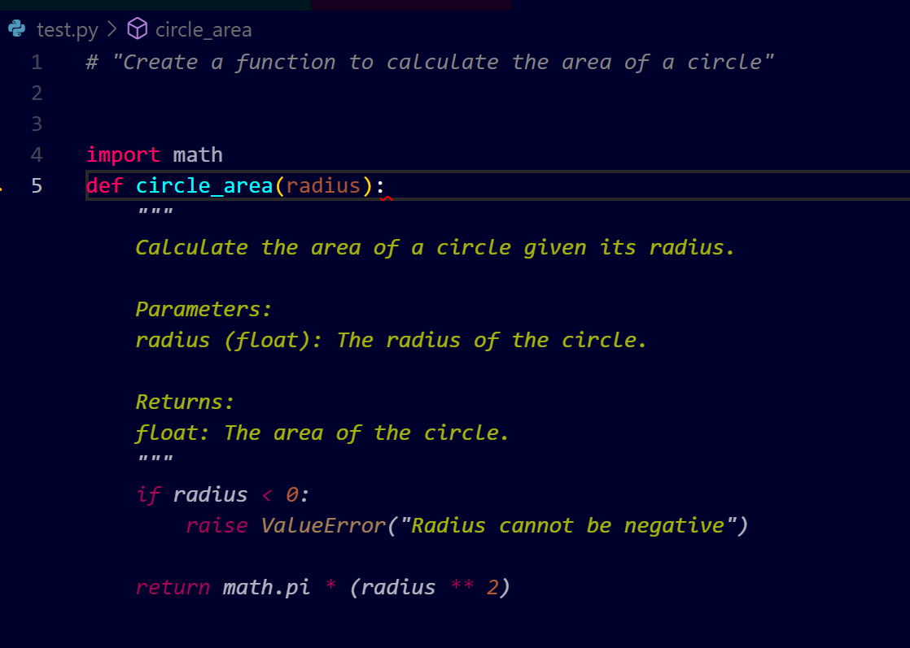

# **Setting Up GitHub Copilot with Custom Coding Instructions**

## **Prerequisites**
- Visual Studio Code installed
- GitHub account with Copilot subscription
- Git installed on your system

## **Step 1: Initial Setup in VS Code**

1. **Install GitHub Copilot Extension:**
   * Open VS Code
   * Press `Ctrl + Shift + X` to open Extensions
   * Search for "GitHub Copilot"
   * Click "Install"
   * Wait for installation to complete
   * Reload VS Code when prompted

2. **Configure Copilot Settings:**
   * Press `Ctrl + ,` to open Settings
   * Type "GitHub Copilot" in the search bar
   * Navigate to "GitHub Copilot Chat > Preview Features"
   * Check the box for "GitHub Copilot Chat Code Instructions"
     

   * Restart VS Code to apply changes

## **Step 2: Repository Setup**



1. **Create Project Directory:**
   ```powershell
   New-Item -ItemType Directory -Path "my-copilot-project"
   Set-Location my-copilot-project
   code .
   ```

2. **Initialize Git Repository:**
   ```powershell
   git init
   git branch -M main
   ```

3. **Create GitHub Directory Structure:**
   ```powershell
   New-Item -ItemType Directory -Path ".github"
   ```
   

## **Step 3: Creating Instruction Files**



1. **Create Base Instructions File:**
   ```powershell
   New-Item -Path ".github/copilot_instructions.md"
   ```

2. **Add Basic Configuration:**
   ```markdown
   # GitHub Copilot Instructions

   ## Global Code Style
   - Use meaningful variable and function names
   - Include proper documentation for all public APIs
   - Follow language-specific best practices
   
   ## Documentation Requirements
   - Add header comments to all files
   - Include usage examples for public functions
   - Document all parameters and return values

   ## Security Guidelines
   - Validate all user inputs
   - Use secure coding practices
   - Handle errors appropriately
   ```

## **Step 4: Language-Specific Instructions**

1. **Python Instructions:**
   ```markdown
   ## Python Guidelines
   
   ### Naming Conventions
   - Classes: PascalCase (Example: `UserAccount`)
   - Functions: snake_case (Example: `calculate_total`)
   - Variables: snake_case (Example: `user_input`)
   - Constants: UPPER_CASE (Example: `MAX_ATTEMPTS`)
   
   ### Documentation
   ```python
   def function_name(param1: type, param2: type) -> return_type:
       """
       Brief description of function.
       
       Args:
           param1 (type): Description of param1
           param2 (type): Description of param2
           
       Returns:
           return_type: Description of return value
           
       Raises:
           ExceptionType: When and why this exception occurs
       """
   ```

2. **JavaScript/TypeScript Instructions:**
   ```markdown
   ## JavaScript/TypeScript Guidelines
   
   ### Naming Conventions
   - Classes: PascalCase (Example: `UserService`)
   - Functions: camelCase (Example: `getUserData`)
   - Variables: camelCase (Example: `userData`)
   - Constants: UPPER_CASE (Example: `API_KEY`)
   
   ### Documentation
   ```typescript
   /**
    * Brief description of function
    * @param {parameterType} paramName - Parameter description
    * @returns {returnType} Description of return value
    * @throws {ErrorType} Description of when errors are thrown
    */
   ```

## **Step 5: Testing Your Instructions**

1. **Create Test Files:**
   * Create a new Python file: `test.py`
   * Create a new JavaScript file: `test.js`

2. **Test Python Implementation:**
   ```python
   # "Create a function to calculate the area of a circle"
   ```
   
   

3. **Verify Generated Code:**
   

   * Check if docstrings are present
   * Verify naming conventions
   * Ensure error handling is included

## **Step 6: Version Control**

1. **Commit Your Changes:**
   ```powershell
   git add .github/copilot_instructions.md
   git commit -m "Add Copilot instructions and guidelines"
   ```

2. **Link to GitHub:**
   ```powershell
   git remote add origin <your-repository-url>
   git push -u origin main
   ```

## **Step 7: Maintenance and Updates**

1. **Regular Review Process:**
   * Review instructions monthly
   * Update based on team feedback
   * Keep track of changes in a changelog

2. **Team Collaboration:**
   * Share instructions with team members
   * Collect feedback and suggestions
   * Update guidelines based on project needs

## **Step 8: Troubleshooting Guide**

**Common Issues and Solutions:**
* Instructions not applying:
  - Verify file location (.github/copilot_instructions.md)
  - Check file permissions
  - Restart VS Code

* Inconsistent behavior:
  - Clear Copilot cache
  - Update VS Code and Copilot extension
  - Re-authenticate GitHub account


