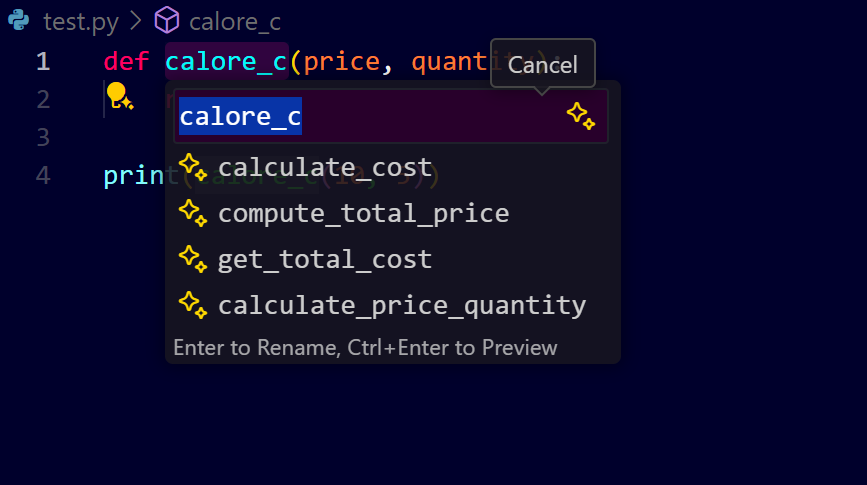
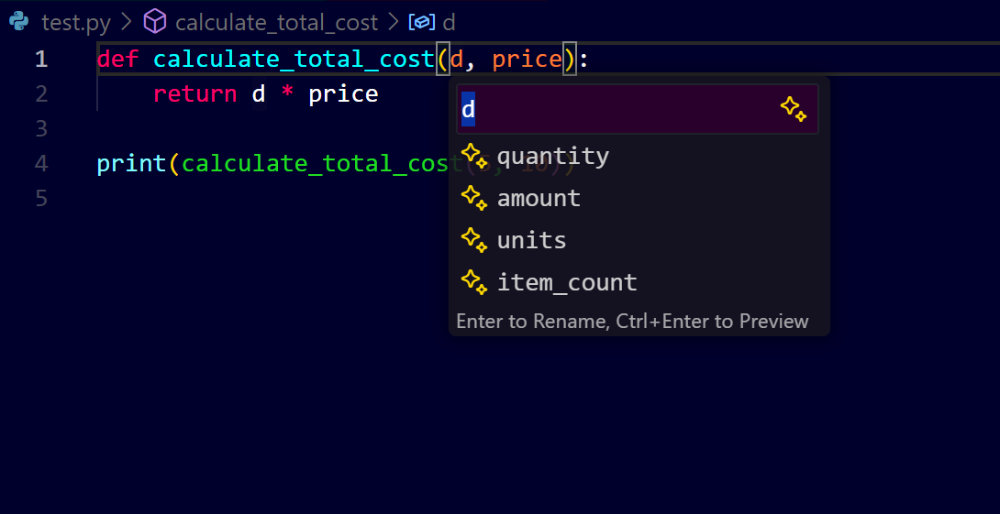
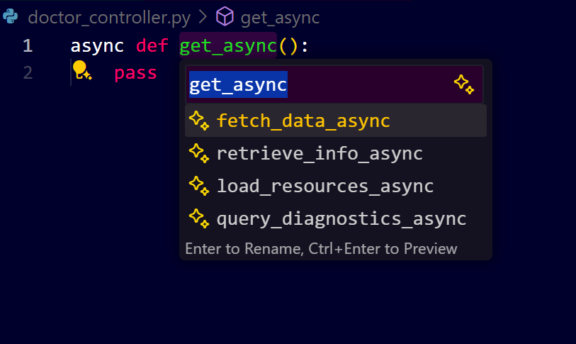
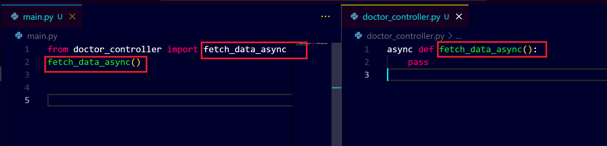

# **GitHub Copilot Smart Renaming Guide**

## **Introduction**

GitHub Copilot can significantly enhance your workflow by making variable and function renaming faster and more efficient. This guide will take you through the step-by-step process of using GitHub Copilot to smartly rename variables and functions in VS Code.

---

## **Prerequisites**

* Installed Visual Studio Code (VS Code).
* Enabled GitHub Copilot extension.
* A GitHub Copilot subscription (free trial or paid).

---

## **Step 1: Setting Up**

1. Open Visual Studio Code.
2. Make sure GitHub Copilot is enabled.
3. Open the project you want to work on.

---

## **Step 2: Renaming Functions Using Copilot**

### **Example 1: Renaming a Function**

* Consider a Python function with a confusing name:

```python
# Before
def calore_c(price, quantity):
    return price * quantity

print(calore_c(10, 5))
```

### **How to Rename:**

1. Place your cursor on the function name `calore_c` in your code editor.
2. Initiate the rename operation by either:
   - Pressing the `F2` key on your keyboard
   - Right-clicking and selecting `Rename Symbol` from the context menu
3. GitHub Copilot will analyze the code and display intelligent suggestions for better function names:
   
   

4. Select the most appropriate function name from the suggestions by clicking on it. The change will be applied across all references to this function in your codebase.

---

## **Step 3: Renaming Variables Using Copilot**

### **Example 2: Renaming a Variable**

* Suppose you have a variable with a vague name:

```python
# Before
def calculate_total_cost(d, price):
    return d * price

print(calculate_total_cost(5, 10))
```

### **How to Rename:**

1. Click on the variable name `d`.
2. Initiate the rename operation by either:
   - Pressing the `F2` key on your keyboard
   - Right-clicking and selecting `Rename Symbol` from the context menu
3. GitHub Copilot will analyze the code and display intelligent suggestions for better variable names:
   
   

4. Select the most appropriate function name from the suggestions by clicking on it.

---

## **Step 4: Renaming Across Multiple Files with Copilot**

### **Example 3: Renaming a Function Across Multiple Files**

* Consider a function `get_async` in `doctor_controller.py` used in another file `main.py`.

```python
# doctor_controller.py
async def get_async():
    pass

# main.py
from doctor_controller import get_async
get_async()
```

### **How to Rename:**

1. Open `doctor_controller.py`.
2. Select `get_async` and press `F2`.
3. Choose a new name, such as `fetch_data_async`.
   

4. In the popup, select **Rename Symbol Across All Files**.
   

---

## **Step 5: Using Copilot Chat for Complex Renaming**

1. If you want to rename a function used in multiple locations without manually navigating, open Copilot Chat.
2. Ask Copilot: "Rename the function `get_async` in `doctor_controller.py` to `get_doctor_details_async` in all files."
3. Copilot will list all locations and apply the rename.

---

## **Step 6: Best Practices**

* Use descriptive names for functions and variables.
* Always review Copilot’s suggestions to ensure accuracy.
* Test the renamed code to ensure no errors occur.

---
## **Conclusion**

GitHub Copilot makes renaming variables and functions efficient and error-free. Explore it to enhance your productivity.
