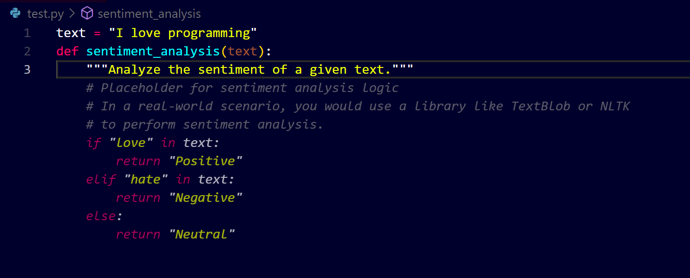
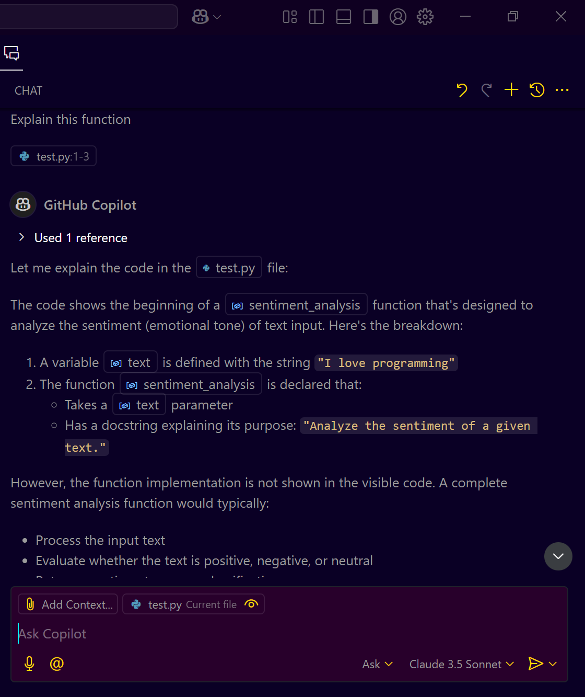
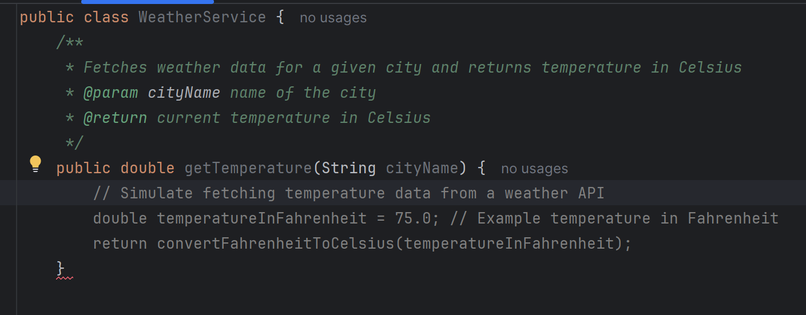

# **GitHub Copilot Free Setup Guide**

## **Introduction**

GitHub Copilot is now available for free for Visual Studio Code (VS Code) and JetBrains users, providing limited access to its AI-powered code completion and chat capabilities. This guide will walk you through the complete process of setting up GitHub Copilot for free in VS Code and JetBrains IDEs, understanding its features, limitations, and exploring it with examples.

---

## **Prerequisites**

* A GitHub account (free account is sufficient).
* Installed Visual Studio Code (VS Code) or any JetBrains IDE (e.g., IntelliJ, PyCharm).
* Stable internet connection.

---

## **Step 1: Understanding GitHub Copilot Free Tier**

### **What GitHub Copilot Free Tier Offers:**

* 2,000 code completions per month.
* 60 chat requests per month.
* Access to two models: `Claude` and `GPT-4`.

### **Limitations:**

* Limited code completions and chat requests.
* Only accessible in VS Code and JetBrains IDEs.

---

## **Step 2: Setting Up GitHub Copilot in VS Code**

### **1. Installing GitHub Copilot Extension**

1. Open VS Code.
2. Go to the Extensions tab (left sidebar).
3. Search for "GitHub Copilot".
4. Click "Install" to add the extension.

### **2. Signing In with GitHub Account**

1. After installation, click "Sign In" in the Copilot sidebar.
2. Use your GitHub account (ensure you are using a free account for free tier access).
3. Authorize GitHub Copilot in the VS Code prompt.

### **3. Verifying Free Tier Activation**

1. Go to `GitHub.com` → `Settings` → `Copilot`.
2. Ensure that "GitHub Copilot Free" is enabled.
3. You will see your usage limits (2,000 code completions and 60 chat requests per month).

---

## **Step 3: Using GitHub Copilot in VS Code**

### **Example 1: Code Completion**

1. Open a Python file in VS Code.
2. Start typing a function definition:

```python
# Example
text = "I love programming"
def sentiment_analysis(text):
    """Analyze the sentiment of a given text."""
    # GitHub Copilot will suggest the rest of the code.
```

3. Copilot will automatically suggest code to complete the function.
   

### **Example 2: Using Copilot Chat**

1. Open the Copilot Chat sidebar.
2. Type a query like "Explain this function" or "Fix this bug".
3. Review the response.
   

---

## **Step 4: Setting Up GitHub Copilot in JetBrains IDE (IntelliJ, PyCharm)**

### **1. Installing GitHub Copilot Plugin**

1. Open IntelliJ IDEA
2. Access the plugins menu:
   - Windows/Linux: `File` → `Settings` → `Plugins`
   - Mac: `IntelliJ IDEA` → `Preferences` → `Plugins`
3. Select the `Marketplace` tab
4. Search for "GitHub Copilot"
5. Click `Install`
6. Click `Restart IDE` when prompted

### **2. Signing In and Configuration**

1. After restart, go to `File` → `Settings` → `GitHub Copilot`
2. Click `Sign in to GitHub`
3. Complete the GitHub authorization process in your browser
4. Return to IntelliJ and verify connection status
5. Configure settings (optional):
   - Enable/disable inline completions
   - Adjust completion delay
   - Set keybindings for next/previous suggestions

---

### **3. Using GitHub Copilot in IntelliJ**

### **Example 1: IntelliJ Code Completion Example**

1. Create a new Java file in IntelliJ.
2. Start typing this example code:

```java
public class WeatherService {
    /**
     * Fetches weather data for a given city and returns temperature in Celsius
     * @param cityName name of the city
     * @return current temperature in Celsius
     */
    public double getTemperature(String cityName) {
        // GitHub Copilot will suggest implementation
    }
}
```

3. Copilot will suggest code completion, including:
   

   - API integration   
   - Error handling
   - Temperature conversion logic
   - Return value handling

4. Basic Code Completion:
   - Start typing code normally
   - View suggestions in gray text
   - Press `Tab` to accept suggestions
   - Press `Alt + ]` or `Alt + [` to cycle through suggestions

5. Copilot Chat Usage:
   - Open Copilot tool window: `View` → `Tool Windows` → `GitHub Copilot`
   - Type your questions in the chat interface
   - Use commands like `/explain`, `/fix`, `/tests` for specific actions

6.  Keyboard Shortcuts:
   - Accept suggestion: `Tab`
   - Next suggestion: `Alt + ]`
   - Previous suggestion: `Alt + [`
   - Dismiss suggestion: `Esc`
   - Open Copilot Chat: `Alt + C` (customizable)

---

### **4. Troubleshooting IntelliJ Setup**

1. If plugin doesn't appear:
   - Verify you're using IntelliJ 2023.1 or later
   - Check internet connection
   - Try manual plugin download from JetBrains Marketplace

2. If authentication fails:
   - Clear browser cookies
   - Try signing out and back into GitHub
   - Verify GitHub account has Copilot access

3. If suggestions don't appear:
   - Check if Copilot is enabled in settings
   - Verify file type is supported
   - Try restarting IntelliJ

---

## **Step 5: Advanced Usage Tips**

### **1. Optimizing Code Suggestions**

* Use clear and descriptive function names for better suggestions.
* Use inline comments to guide Copilot on what to suggest.

### **2. Managing Your Free Tier Limits**

* Regularly monitor your usage in GitHub settings.
* Plan your usage to avoid running out of completions or chat requests.

### **3. Comparing Free vs Pro Versions**

* Free Tier: 2,000 completions, 60 chats.
* Pro Tier: Unlimited completions and chats, access to more features.

---

## **Conclusion**

GitHub Copilot Free Tier is an excellent way to experience AI-powered coding assistance in VS Code and JetBrains IDEs. Set it up, explore its capabilities, and enhance your productivity.
