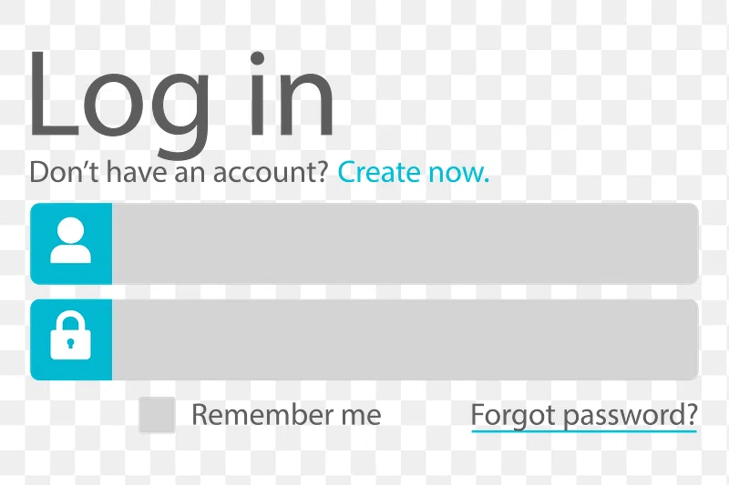

# **GitHub Copilot Vision Extension for Image-Based Code Generation Guide**

## **Introduction**

GitHub Copilot Vision Extension is a powerful tool that allows you to generate HTML, CSS, and JavaScript code directly from an image of a design. This guide will walk you through the complete process of using the Vision Extension in Visual Studio Code (VS Code), from setup to advanced customization.

---

## **Prerequisites**

* A GitHub account (free or paid).
* Installed Visual Studio Code (VS Code).
* GitHub Copilot Extension installed and authorized.
* Stable internet connection.

---

## **Step 1: Setting Up GitHub Copilot Vision Extension**

### **1. Installing GitHub Copilot Extension**

1. Open VS Code.
2. Go to the Extensions tab (left sidebar).
3. Search for "GitHub Copilot".
4. Click "Install" to add the extension.

### **2. Enabling Vision Extension**

1. Go to GitHub Copilot settings in VS Code.
2. Ensure the "Vision" extension is enabled.
3. Adjust any settings as needed (e.g., response length).

---

## **Step 2: Generating Code from Image Designs**

### **Example 1: Simple Login Page**

1. Prepare your design image (e.g., `login_page.png`).
   

2. Drag and drop the image into the Vision Extension window in VS Code.
3. Use the prompt:
   
   ```
   Generate HTML, CSS, and JavaScript code for the attached login page design.
   ```
   

4. Copilot will generate:
   

   * HTML structure (e.g., form fields, buttons).
   * CSS styles (e.g., colors, fonts, layout).
   * JavaScript (e.g., validation, interactivity).
   
5. Created Login Page using copilot:
   

### **Example 2: Complex Web Design with Cards**

1. Drag and drop `menu_order.png` (a complex design with cards).
   
   
2. Use the prompt:

   ```
   Generate HTML, CSS, and JavaScript code for the attached card design. Use placeholder images and maintain the color scheme.
   ```
3. Review and copy the generated code into respective files.
   

4. Created menu order card using copilot:
   
   
---

## **Step 3: Customizing Generated Code with Copilot**

### **Fine-Tuning Layout and Styles**

* To change alignment, use the prompt:

  ```
  Adjust the CSS to vertically center the main content and change button colors to orange.
  ```
* To adjust text alignment in a section:

  ```
  Make the title left-aligned and the menu items right-aligned.
  ```

### **Transforming Components**

* For buttons to be converted into links:

  ```
  Replace the "Order" button with a link and center it.
  ```

---

## **Step 4: Best Practices**

* Always use high-resolution design images for accurate code generation.
* Use descriptive prompts for precise results.
* Regularly test generated code using Live Server in VS Code.
* Use Copilot’s multi-edit feature for bulk changes.

---

## **Conclusion**

GitHub Copilot Vision Extension simplifies the process of transforming design images into functional code. Mastering its usage will save you time and enhance your development workflow. 