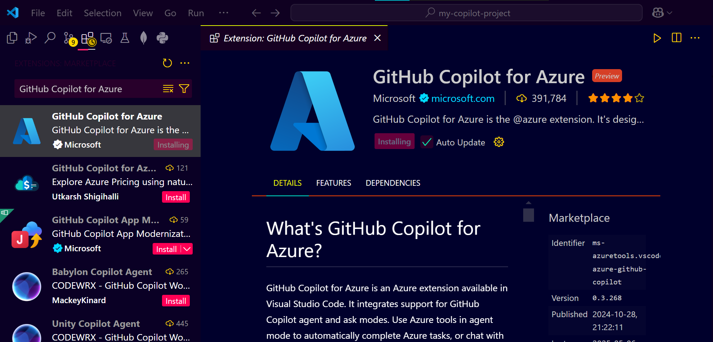
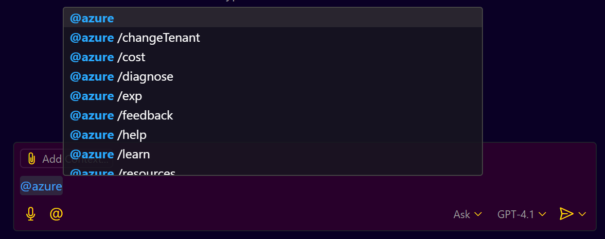
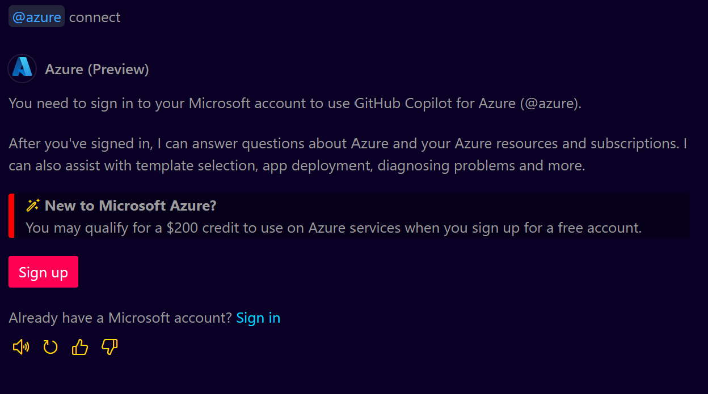
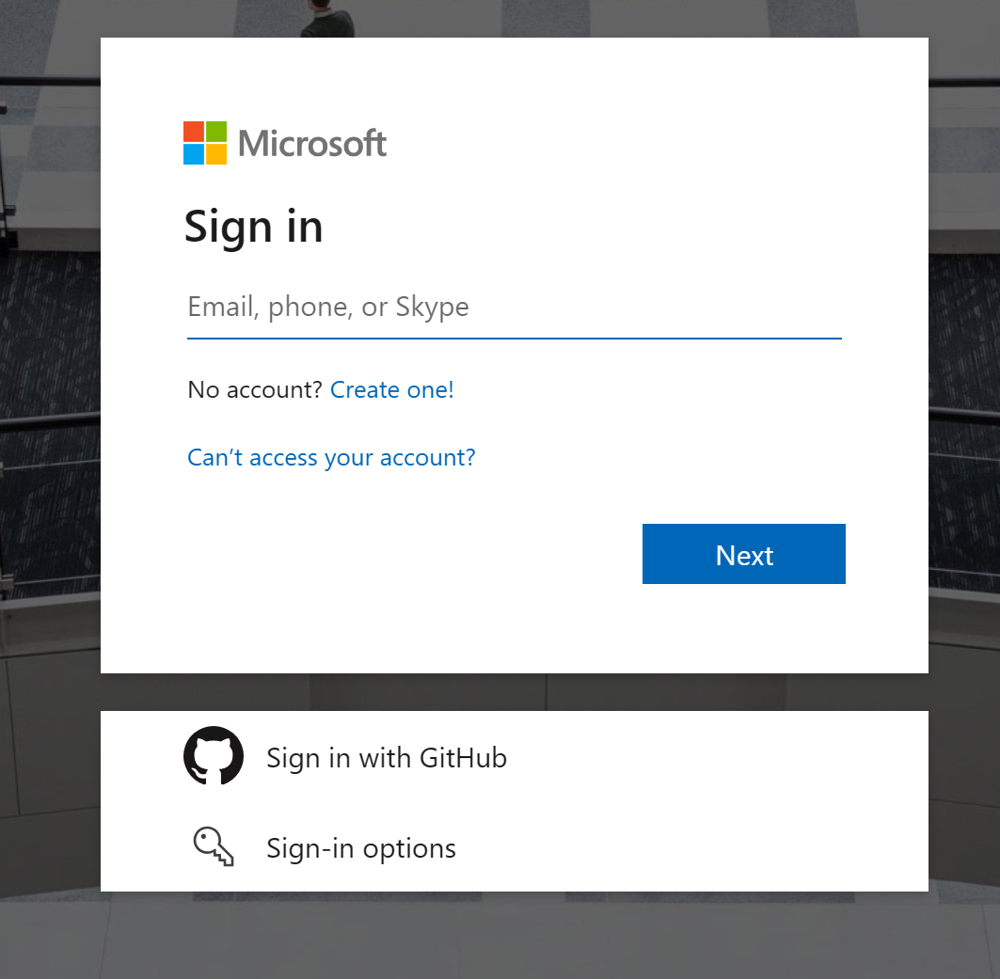

# **GitHub Copilot for Azure Extension Guide**

## **Introduction**

GitHub Copilot for Azure Extension is a powerful tool that allows developers to manage Azure resources directly from their Visual Studio Code (VS Code) environment. This guide will walk you through the installation, usage, and advanced features of this extension with clear examples and explanations.

---

## **1. Prerequisites**

* **Visual Studio Code (VS Code)** installed.
* **GitHub Copilot License** (either personal or organization-based).
* **Azure Account** with active subscription.

---

## **2. Installing GitHub Copilot for Azure Extension**

1. **Open VS Code**.
2. Go to the Extensions tab (Shortcut: `Ctrl + Shift + X`).
3. Search for "GitHub Copilot for Azure".
4. Click the Install button.
   

5. After installation, ensure you are signed in with your GitHub account.

### **Example**

If you are unable to find the extension, ensure you are searching in the VS Code Marketplace, not the GitHub Marketplace.

---

## **3. Connecting GitHub Copilot to Azure Subscription**

1. After installation, open the Copilot Chat panel (`Ctrl + Shift + P` -> "GitHub Copilot: Open Copilot Chat").
   

2. Use the command `@azure connect`.
   

3. Sign in to your Azure account when prompted.
   

4. Verify that your Azure subscription is connected.

### **Example**

If you have multiple subscriptions, you can select the desired one using `@azure change subscription`.

---

## **4. Understanding Azure Developer CLI (AZD) and Azure CLI (AZ)**

* **Azure CLI (AZ)**: Primarily used for provisioning and managing Azure resources.
* **Azure Developer CLI (AZD)**: Focused on application lifecycle management (development, deployment, and removal).

### **Key Differences:**

| Feature         | Azure CLI (AZ)        | Azure Developer CLI (AZD)    |
| --------------- | --------------------- | ---------------------------- |
| Purpose         | Resource management   | Application lifecycle        |
| Commands Prefix | az                    | azd                          |
| Use Case        | Create VM, Manage AKS | Deploy web apps, manage apps |

### **Example 1: Learning About Azure Services**

#### **Prompt:**

`@azure learn about Azure services`

#### **Copilot Suggestion:**

* Provides a list of Azure services, including AI, Compute, Storage, Networking, and more.

### **Example 2: Creating an Azure Kubernetes Service (AKS) Cluster**

#### **Prompt:**

`@azure provision an AKS cluster with 5 nodes and ingress controller`

#### **Copilot Suggestion:**

* Generates Azure CLI (`az`) commands for creating the AKS cluster.

---

## **5. Using Azure Developer CLI (azd)**

Azure Developer CLI (azd) is a tool for managing Azure resources from a developer perspective.

### **Difference between `az` and `azd`**

* `az`: General-purpose Azure CLI for provisioning resources.
* `azd`: Developer-centric CLI for app lifecycle management (deploying, updating, deleting).

### **Example 1: Initializing an Azure Application**

#### **Prompt:**

`@azure deploy a chat vision app`

#### **Copilot Suggestion:**

* Generates `azd init` and `azd up` commands to initialize and deploy the application.

---

## **6. Deploying AI Applications Using Azure Templates**

### **Step 1: Initialize AI Application**

* Use the command: `@azure deploy a chat vision app`
* Copilot provides a list of templates.

### **Step 2: Modify and Deploy**

* Use the command: `@azure deploy using azd`.
* Copilot will provide the `azd up` command.

### **Step 3: Test the Application**

* Open the deployed URL and interact with the AI application.

---

## **7. Managing Costs with Azure Extension**

### **Example Prompt:**

`@azure cost of subscription <subscription-id> for December`

#### **Copilot Suggestion:**

* Provides a detailed cost breakdown for the specified subscription.

---

## **8. Troubleshooting with GitHub Copilot for Azure**

### **Diagnosing Issues**

#### **Prompt:**

`@azure diagnose my web app for issues`

#### **Copilot Suggestion:**

* Provides insights or possible fixes for the specified resource.

### **Example: Fetching Resource Details**

#### **Prompt:**

`@azure list my storage accounts`

#### **Copilot Suggestion:**

* Displays all storage accounts in your subscription.

---

## **9. Cleaning Up Azure Resources**

### **Example Prompt:**

`@azure take down my deployed app`

#### **Copilot Suggestion:**

* Provides the `azd down` command to remove the app and associated resources.

---

## **10. Best Practices and Tips**

* Always review Copilot’s suggested commands before executing.
* Use `@azure` to invoke Copilot for Azure-specific tasks.
* Familiarize yourself with Azure CLI and Azure Developer CLI for more control.

---

## **Conclusion**

This guide has provided a detailed walkthrough for using GitHub Copilot for Azure Extension. With these skills, you can efficiently manage, deploy, and troubleshoot Azure resources directly from VS Code. Feel free to explore further and customize the commands as needed.
