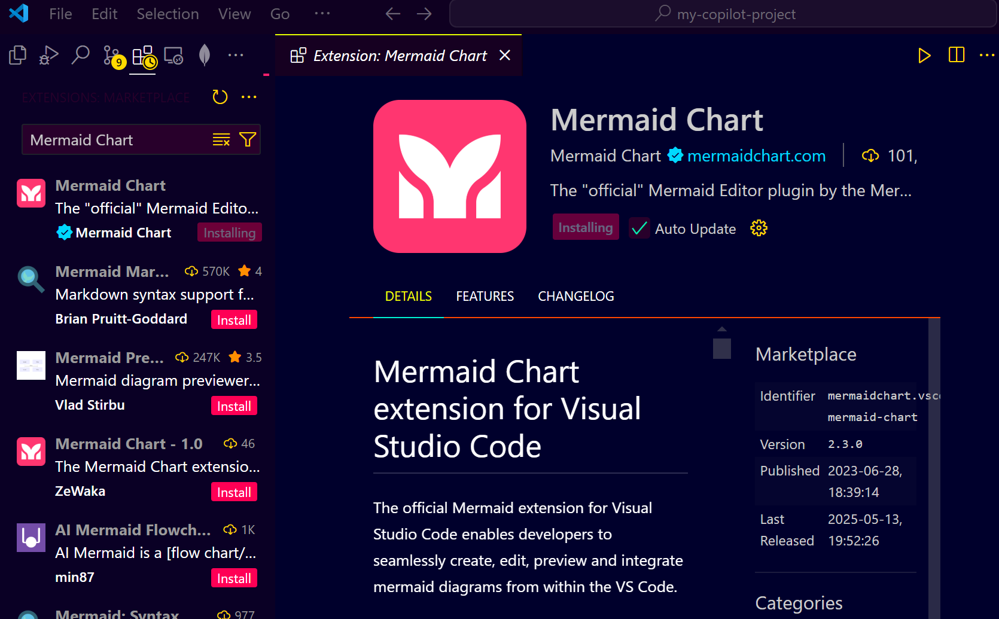
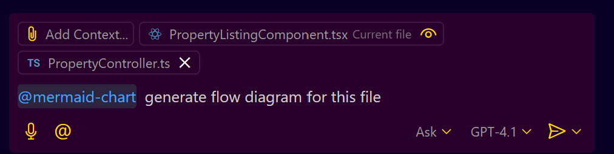
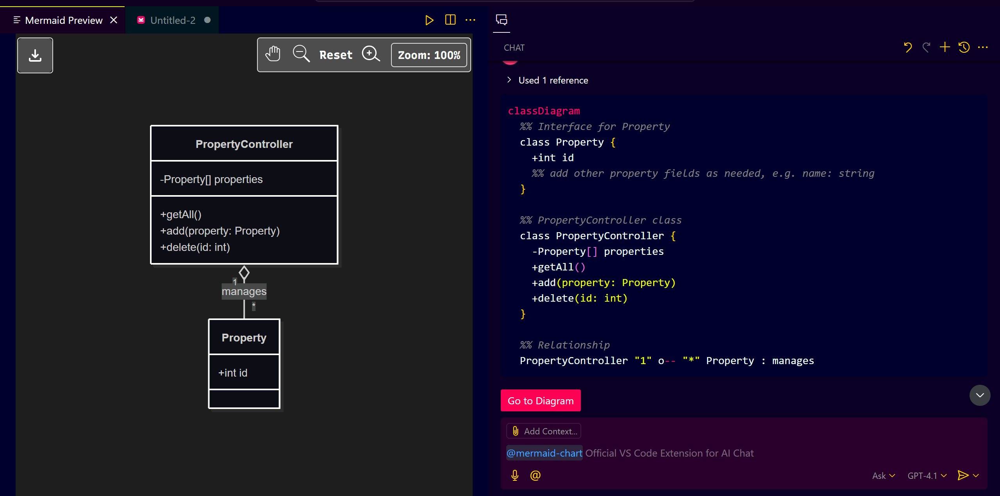
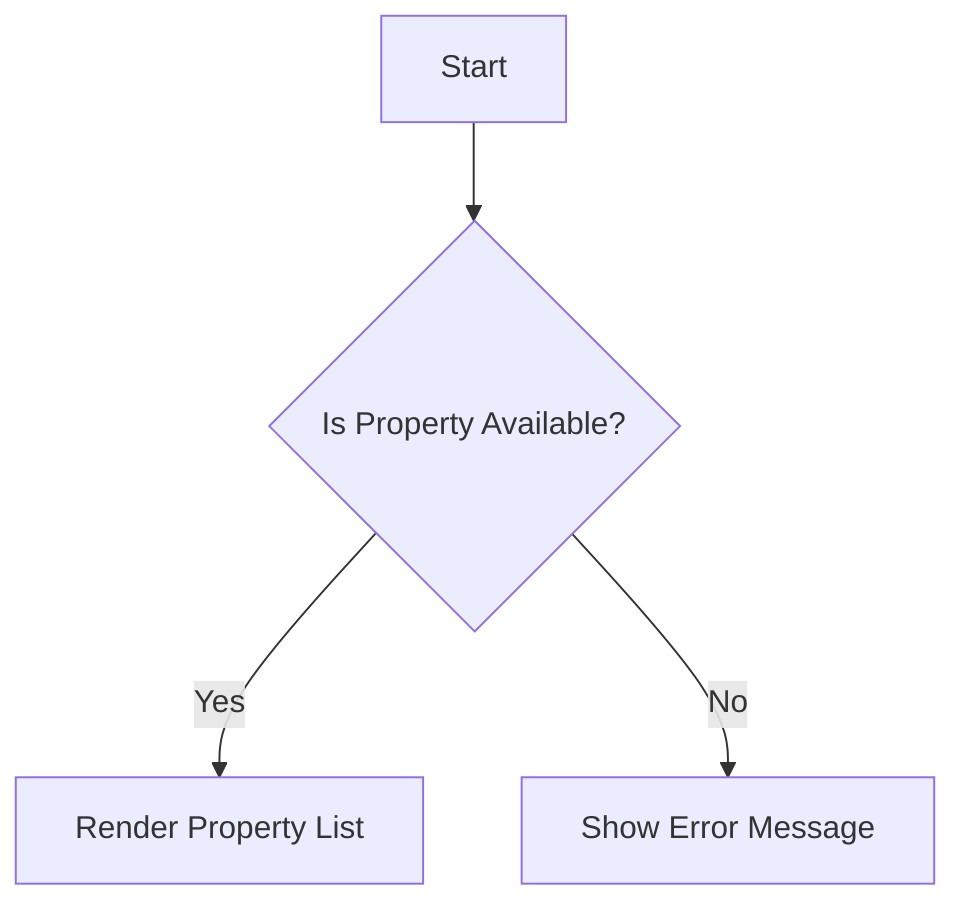
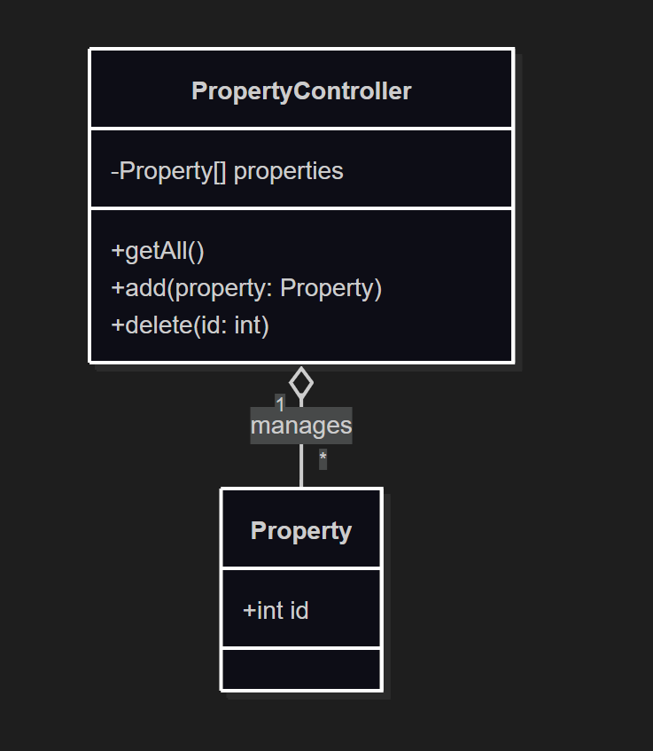
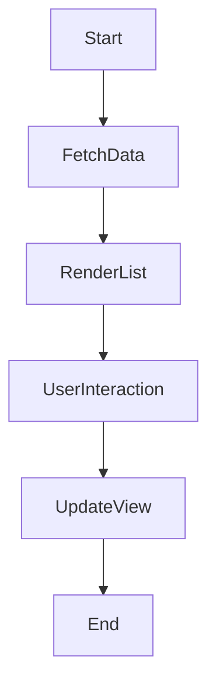

# **Step-by-Step Guide to Using GitHub Copilot Mermaid Chart Extension**

## **Understand Mermaid and GitHub Copilot Basics**

* **Mermaid** is a tool that lets you create diagrams (flowcharts, class diagrams, sequence diagrams, etc.) using simple code syntax.
* **GitHub Copilot** can assist you by generating Mermaid diagram code based on your source files or prompts.
* The **Mermaid Chart extension** is a GitHub App integration that helps generate and visualize Mermaid diagrams directly in GitHub repositories or compatible editors.

---

## **Install the Mermaid Chart Extension from GitHub Marketplace**

* Go to **GitHub Marketplace** ([https://github.com/marketplace](https://github.com/marketplace))
* Search for **Mermaid Chart** extension.
* Click **Install** and authorize the extension for your GitHub account or organization.
  

* Once installed, you should see **Mermaid Chart** listed under your authorized GitHub apps (`https://github.com/settings/apps`).
---

## **Use the Mermaid Chart Extension with GitHub Copilot**

### **Example: Generate Mermaid Diagrams from Your Code Files**

#### **a. Prepare your code file to analyze**

* Choose a file like a React component, TypeScript, or a controller file in your repo.
* For example, a `PropertyController.ts` or `PropertyListingComponent.tsx`.

**PropertyController.ts**

```
interface Property {
  id: number;
  // add other property fields as needed, e.g. name: string;
}

class PropertyController {
  properties: Property[] = [];

  getAll() {
    return this.properties;
  }

  add(property: Property) {
    this.properties.push(property);
  }

  delete(id: number) {
    this.properties = this.properties.filter(p => p.id !== id);
  }
}
```

**PropertyListingComponent.tsx**
```
import React, { useState, useEffect } from 'react';

type Property = { id: number; title: string };

const PropertyListingComponent = () => {
  const [properties, setProperties] = useState<Property[]>([]);

  useEffect(() => {
    setProperties([{ id: 1, title: 'Home' }, { id: 2, title: 'Office' }]);
  }, []);

  return (
    <ul>
      {properties.map((p: Property) => (
        <li key={p.id}>{p.title}</li>
      ))}
    </ul>
  );
};

export default PropertyListingComponent;
```

#### **b. Use a comment prompt to trigger Mermaid Chart**

Add a comment in your file or in a Markdown file, use the special Copilot extension prompt:



```plaintext
@mermaid-chart generate flow diagram for this file
```

or

```plaintext
@mermaid-chart generate class diagram for PropertyController.ts
```
#### **c. How to Open Mermaid Diagram in Preview in VS Code**
**Open the Markdown Preview**
  * Open the Markdown file containing your Mermaid code.
  * Right-click in the editor and select **"Open Preview"** or press `Ctrl+Shift+V`.
  * If using the Mermaid Preview extension, you may also see a **"Preview Mermaid Diagram"** button above the code block or in the editor title bar—click it to open the diagram preview.

**Edit and View Live Updates**
  * As you edit the Mermaid code, the preview updates automatically.
  * You can split the editor (`Ctrl+\`) to see code and preview side by side.

> **Tip:** For more features, refer to the extension's documentation in the VS Code Marketplace.


#### **d. Copilot provides code and creates a Mermaid class diagram**



---

## **Ask Copilot to Generate the Diagram Code**

### **Prompts to use for diagram generation:**

* **Flow Diagram:**

```plaintext
@mermaid-chart generate flow diagram for PropertyListingComponent.tsx
```

* **Class Diagram:**

```plaintext
@mermaid-chart generate class diagram for PropertyController.ts
```

* **Sequence Diagram:**

```plaintext
@mermaid-chart generate sequence diagram for PropertyDetailsComponent.tsx
```

---

## **6. View and Edit the Generated Diagram**

* After Copilot generates the Mermaid code, you can copy it into a Markdown (`.md`) file or directly view it using Mermaid playground tools.
* To view or edit the diagram, go to [Mermaid Live Editor](https://mermaid-js.github.io/mermaid-live-editor/).
* Paste the Mermaid code to see the rendered diagram.
* You can modify the code here and see live updates.

---

## **7. Iterate by Modifying Mermaid Code**

* If you want to add nodes, relationships, or styles, you can edit the Mermaid code.
* Example snippet of Mermaid flowchart syntax generated:



* Modify this code to add or remove steps.
  
**Output**


---

## **8. Bring Edited Diagram Back to Your Codebase**

* After editing in Mermaid playground, copy updated code.
* Paste it back into your Markdown documentation or code comments.
* The Mermaid Chart extension or GitHub Markdown will render the diagram in your repository README or docs.

---

## **9. Summary of Workflow**

| Step | Action                                    | Command/Prompt Example                                                                                 |
| ---- | ----------------------------------------- | ------------------------------------------------------------------------------------------------------ |
| 1    | Install Mermaid Chart extension           | From GitHub Marketplace                                                                                |
| 2    | Connect extension to repo                 | Authorize access                                                                                       |
| 3    | Open code file                            | Open `.ts` or `.tsx` file in repo                                                                      |
| 4    | Add Mermaid prompt comment                | `@mermaid chart generate flow diagram for this file`                                                   |
| 5    | Let Copilot generate Mermaid code         | Copilot auto completes Mermaid diagram code                                                            |
| 6    | Copy Mermaid code to Mermaid playground   | [https://mermaid-js.github.io/mermaid-live-editor/](https://mermaid-js.github.io/mermaid-live-editor/) |
| 7    | Edit diagram and review                   | Live preview and tweak code                                                                            |
| 8    | Paste updated Mermaid code back into docs | Render diagram in Markdown or repo                                                                     |

---

## **Additional Tips**

* You don't always need the Mermaid Chart extension; GitHub Copilot can generate Mermaid code from plain comments.
* Mermaid supports many diagram types: flowcharts, class diagrams, sequence diagrams, gantt charts, etc.
* Use Mermaid syntax docs here for advanced customizations: [https://mermaid-js.github.io/mermaid/#/](https://mermaid-js.github.io/mermaid/#/)

---

## **Sample Copilot Prompt and Result**

### **Prompt:**

```plaintext
// @mermaid-chart generate flowchart for this function

function processPropertyListing() {
  // ...
}
```

### **Copilot Completion (Example):**



