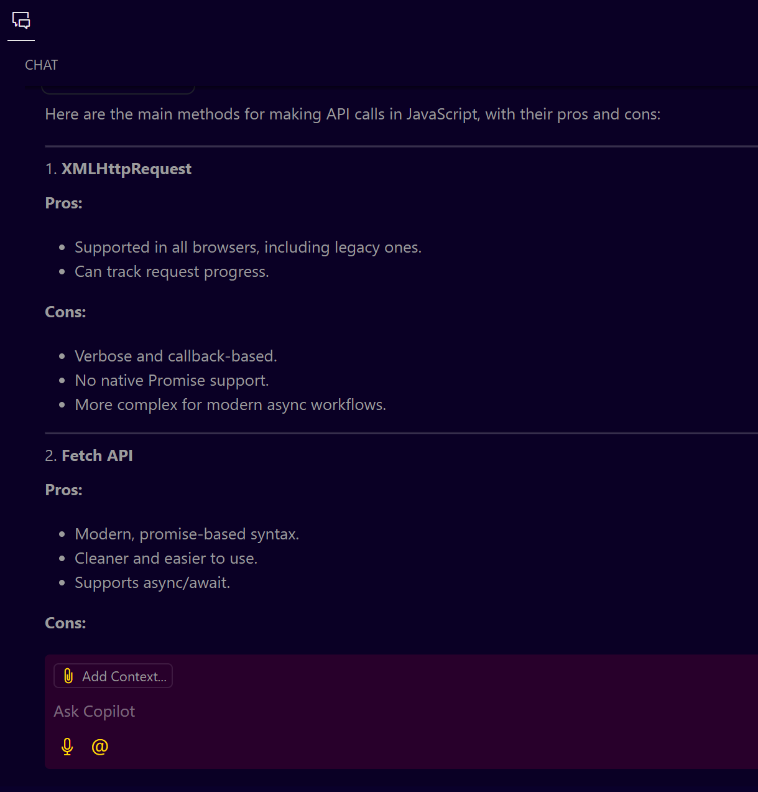
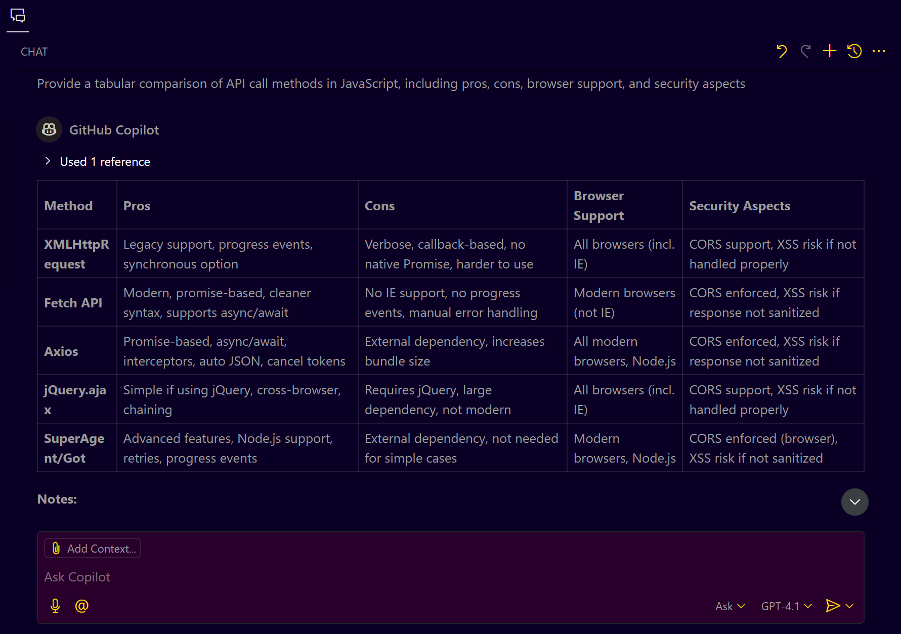
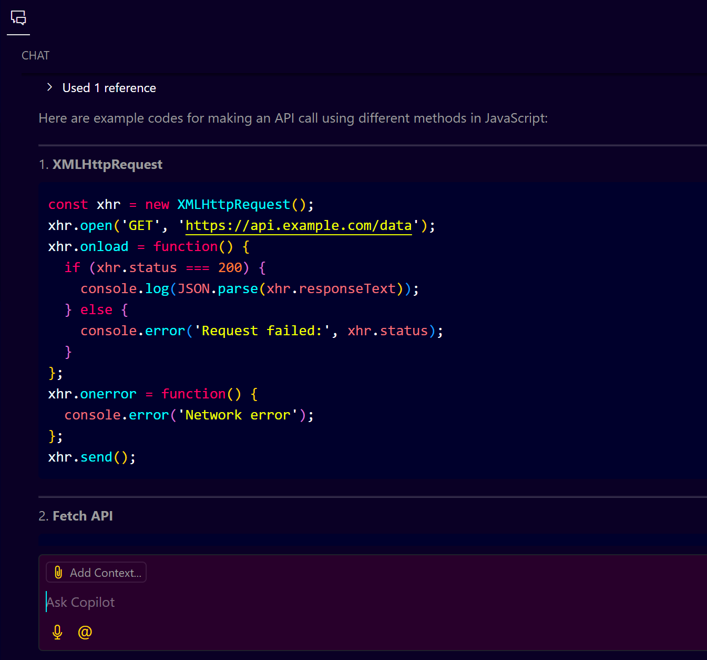
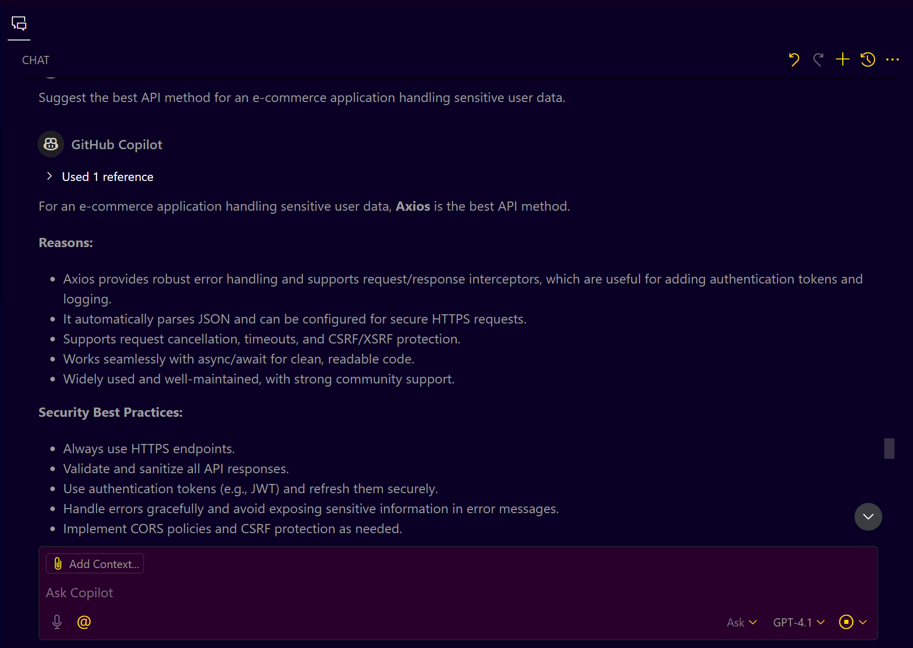
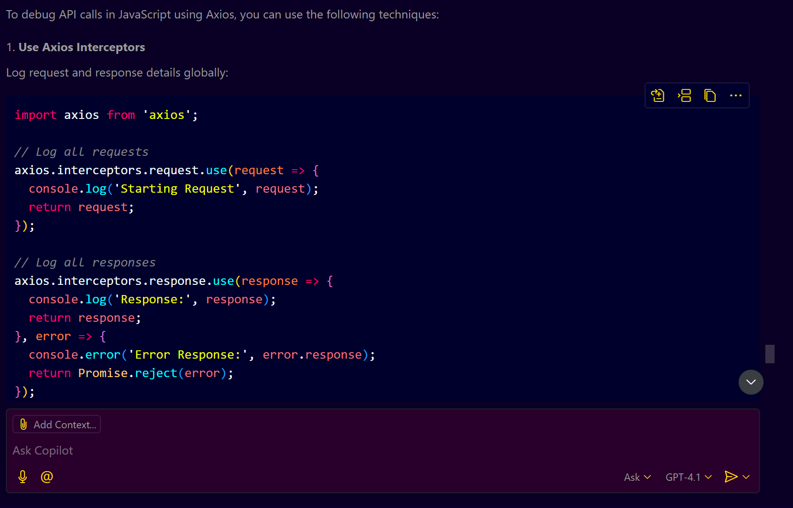
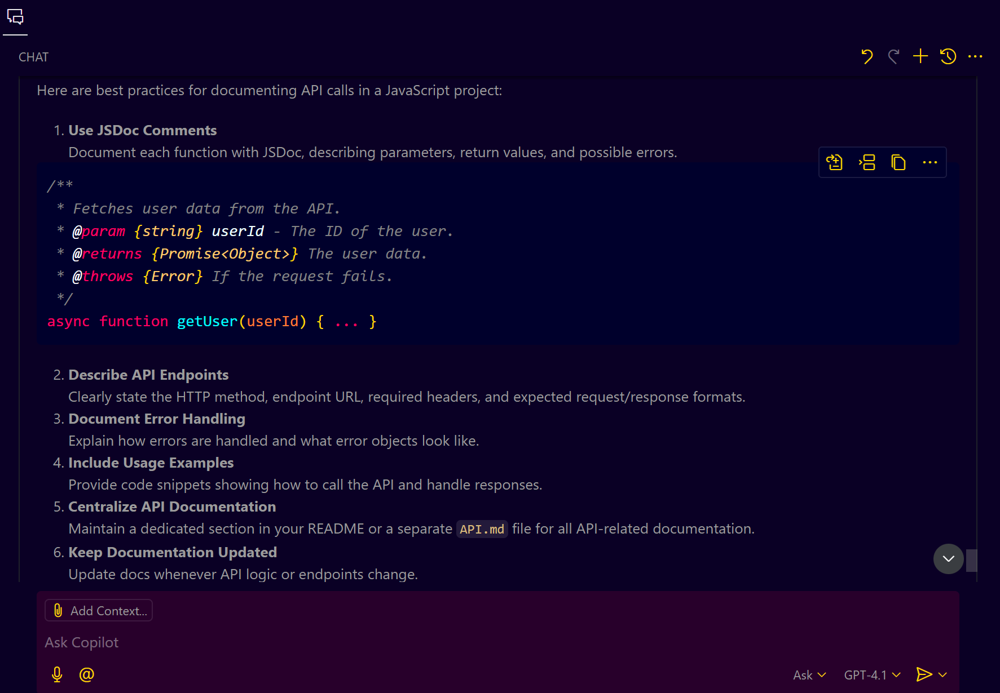

# **Mastering API Calls in JavaScript with GitHub Copilot**

## **Introduction**

GitHub Copilot is a powerful AI-powered code completion tool that can assist you in mastering various programming concepts, including making API calls in JavaScript. This guide provides a detailed, step-by-step walkthrough of how to effectively use GitHub Copilot to learn, understand, and implement API calls in JavaScript.

### **What You Will Learn**

* Different methods of making API calls in JavaScript.
* Advantages and disadvantages of each method.
* Practical implementation examples.
* How to use GitHub Copilot to enhance your understanding.

---

## **Prerequisites**

* Basic knowledge of JavaScript.
* Access to GitHub Copilot in VS Code.
* A working internet connection.

---

## **Step 1: Understanding Different API Methods in JavaScript**

Start by asking GitHub Copilot to list various methods for making API calls in JavaScript. Use the following prompt in your VS Code:

**Prompt:**
```plain text
List the different methods for making API calls in JavaScript along with their pros and cons.
```

### **Expected Response**

**GitHub Copilot lists the following methods:**



---

## **Step 2: Analyzing Each Method**

Next, ask Copilot to provide a detailed comparison of these methods, including their pros and cons, in a tabular format.

**Prompt:**
```plain text
Provide a tabular comparison of API call methods in JavaScript, including pros, cons, browser support, and security aspects
```

**Copilot Response** 


---

## **Step 3: Practical Code Examples**

Request GitHub Copilot to generate sample code for each API method.

**Prompt:**
```plain text
Provide example code for making an API call using XMLHttpRequest, Fetch API, Axios, and other methods.
```

**Copilot Response** 


---

## **Step 4: Selecting the Best Method for Your Project**

Use GitHub Copilot to help you decide which API method is best suited for your specific project type (e.g., e-commerce, healthcare).

**Prompt:**
```plain text
Suggest the best API method for an e-commerce application handling sensitive user data.
```

**Copilot Response** 

GitHub Copilot recommends Axios for its security, ease of use, and enhanced error handling capabilities.


---

## **Step 5: Debugging API Calls**

Ask GitHub Copilot to suggest debugging strategies for API calls.

**Prompt:**
```plain text
How can I debug API calls in JavaScript using Axios?
```

**Copilot Response** 


* Use console logging.
* Utilize Axios interceptors for request/response logging.
* Debug with browser developer tools.

---

## **Step 6: Documenting Your API Integration**

Request Copilot to suggest best practices for documenting API calls in your JavaScript project.

**Prompt:**
```plain text
What are the best practices for documenting API calls in a JavaScript project?
```

**Copilot Response** 


* Use JSDoc for code comments.
* Maintain a README file with API usage details.
* Use Swagger for API documentation.

---

## **Step 7: Exploring Further with Copilot**

Finally, enable follow-up suggestions in GitHub Copilot settings for continuous learning.

**How to Enable:**

1. Go to VS Code settings.
2. Search for GitHub Copilot.
3. Enable "Always provide follow-up questions."

---

## **Conclusion**

By following this guide, you have mastered how to efficiently use GitHub Copilot to learn, understand, and implement API calls in JavaScript. Explore more and continue learning with GitHub Copilot.
