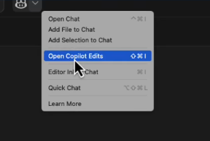
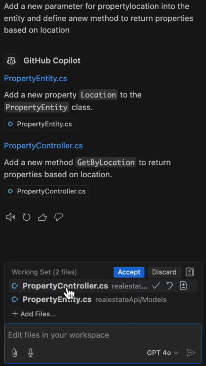
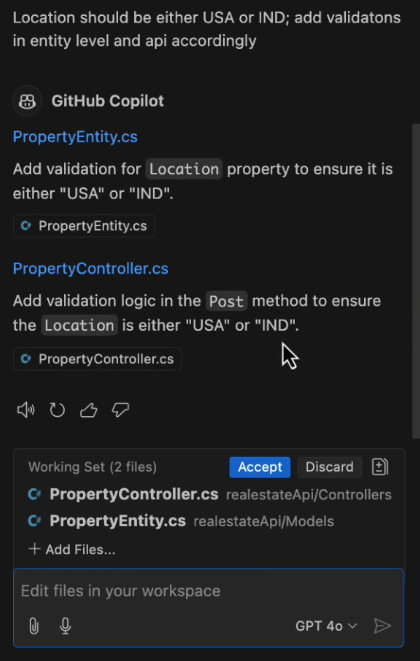
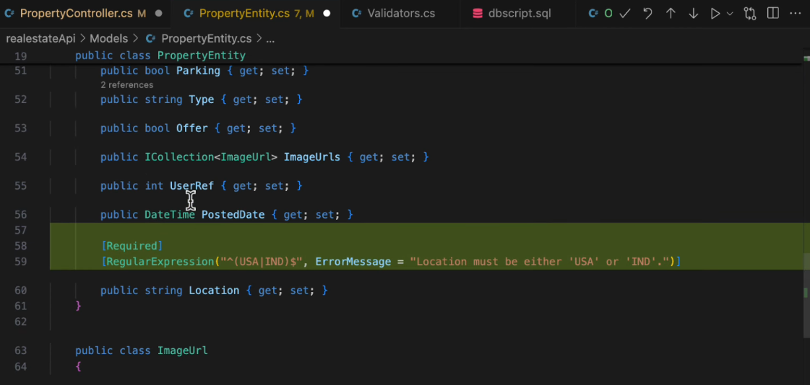
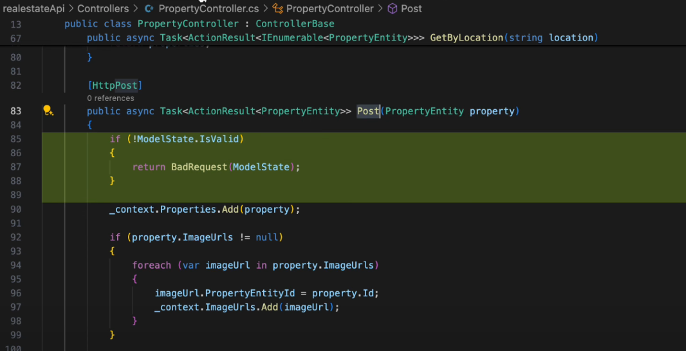

# **GitHub Copilot Multi-File Edits: A New AI-Powered Editing Experience**

## **Introduction**

GitHub Copilot now offers a powerful multi-file editing feature, allowing you to efficiently modify multiple files at once based on your requirements. This guide provides a detailed walkthrough of how to leverage this feature, with practical examples and prompts.

---

## **Understanding Multi-File Edits**

* **What are Multi-File Edits?**
  Multi-File Edits (also known as Copilot Edits) enable you to make simultaneous changes across multiple files in your project using GitHub Copilot.

* **How to Access Multi-File Edits:**

  * From the Copilot Menu:
    * Click on the Copilot menu at the top of VS Code.
    * Select "Open Copilot Edits."
  
  * From the Chat Interface:
    * Click on the "Copilot Edits" icon at the top.
      

---

## **Scenario 1: Editing Property Controller and Entity**

### **Step 1: Add Required Files**

* Ensure that the "Property Entity" and "Property Controller" files are open.
* Use the Copilot Edits menu to add these files for simultaneous editing.

### **Step 2: Define the Change**

* Request Copilot to **"Add a new field 'location' in Property Entity"** and **"Add a new method in Property Controller to fetch properties based on location."**

### **Step 3: Review Changes**

* **Property Entity:**
  
  * A new field "location" will be added to the entity.
  * Constructors will be updated to include "location."

* **Property Controller:**
  
  
  * A new method "getPropertiesByLocation" will be added.

### **Step 4: Accept or Discard Changes**

* Review the suggested changes.
* Accept if they are correct, or discard and re-prompt for modifications.

---

## **Scenario 2: Adding Validation to Fields**

### **Step 1: Define Validation Requirement**

* Specify that the "location" field should only accept values "USA" or "India."

### **Step 2: Review Validation Changes**

* **Property Entity:**
  
  * A validation attribute is added to restrict the "location" field values.
  
* **Property Controller:**
  
  * The "POST" method will validate the location field before processing.

### **Step 3: Undo and Redo Changes**

* Use the "Undo" option to revert changes if needed.
* Use "Redo" to re-apply the changes.

---

## **Scenario 3: Generating Owner Controller with Validations**

### **Step 1: Add Files**

* Include "DB Script," "Property Entity," "Owner Controller," and "Validators.cs" files.

### **Step 2: Request Copilot to Generate Code**

* Ask Copilot to **"Generate Owner Entity and API methods in Owner Controller with validations for email and phone number."**

### **Step 3: Review Generated Code**

* Owner Entity will be generated in Property Entity.
* Owner Controller will include GET, POST, PUT methods.
* Validations will be applied in the Validators file.

### **Step 4: Refine Validations**

* Request Copilot to move all validations from the entity to "Validators.cs."
* Review and accept changes.

---

## **Key Features and Best Practices**

* **Undo and Redo:** Quickly revert changes without manually removing code.
* **Context Awareness:** Copilot maintains context, understanding related changes across files.
* **Efficient Workflows:** Simultaneously edit multiple files with a single prompt.

---

## **Practical Use Cases**

* Adding new fields to entities and updating corresponding controllers.
* Implementing field validations using a separate validator file.
* Generating complete controllers for new entities.

---

## **Conclusion**

GitHub Copilot Multi-File Edits significantly enhances productivity by allowing you to make consistent changes across multiple files at once. Use this guide to explore this feature and integrate it into your development workflow.
