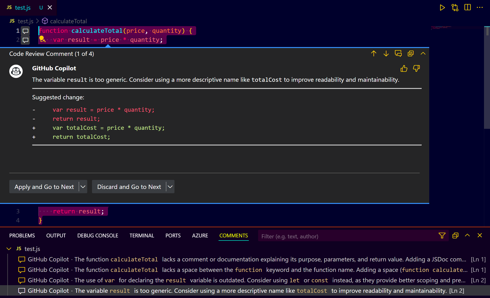

# **GitHub Copilot Code Review in VS Code - Step-by-Step Guide**

## **Introduction**

GitHub Copilot's Code Review feature in Visual Studio Code (VS Code) provides an AI-powered approach to reviewing code changes. This guide will help you understand how to use this feature effectively to enhance code quality.

## **Prerequisites**

* Install Visual Studio Code (VS Code).
* Install GitHub Copilot extension in VS Code.
* Ensure you have a GitHub account linked to Copilot.

## **Types of Code Review with GitHub Copilot**

### **Selection-Based Code Review**

* Select a portion of your code in VS Code.
* Right-click and choose "Copilot Review and Comment".
* GitHub Copilot will analyze the selected code and provide feedback.
* Review comments appear inline, and you can choose to:

  * **Apply suggestions** directly.
  * **Discard suggestions**.
  * **Move to the next suggestion**.

### **Source Control Code Review**

* Make changes to your code files in VS Code.
* Go to the Source Control tab.
* If changes are staged or committed, you will see the Copilot Review icon.
* Click the icon to initiate a review for all changes.
* GitHub Copilot will analyze the code changes and suggest improvements.

## **How to Use GitHub Copilot Code Review**

### **Step 1: Select Code for Review**

* Open any code file in VS Code.
* Highlight the portion of the code you want to review.
* Right-click and choose "Copilot Review and Comment".

#### **Example Prompt:**

"Review this function for best practices and potential improvements."

### **Step 2: Apply or Discard Suggestions**

* Review each suggestion provided by Copilot.
* Use the "Apply" button to implement the suggested change.
* Use the "Discard" button to skip the suggestion.
* Continue until all suggestions are reviewed.

#### **Example:**

**Original Code:**

```javascript
function calculateTotal(price, quantity) {
    var result = price * quantity;
    return result;
}
```

**Copilot Suggestion:**




**Updated Code:**

```javascript
/**
    const totalCost = price * quantity;
 * @param {number} price - The price of a single item.
 * @param {number} quantity - The number of items.
 * @returns {number} The total cost.
 */
function calculateTotal(price, quantity) {
    var totalCost = price * quantity;
    return totalCost;
}
```

### **Step 3: Review Changes from Source Control**

* Save your code changes.
* Go to the Source Control tab.
* Click the Copilot Review icon.
* Review and apply the suggested changes for all modified files.

### **Example Prompt:**

"Review all modified files for code quality improvements."

## **Tips for Effective Code Review**

* Prioritize reviewing critical code sections (business logic, security, API calls).
* Use descriptive variable names based on Copilot’s feedback.
* Refactor code based on Copilot’s best practices.
* Regularly review code changes before committing.

## **Advanced Usage**

* Use the Command Palette (Ctrl+Shift+P) and type "Copilot Review" for quick access.
* Customize review criteria by setting coding instructions in your repository settings (Enterprise only).

## **Conclusion**

GitHub Copilot’s Code Review feature is a powerful tool for improving code quality and catching potential issues early. Regularly using it can enhance your coding skills and maintain high-quality codebases.
