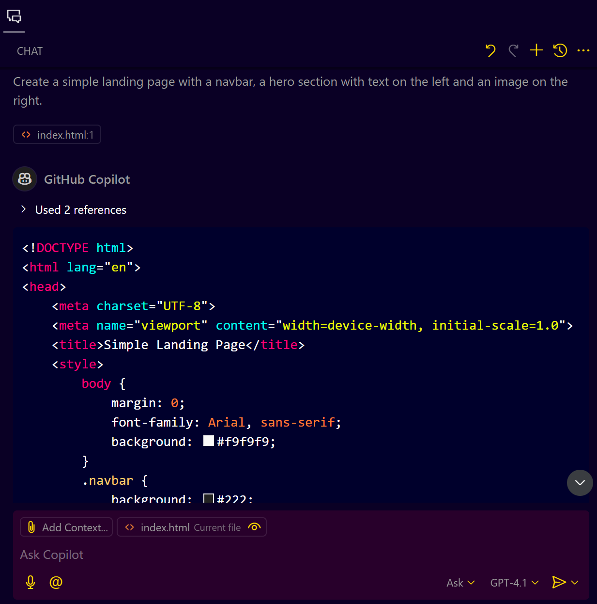
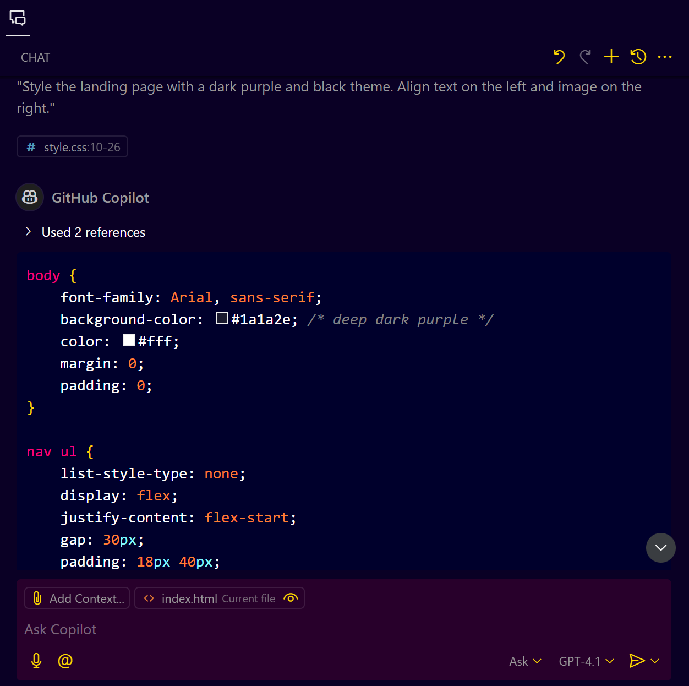
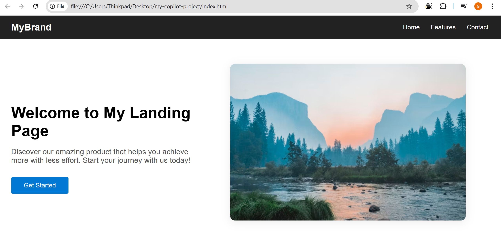

# **GitHub Copilot in Action - Crafting a Webpage with HTML & CSS - Step-by-Step Guide**

## **Introduction**

GitHub Copilot is an AI-powered tool that can help you quickly generate code. In this guide, we will explore how to use GitHub Copilot to create a professional webpage using HTML and CSS in Visual Studio Code (VS Code).

---

## **Prerequisites**

* Install Visual Studio Code (VS Code).
* Install GitHub Copilot extension in VS Code.
* Ensure you have a GitHub account linked to Copilot.

---

## **Understanding the Workflow**

* We will create a simple landing page using HTML and CSS.
* We will use GitHub Copilot to generate the HTML structure and CSS styling.
* We will refine the page layout using Copilot suggestions.

---

## **Step 1: Setting Up Your Project**

1. Open VS Code.
2. Create a new folder for your project.
3. Inside this folder, create two files:

   * `index.html` (for HTML structure)
   * `styles.css` (for CSS styling)

---

## **Step 2: Generating HTML Structure**

1. Open `index.html`.
2. Type the following prompt for Copilot:
   **Prompt:** "Create a simple landing page with a navbar, a hero section with text on the left and an image on the right."
   

3. Review the generated HTML and make adjustments as needed.

### **Example HTML Code:**

```html
<!DOCTYPE html>
<html lang="en">
<head>
    <meta charset="UTF-8">
    <meta name="viewport" content="width=device-width, initial-scale=1.0">
    <title>Simple Landing Page</title>
    <style>
        body {
            margin: 0;
            font-family: Arial, sans-serif;
            background: #f9f9f9;
        }
        .navbar {
            background: #222;
            color: #fff;
            padding: 1rem 2rem;
            display: flex;
            justify-content: space-between;
            align-items: center;
        }
        .navbar .logo {
            font-weight: bold;
            font-size: 1.5rem;
        }
        .navbar nav a {
            color: #fff;
            text-decoration: none;
            margin-left: 1.5rem;
            font-size: 1rem;
        }
        .hero {
            display: flex;
            align-items: center;
            justify-content: center;
            padding: 4rem 2rem;
            background: #fff;
        }
        .hero-content {
            flex: 1;
            max-width: 500px;
        }
        .hero-content h1 {
            font-size: 2.5rem;
            margin-bottom: 1rem;
        }
        .hero-content p {
            font-size: 1.2rem;
            margin-bottom: 2rem;
            color: #555;
        }
        .hero-content button {
            padding: 0.75rem 2rem;
            font-size: 1rem;
            background: #0078d4;
            color: #fff;
            border: none;
            border-radius: 4px;
            cursor: pointer;
        }
        .hero-image {
            flex: 1;
            display: flex;
            justify-content: center;
            align-items: center;
        }
        .hero-image img {
            max-width: 100%;
            height: auto;
            border-radius: 12px;
            box-shadow: 0 4px 24px rgba(0,0,0,0.08);
        }
        @media (max-width: 900px) {
            .hero {
                flex-direction: column;
                text-align: center;
            }
            .hero-image {
                margin-top: 2rem;
            }
        }
    </style>
</head>
<body>
    <div class="navbar">
        <div class="logo">MyBrand</div>
        <nav>
            <a href="#">Home</a>
            <a href="#">Features</a>
            <a href="#">Contact</a>
        </nav>
    </div>
    <section class="hero">
        <div class="hero-content">
            <h1>Welcome to My Landing Page</h1>
            <p>Discover our amazing product that helps you achieve more with less effort. Start your journey with us today!</p>
            <button>Get Started</button>
        </div>
        <div class="hero-image">
            
        </div>
    </section>
</body>
</html>
```

---

## **Step 3: Generating CSS Styles**

1. Open `styles.css`.
2. Use the following prompt:
   **Prompt:** "Style the landing page with a dark purple and black theme. Align text on the left and image on the right."
   

3. Review the CSS generated by Copilot.


### **Example CSS Code:**

```css
body {
    font-family: Arial, sans-serif;
    background-color: #1a1a2e; /* deep dark purple */
    color: #fff;
    margin: 0;
    padding: 0;
}

nav ul {
    list-style-type: none;
    display: flex;
    justify-content: flex-start;
    gap: 30px;
    padding: 18px 40px;
    background-color: #0f0f3d; /* darker purple/black */
    margin: 0;
}

nav ul li a {
    color: #fff;
    text-decoration: none;
    font-weight: 600;
    font-size: 1.1rem;
    transition: color 0.2s;
}

nav ul li a:hover {
    color: #a259ff; /* accent purple */
}

.hero {
    display: flex;
    justify-content: space-between;
    align-items: center;
    padding: 60px 40px;
    background: linear-gradient(90deg, #1a1a2e 60%, #23234d 100%);
    min-height: 70vh;
}

.hero .text {
    max-width: 48%;
    text-align: left;
}

.hero .text h1 {
    font-size: 2.8rem;
    margin-bottom: 18px;
    color: #a259ff;
}

.hero .text p {
    font-size: 1.25rem;
    margin-bottom: 28px;
    color: #e0e0e0;
}

.hero .text button {
    background: #a259ff;
    color: #fff;
    border: none;
    padding: 14px 36px;
    border-radius: 6px;
    font-size: 1.1rem;
    font-weight: bold;
    cursor: pointer;
    transition: background 0.2s;
}

.hero .text button:hover {
    background: #6c2bd7;
}

.hero .image {
    flex: 1;
    display: flex;
    justify-content: flex-end;
    align-items: center;
}

.hero .image img {
    max-width: 400px;
    width: 100%;
    border-radius: 16px;
    box-shadow: 0 8px 32px rgba(30, 20, 60, 0.4);
}

@media (max-width: 900px) {
    .hero {
        flex-direction: column;
        padding: 40px 10px;
        text-align: center;
    }
    .hero .text, .hero .image {
        max-width: 100%;
    }
    .hero .image {
        justify-content: center;
        margin-top: 30px;
    }
    .hero .image img {
        max-width: 90vw;
    }
}
```

---

## **Step 4: Testing and Refining the Page**

1. Open the `index.html` file in your browser.
   

2. Make sure the layout looks as expected.
3. If needed, use Copilot to further refine the layout and design.

--- 

## **Conclusion**

GitHub Copilot can significantly speed up the process of building web pages. With the right prompts, you can create, style, and enhance your webpage efficiently. Use it as a coding assistant to build better designs.
