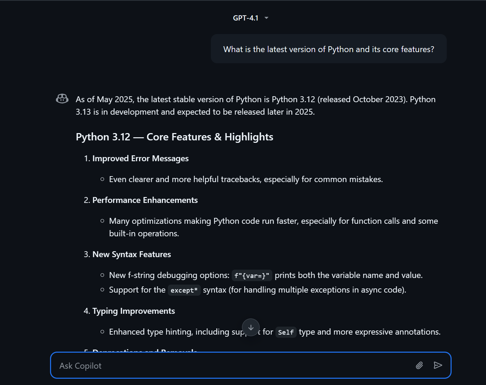
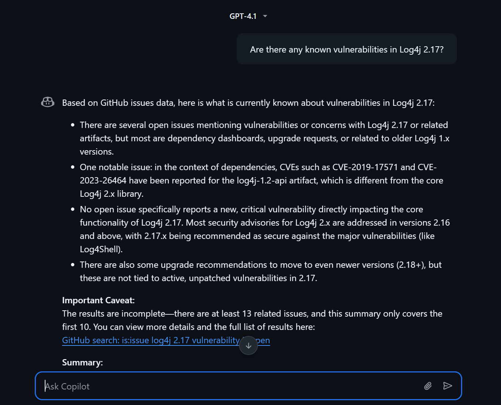
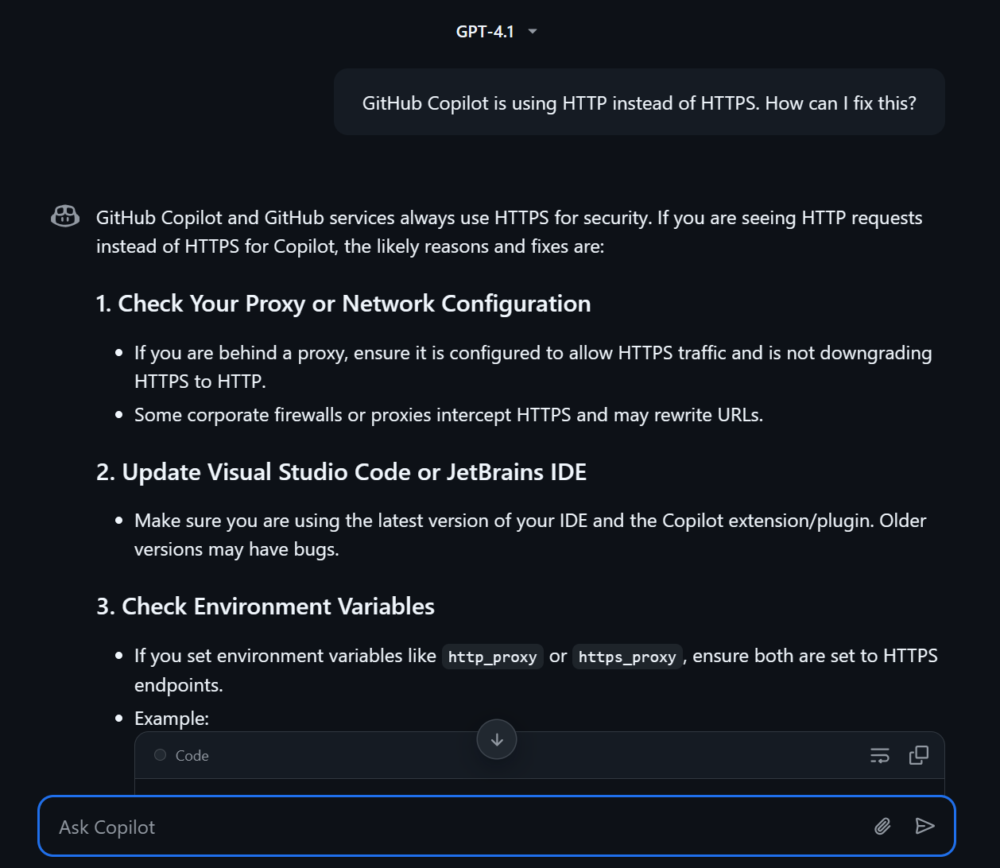
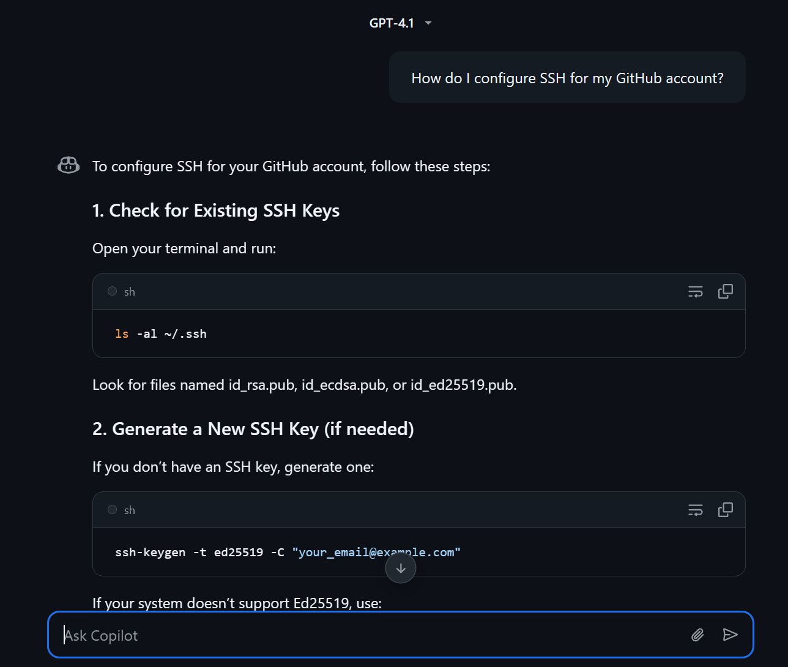
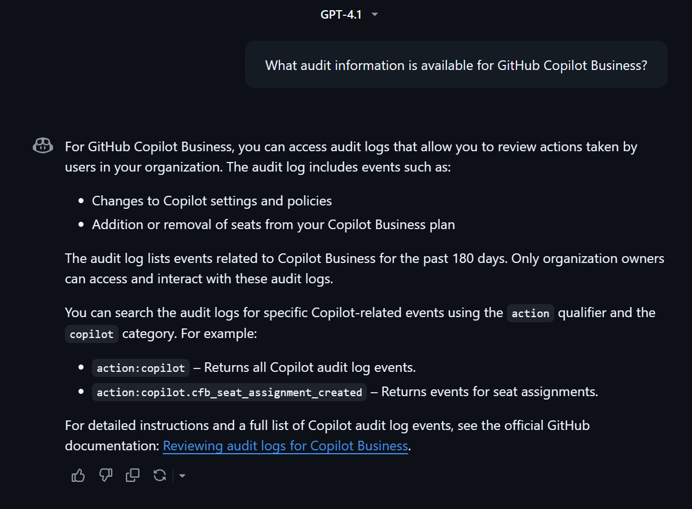
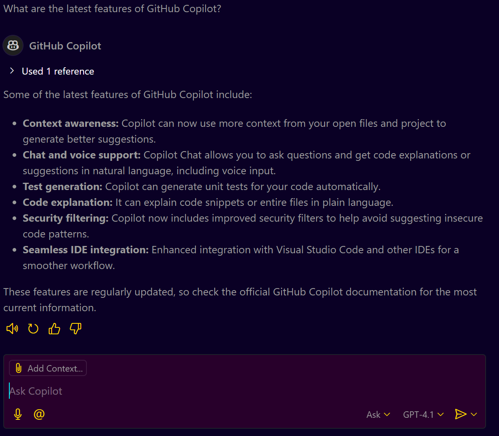
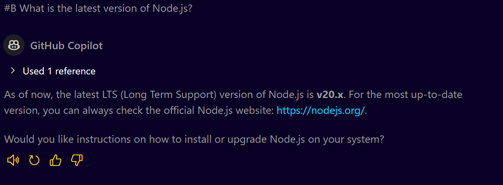

# **GitHub Copilot Chat: Queries, Support Queries, and Documentation Guide**

## **Introduction**

This guide provides a comprehensive, step-by-step walkthrough of using GitHub Copilot Chat for querying general information, resolving support queries, and accessing GitHub documentation directly. Whether you're working in a browser or an IDE, this guide will help you make the most of Copilot Chat.

---

## **Prerequisites**

* You must have an active GitHub Copilot license (individual, business, or enterprise).
* Ensure that GitHub Copilot Chat is enabled in your GitHub settings.

## **Understanding GitHub Copilot Chat**

GitHub Copilot Chat allows you to:

* Query general information using web search.
* Resolve support queries using the support knowledge base.
* Access GitHub documentation directly.

## **Scenario 1: General Queries**

**What are General Queries?**

General queries involve asking about the latest features, libraries, vulnerabilities, or general programming concepts.

**How to Use General Queries**
- Open Immersive View.
- Go to your GitHub repository.
- Click on the three-dot menu at the top.
- Select "Take Conversation to Immersive".

### **Example 1: Querying Latest Version of a Technology**

**Prompt:**

```
What is the latest version of Python and its core features?
```

**Response:**

* Copilot Chat will perform a web search (using Bing) and provide the latest version of Python and its features.
  


### **Example 2: Checking Security Vulnerabilities**

**Prompt:**

```
Are there any known vulnerabilities in Log4j 2.17?
```

**Response:**

* Copilot will use the web search or support knowledge base to find known vulnerabilities.
  



---

## **Scenario 2: Support Queries**

**What are Support Queries?**
Support queries help you resolve errors, understand GitHub features, and troubleshoot issues.

### **Example 1: Resolving HTTP to HTTPS Issue**

**Prompt:**

```
GitHub Copilot is using HTTP instead of HTTPS. How can I fix this?
```

**Response:**

* Copilot will suggest checking proxy settings and updating configurations to use HTTPS.



### **Example 2: Configuring SSH**

**Prompt:**

```
How do I configure SSH for my GitHub account?
```

**Response:**

* Step-by-step SSH configuration instructions will be provided.


---

## **Scenario 3: Documentation Queries**

**What are Documentation Queries?**
Documentation queries help you find information directly from GitHub’s official documentation.

### **Example: Understanding Audit Information**

**Prompt:**

```
What audit information is available for GitHub Copilot Business?
```

**Response:**

* Copilot will search GitHub documentation and provide details on available audit logs.


---

## **Using Copilot Chat in VS Code (IDE)**

1. Open VS Code and ensure Copilot is enabled.
2. Use the Copilot Chat panel to type your query.

### **Example Prompt:**

```
What are the latest features of GitHub Copilot?
```

**Response:**
* Copilot will search and provide a list of the latest features.


---

## **Forcing Specific Search Modes**

* **Web Search:** Use `#B` at the start of your query to force Bing search.
* **Support Search:** Use `#Support` for support-related queries.
* **Documentation Search:** Use `#Docs` for direct documentation search.

### **Example:**

```
#B What is the latest version of Node.js?
```

**Response:**
* This forces a Bing search for the latest Node.js version.


---

## **Conclusion**

GitHub Copilot Chat is a versatile tool for quickly accessing information. Mastering these scenarios will save you time and enhance your workflow.
