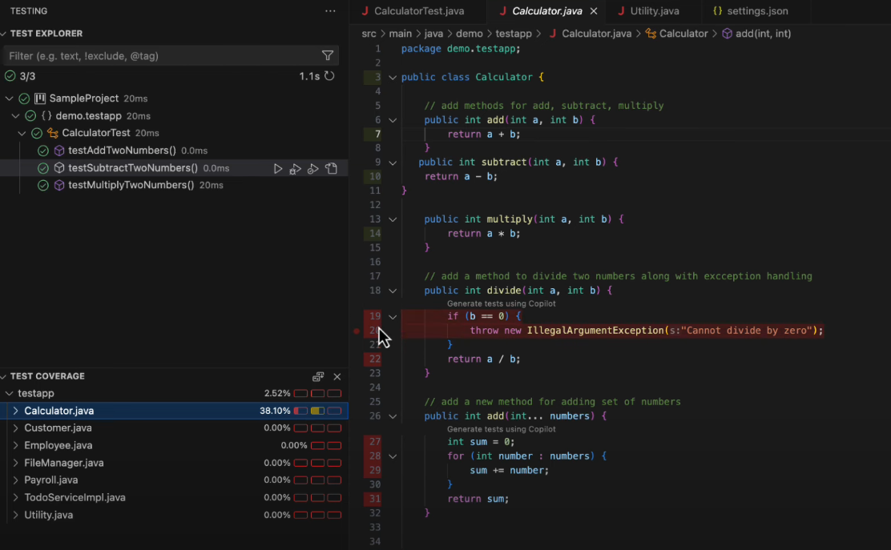
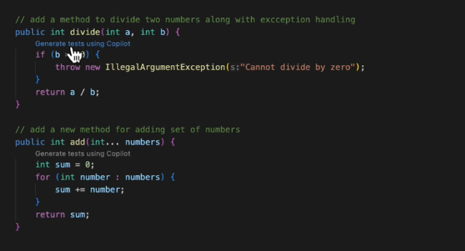
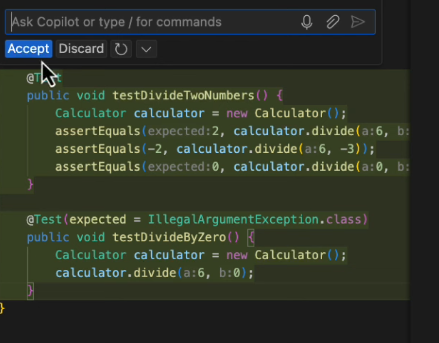
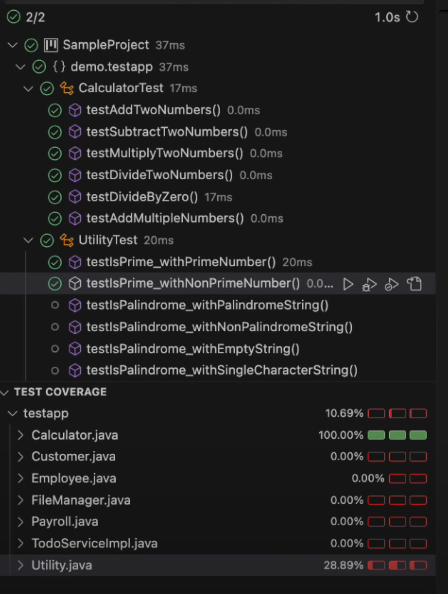

# **GitHub Copilot: Code Coverage with New Test Generation**

## **Introduction**
This guide provides a step-by-step approach to using GitHub Copilot's experimental test generation feature in VS Code, specifically for achieving better code coverage in your Java projects. We will use a simple Calculator class to demonstrate this process.

---

## **Prerequisites**
- VS Code installed.
- GitHub Copilot extension installed and enabled in VS Code.
- Basic understanding of Java and JUnit.
- Java Development Kit (JDK) installed.

---

## **Step 1: Setting Up the Project**
1. **Open VS Code** and create a new Java project.
2. **Create a new file named `Calculator.java`** and add the following code:

```java
public class Calculator {
	// add methods for add, subtract, multiply
	public int add(int a, int b) {
		return a + b;
	}

	public int subtract(int a, int b) {
		return a - b;
	}

	public int multiply(int a, int b) {
		return a * b;
	}

	// add a method to divide two numbers along with exception handling
	public int divide(int a, int b) {
		if (b == 0) {
			throw new IllegalArgumentException("Cannot divide by zero");
		}
		return a / b;
	}

	// add a new method for adding set of numbers
	public int add(int... numbers) {
		int sum = 0;
		for (int number : numbers) {
			sum += number;
		}
		return sum;
	}
}
```

---

## **Step 2: Creating the Initial Test Class**
1. **Create a new file named `CalculatorTest.java`**.
2. **Add the following test cases manually:**

```java
import org.junit.Test;
import static org.junit.Assert.*;

public class CalculatorTest {

	@Test
	public void testAddTwoNumbers() {
		Calculator calculator = new Calculator();
		assertEquals(5, calculator.add(2, 3));
		assertEquals(-1, calculator.add(2, -3));
		assertEquals(0, calculator.add(0, 0));
	}

	@Test
	public void testSubtractTwoNumbers() {
		Calculator calculator = new Calculator();
		assertEquals(1, calculator.subtract(3, 2));
		assertEquals(5, calculator.subtract(2, -3));
		assertEquals(0, calculator.subtract(0, 0));
	}

	@Test
	public void testMultiplyTwoNumbers() {
		Calculator calculator = new Calculator();
		assertEquals(6, calculator.multiply(2, 3));
		assertEquals(-6, calculator.multiply(2, -3));
		assertEquals(0, calculator.multiply(0, 3));
	}
}
```

---

## **Step 3: Running Tests with Code Coverage**
1. **Right-click on `CalculatorTest.java`** and select **"Run Tests with Coverage"**.
2. **Observe the Code Coverage Report**:
   
   
   - **Green lines:** Covered by tests.
   - **Red lines:** Not covered by tests.

---

## **Step 4: Enabling GitHub Copilot Test Generation**
1. **Go to VS Code settings** (`settings.json`) and add the following:

```json
{
    "github.copilot.chat.experimental.generateTest.codelens": true
}
```

2. **Restart VS Code** to apply the setting.

---

## **Step 5: Automatically Generating Test Cases**
1. **Open `Calculator.java`**.
   
2. **Click on "Generate Test using Copilot"** above uncovered lines (red).
   
3. **Accept the generated test cases** and save them.

---

## **Step 6: Achieving 100% Code Coverage**
1. **Run the tests again with code coverage.**
   
   

2. **Ensure all lines are covered (all green).**

---

## **Example Prompts for Copilot**
- "Generate test cases for uncovered methods in Calculator.java."
- "Generate boundary test cases for divide method."
- "Generate negative test cases for all methods."

---

## **Conclusion**
This guide helps you understand how to leverage GitHub Copilot's test generation feature to ensure complete code coverage in your Java projects with minimal effort.
