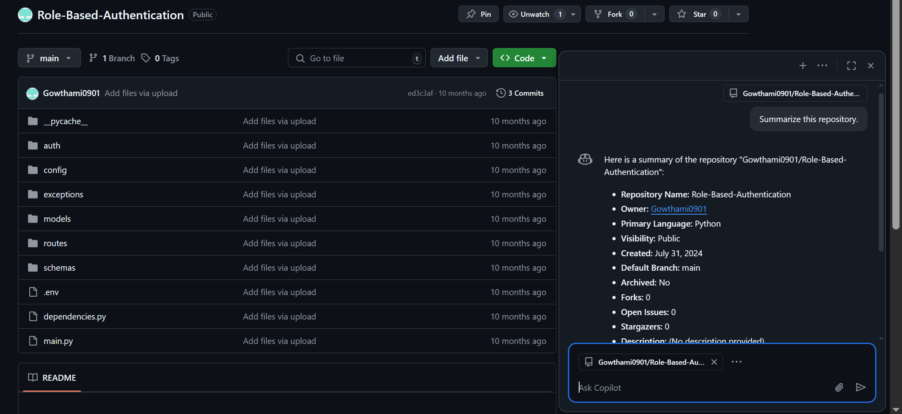
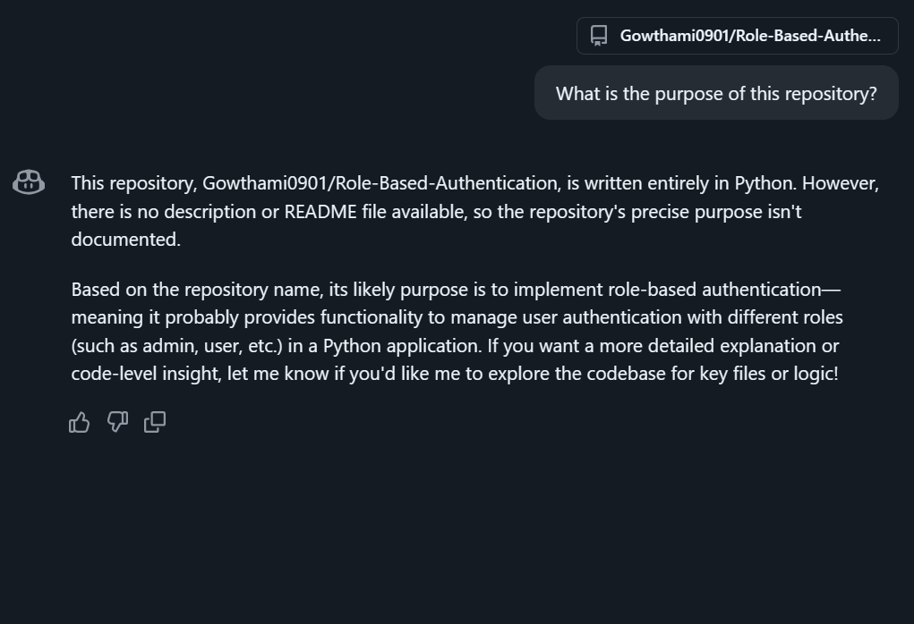
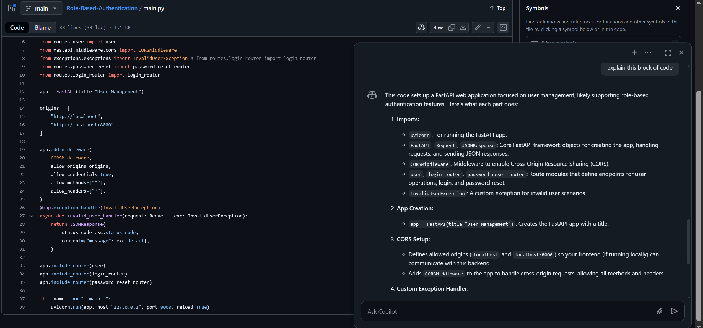
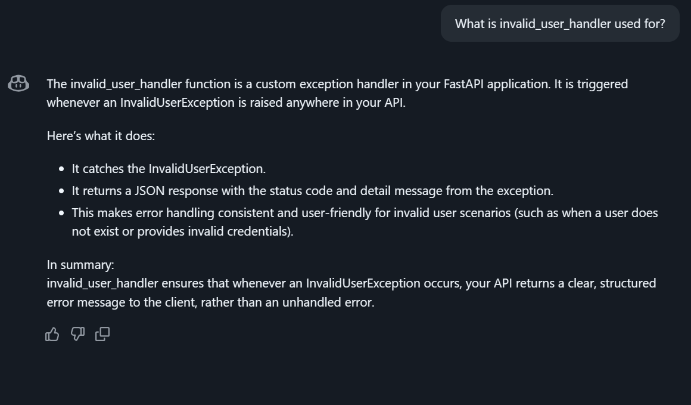

# **Exploring Code Effortlessly with GitHub Copilot Enterprise**

## **Introduction**

Understanding complex codebases can be challenging for developers, especially when joining new projects. GitHub Copilot Enterprise provides a powerful solution with its natural language query capabilities, allowing developers to explore and understand codebases quickly.

This guide will walk you through using GitHub Copilot Enterprise’s chat feature to explore and understand code effectively. 

---

## **Prerequisites**

* GitHub Copilot Enterprise enabled in your VS Code.
* Access to a code repository you want to explore.

---

## **Step 1: Setting Up GitHub Copilot Enterprise**

1. **Open VS Code**.
2. **Ensure GitHub Copilot Enterprise is enabled**:
   * Go to Extensions (Ctrl+Shift+X).
   * Search for "GitHub Copilot" and ensure it is installed and enabled.
3. **Login to your GitHub account** with enterprise access.

---

## **Step 2: Understanding the Repository**

1. **Open your project repository**.
2. **Launch Copilot Chat**:
   * Click on the Copilot icon next to your avatar (top-right corner).
  
3. **Ask a Natural Language Query**:

   * **Example Prompt:** "Summarize this repository."
   * This will provide an overview of what the repository does and the technologies it uses.
     

### **Example:**

**Prompt:** "What is the purpose of this repository?"
**Response:** 

---

## **Step 3: Exploring File-Level Details**

1. **Open any file (e.g., `main.py`)**.
2. **Highlight the Code Block** you want to understand.
3. **Right-click and choose 'Explain with Copilot'**.
4. **Ask Specific Questions**:

   * Example Prompt: "Explain this block of code."

### **Example:**

**Prompt:** "What is this block doing?"
**Response:** 

---

## **Step 4: Understanding Object Usage**

1. **Select any object**.
2. **Right-click and choose 'Explain with Copilot'**.
3. **Ask about the object’s usage:**

   * Example Prompt: "How is this object used in the project?"

### **Example:**

**Prompt:** "What is invalid_user_handler used for?"
**Response:** 

---

## **Step 5: Querying for Specific Information**

1. **Go to the Copilot chat window.**
2. **Ask Repository-Level Questions**:

   * Example Prompt: "Where is the infrastructure defined in this project?"

### **Example:**

**Prompt:** "Where is the infrastructure defined?"
**Response:** "Infrastructure is defined using Bicep files located under the 'infra' directory."

---

## **Step 6: Navigating Code Relationships**

1. **Select a class or function**.
2. **Ask Copilot to show related classes or usage:**

   * **Example Prompt:** "Where is this class used in the project?"

---

## **Step 7: Leveraging Contextual Search**

1. **Use the search box in the Copilot chat window.**
2. **Ask questions naturally:**

   * **Example Prompt:** "How is error handling managed in this project?"

---

## **Conclusion**

GitHub Copilot Enterprise’s natural language query feature is a game-changer for developers who want to quickly understand and navigate complex codebases. Use this guide to explore and understand any code repository efficiently.
