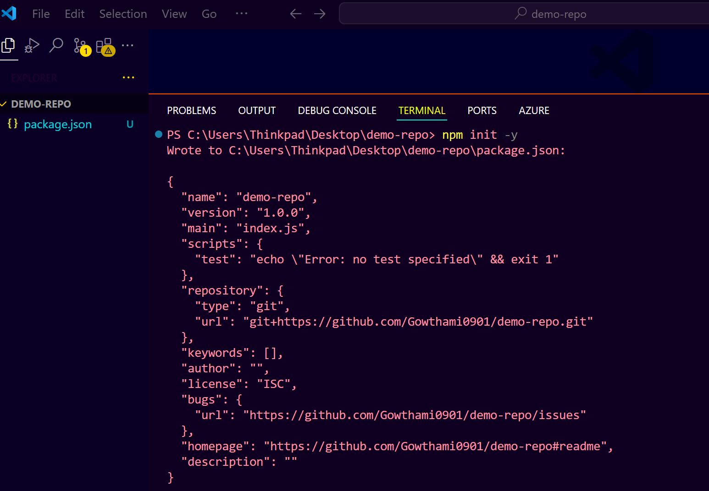
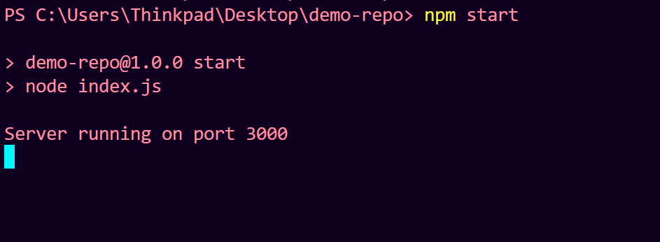
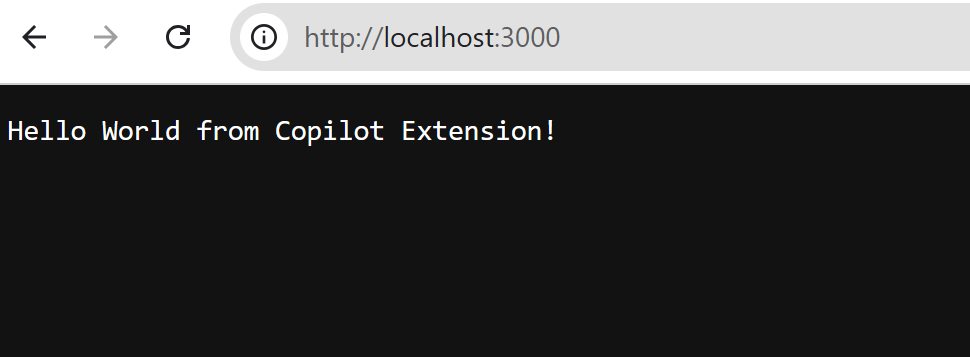
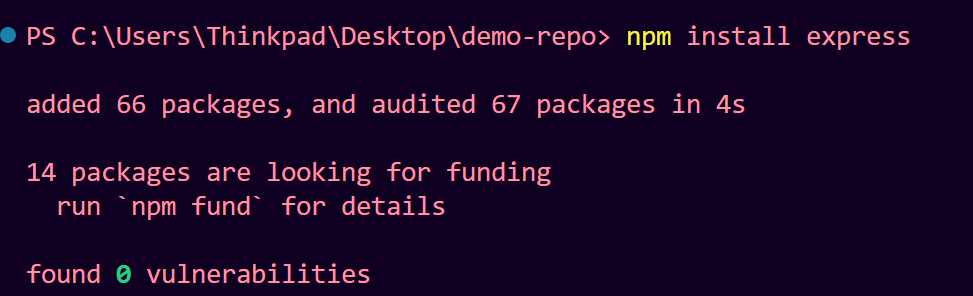
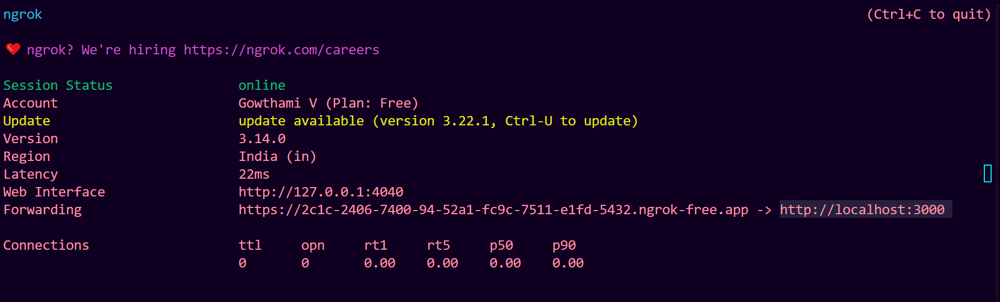

# **How to Build Your First GitHub Copilot Extension — Step-by-Step Guide**

## **1. Understand GitHub Copilot Extensions**

* **Types of Copilot Extensions:**

  * **Public Extensions:** Available on GitHub Marketplace, contributed by partners.
  * **Private Extensions:** You create and host yourself, for your enterprise or personal use.

* This guide focuses on **creating a private Copilot extension** using the JavaScript SDK (currently in preview).

---

## **2. Setup Development Environment**

You can develop using:

* GitHub Codespaces (recommended for quick start)
* Visual Studio Code (VS Code)
* Any other IDE supporting JavaScript development

---

## **3. Create a New Repository**

Start with an **empty GitHub repository** for your extension.

---

## **4. Initialize Node.js Project**

Open terminal in your project folder and run:

```bash
npm init -y
```

This creates a `package.json` with default values.


---

## **5. Create Your Main File**

Create an `index.js` file (or any name you prefer) for your extension's code.

---

## **6. Write a Simple HTTP Server (Hello World)**

Use Copilot or write manually:

```js
import http from 'http';

const server = http.createServer((req, res) => {
  if (req.method === 'GET') {
    res.writeHead(200, { 'Content-Type': 'text/plain' });
    res.end('Hello World from Copilot Extension!');
  } else {
    res.writeHead(405);
    res.end();
  }
});

const PORT = 3000;
server.listen(PORT, () => {
  console.log(`Server running on port ${PORT}`);
});
```

---

## **7. Add `type` and `start` Script in `package.json`**

Modify `package.json`:

```json
{
  "type": "module",
  "scripts": {
    "start": "node index.js"
  }
}
```

Run your server:

```bash
npm start
```



Open `http://localhost:3000` and verify you see `Hello World from Copilot Extension!`.



---

## **8. To install a packages**

```bash
npm install express
```



---

## **9. Import and Use Basic Methods**

Update your `index.js`:

```js
import http from 'http';
import { createTextEvent, createDoneEvent } from '@githubnext/copilot-sdk';

const server = http.createServer(async (req, res) => {
  if (req.method === 'POST') {
    // Typically copilot extension requests use POST

    // Prepare chunks of text to send back
    const chunks = [
      createTextEvent('Hello World from your Copilot extension!'),
      createTextEvent('This is your first private extension.'),
      createDoneEvent() // Indicates completion
    ];

    res.writeHead(200, { 'Content-Type': 'application/json' });
    res.end(JSON.stringify(chunks));
  } else {
    res.writeHead(405);
    res.end();
  }
});

const PORT = 3000;
server.listen(PORT, () => {
  console.log(`Copilot extension server running on port ${PORT}`);
});
```

---

## **10. Make Your Extension Publicly Accessible**

* Your extension URL must be accessible by GitHub (no firewall blocking).
* If using Codespaces, expose your Codespace port publicly.
* Alternatively, use tools like [ngrok](https://ngrok.com/) to expose local server:

```bash
ngrok http 3000
```

Get the public URL (e.g., `https://abcd1234.ngrok.io`).


---

## **11. Register Your Copilot Extension in GitHub**

* Go to **GitHub > Settings > Developer Settings > GitHub Apps > New GitHub App**.

Fill in:

* **App name:** e.g. `hello-copilot-extension`
* **Homepage URL:** your public URL or `https://github.com`
* **Callback URL:** same public URL (mandatory)
* **Permissions:**

  * Under **Copilot Chat**, select **Read-only** permission (mandatory).
  * Optional: Repository read access if your extension needs repo data.
* **Where can this app be installed?** Choose your user or organization.

* **Create the app.**

---

## **12. Configure the Extension in GitHub Copilot Chat**

* Go to your Copilot Chat extension settings.
* Add your extension using the public URL.
* Provide a description.

---

## **13. Connect and Authorize the Extension**

* When you invoke the extension for the first time, Copilot will prompt you to authorize.
* This authorization uses the callback URL you registered.
* Once authorized, your extension will be linked.

---

## **14. Test Your Extension in Copilot Chat**

* Open Copilot Chat.
* Type: `@hello-copilot-extension` or the exact name you registered.
* Your extension response should appear with your custom messages, e.g.:

```
Hello World from your Copilot extension!
This is your first private extension.
```

* You can use GitHub-flavored Markdown in your responses:

```js
createTextEvent('# Hello from Copilot Extension\nThis supports **markdown** formatting.')
```

---

## **Summary & Helpful Prompts**

### **Basic Commands & Concepts:**

* `npm init -y` — Initialize project.
* `npm install @githubnext/copilot-sdk` — Install SDK.
* Use `createTextEvent(text)` and `createDoneEvent()` to send responses.
* Your extension listens on POST requests with JSON payloads.
* Register your app on GitHub Developer Settings.
* Publicly expose your extension URL (e.g., ngrok, Codespaces).
* Authorize your extension before first use in Copilot Chat.
* Invoke your extension by typing `@your-extension-name` in Copilot Chat.

---

### **Sample `index.js` for Quick Start:**

```js
import http from 'http';
import { createTextEvent, createDoneEvent } from '@githubnext/copilot-sdk';

const server = http.createServer(async (req, res) => {
  if (req.method === 'POST') {
    const chunks = [
      createTextEvent('# Hello from Copilot Extension!'),
      createTextEvent('This message supports **Markdown** formatting.'),
      createDoneEvent(),
    ];
    res.writeHead(200, { 'Content-Type': 'application/json' });
    res.end(JSON.stringify(chunks));
  } else {
    res.writeHead(405);
    res.end();
  }
});

const PORT = 3000;
server.listen(PORT, () => {
  console.log(`Copilot extension server running on port ${PORT}`);
});
```

