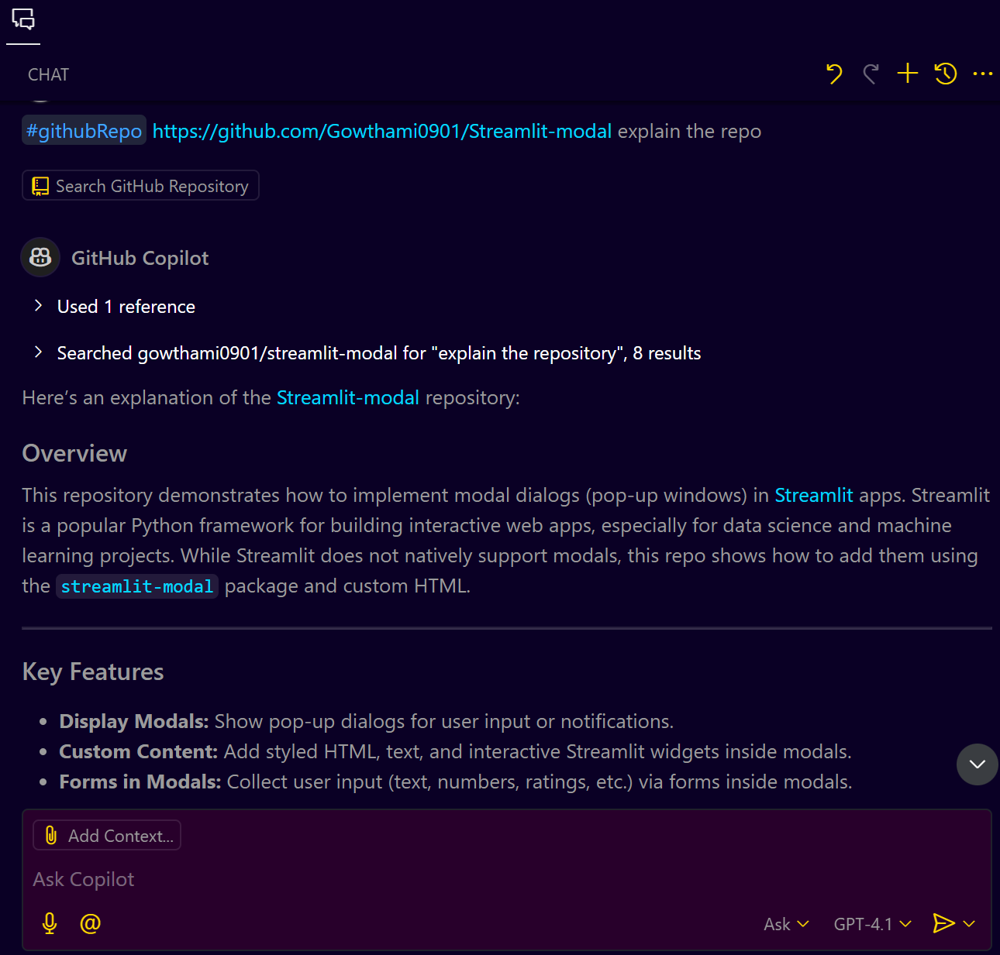
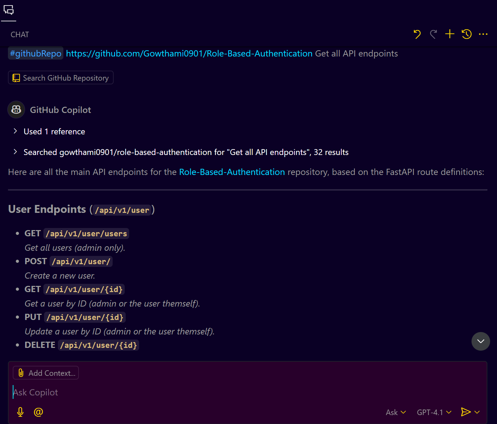

# **GitHub Copilot Cross-Repo Reference Guide**

## **What is GitHub Copilot Cross-Repo Reference?**

GitHub Copilot’s Cross-Repo Reference feature allows you to seamlessly search and access code, documentation, style guides, and other resources from **repositories outside your current workspace** directly within your IDE (like VS Code).

**This is useful for:**

* Accessing API details from backend repos while working on frontend code.
* Referencing shared libraries, utility functions, or style guides.
* Understanding architecture guidelines or complex code spread across multiple repos.

---

## **Prerequisites**

* GitHub Copilot enabled (including free trial accounts).
* Visual Studio Code (VS Code) or any compatible IDE with GitHub Copilot.
* Access to the GitHub repositories you want to reference.

---

## **Step-by-Step Guide**

### **Step 1: Enabling GitHub Copilot**

1. Open VS Code.
2. Ensure GitHub Copilot is enabled (Check Extensions → GitHub Copilot).

---

### **Step 2: Using Cross-Repo Reference**

1. In any code file, activate Copilot by typing a comment or text.
2. Use the special syntax:

   ```
   #githubRepo <repo-name/path> <your query>
   ```

   **Example:**

   ```
   #githubRepo user/repo-name Explain the repo
   ```

   **Response**
   


3. Copilot will fetch and display the relevant code, functions, or documentation from the specified repo.

---


### **Step 3: Exploring API References (Example)**

* You are building a frontend app and need to understand API details from a backend repo.
* **Use the command:**

  ```
  #githubRepo user/backend-repo-name Get all API endpoints
  ```
* **GitHub Copilot will list the available API endpoints**
  


---


### **Step 4: Accessing Style Guides or Utilities**

* Suppose you are working on Python and want to follow the standard style guide from another repo.
* Use the command:

  ```
  #githubRepo org/style-guide-repo Get Python naming conventions
  ```
* Copilot will bring the style guide definitions.

---

### **Step 5: Asking for Usage Examples**

* After retrieving an API or function, you can directly ask for usage examples.
* Example:

  ```
  #githubRepo user/backend-repo-name Show how to use Get API in JavaScript
  ```

---

### **Step 6: Customizing Search**

* You can customize the query to be more specific:

  ```
  #githubRepo user/backend-repo-name Get API response structure
  #githubRepo org/shared-utils Get function definitions
  ```

---

## **Pro Tips**

* Use precise repo names to avoid confusion.
* Ask for specific code sections (like function names, classes, or file types).
* If you work with multiple repos, consider bookmarking the most commonly used repo paths.

---

## **Common Use Cases**

* Frontend-Backend API Reference: Quickly check API details without leaving your workspace.
* Style Guide Lookup: Follow coding standards from a separate style guide repo.
* Shared Library Reference: Use utility functions from another repo without copy-pasting code.

---

## **Troubleshooting**

* Ensure you have access to the referenced repo.
* Make sure Copilot is enabled in your IDE.
* Use correct syntax: `#github repo <repo-path> <query>`.

