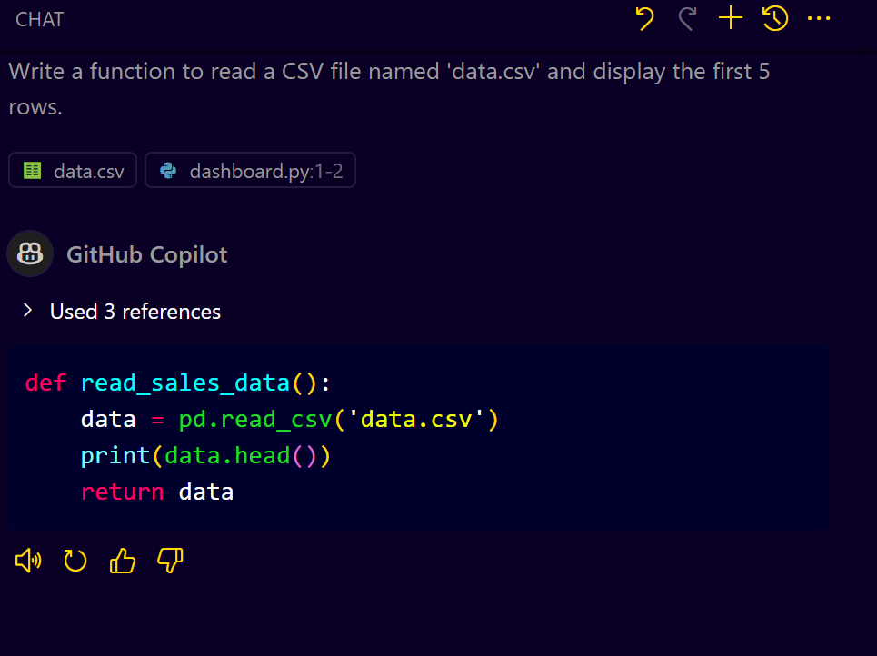
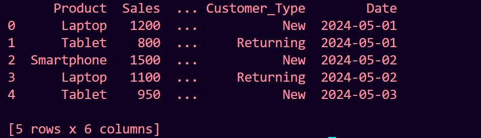
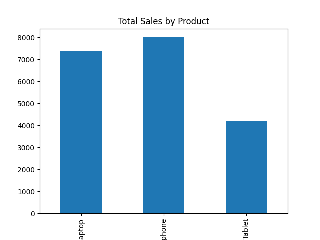
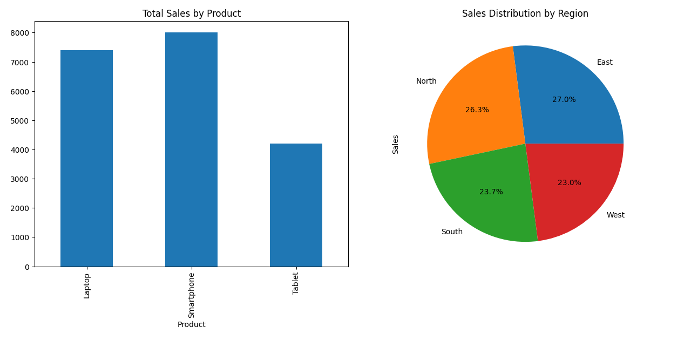

# **Building a Sales Dashboard using GitHub Copilot in VS Code**

## **Introduction**

In this guide, we will explore how to leverage GitHub Copilot in VS Code to quickly build a sales dashboard using Python and Matplotlib. You will learn how to efficiently generate code suggestions with Copilot, fix any issues, and iteratively build a complete dashboard.

---

## **Prerequisites**

* Visual Studio Code (VS Code) installed.
* GitHub Copilot extension set up and enabled in VS Code.
* Basic knowledge of Python and data visualization using Matplotlib.
* A CSV file named `data.csv` containing sales data with columns: `Product`, `Sales`, `Region`, `Sales_Rep`, `Customer_Type`, and `Date`.

---

## **Step 1: Project Setup**

1. Create a new folder for your project and open it in VS Code.
2. Save your CSV file (`data.csv`) inside this folder.
3. Create a new Python file named `dashboard.py`.

---

## **Step 2: Reading the Sales Data**

1. Start by importing the necessary libraries:

   ```python
   import pandas as pd
   import matplotlib.pyplot as plt
   ```

2. Use GitHub Copilot to write a function to read the CSV data:

   * **Prompt:** "Write a function to read a CSV file named 'data.csv' and display the first 5 rows."

3. Copilot will suggest the following code:

   

4. Save and run the code using the terminal:

   ```bash
   python dashboard.py
   ```
   

---

## **Step 3: Generating the First Chart (Bar Chart)**

1. Prompt Copilot:

   * **Prompt:** "Write a function to create a bar chart showing total sales by product."

2. Copilot may generate the following code:

   ```python
   def plot_sales_by_product(data):
       product_sales = data.groupby('Product')['Sales'].sum()
       product_sales.plot(kind='bar')
       plt.title('Total Sales by Product')
       plt.show()

   plot_sales_by_product(data)
   ```
   

3. Adjust the column name if it doesn't match your CSV data.

---

## **Step 4: Adding a Pie Chart (Sales by Region)**

1. Use Copilot again:

   * **Prompt:** "Add a function to create a pie chart showing sales distribution by region."

2. It will suggest:

   ```python
   def plot_sales_by_region(data):
       region_sales = data.groupby('Region')['Sales'].sum()
       region_sales.plot(kind='pie', autopct='%1.1f%%')
       plt.title('Sales Distribution by Region')
       plt.show()

   plot_sales_by_region(data)
   ```

3. Test and ensure it displays correctly.

---

## **Step 5: Creating a Dashboard Layout**

1. Combine the charts in a single dashboard.

   * **Prompt:** "Create a function to display the bar chart and pie chart side by side in one figure."

2. Copilot should suggest a layout using `plt.subplot()`:

   ```python
   def create_dashboard(data):
       plt.figure(figsize=(12, 6))

       plt.subplot(1, 2, 1)
       product_sales = data.groupby('Product')['Sales'].sum()
       product_sales.plot(kind='bar')
       plt.title('Total Sales by Product')

       plt.subplot(1, 2, 2)
       region_sales = data.groupby('Region')['Sales'].sum()
       region_sales.plot(kind='pie', autopct='%1.1f%%')
       plt.title('Sales Distribution by Region')

       plt.tight_layout()
       plt.show()

   create_dashboard(data)
   ```
   

---

## **Step 6: Adding More Charts**

1. Add a horizontal bar chart for sales by representative.
2. Add a dual-axis chart for new and returning customers.
3. Add a line chart for daily sales trends.

---

## **Step 7: Finalizing the Dashboard**

1. Adjust the layout to display all charts in a neat grid.
2. Test the code and fix any column name issues suggested by Copilot.
   
---

## **Conclusion**

In this guide, we learned how to quickly build a sales dashboard using GitHub Copilot in VS Code, leveraging its code generation capabilities to create, fix, and organize multiple charts.
