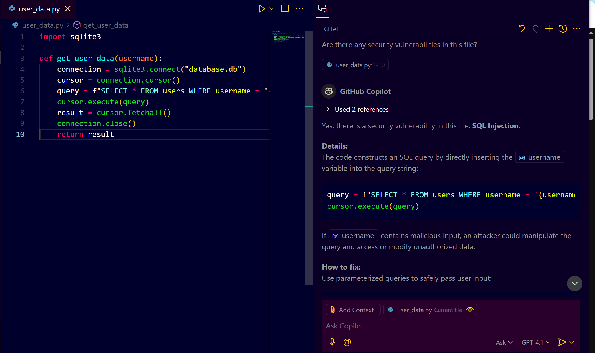
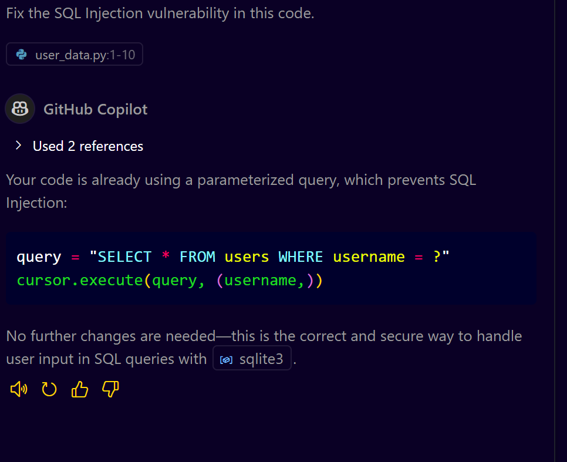

# **Secure Code Review with GitHub Copilot: Step-by-Step Guide**

## **Introduction**

Secure code review is a critical process that ensures your code is free from vulnerabilities and adheres to best security practices. In this guide, we will explore how to perform secure code reviews using GitHub Copilot, making the process faster, efficient, and more accurate.

### **What You Will Learn**

* How to identify security vulnerabilities using GitHub Copilot.
* How to fix security vulnerabilities with Copilot’s suggestions.
* Best practices for secure coding.

---

## **Prerequisites**

* A GitHub Copilot subscription with VS Code installed.
* Basic understanding of security vulnerabilities (SQL Injection, XSS, etc.).
* A sample codebase for testing (Python, Go, TypeScript, and .NET examples).

---

## **Step 1: Setting Up Your Environment**

1. **Install GitHub Copilot in VS Code:**

   * Go to VS Code Extension Marketplace.
   * Search for "GitHub Copilot" and install it.
   * Log in with your GitHub account.

2. **Load Your Codebase:**

   * Open your project folder in VS Code.
   * Ensure your code is properly organized into folders for better code review.

---

## **Step 2: Identifying Security Vulnerabilities**

### **Example 1: SQL Injection in Python**

1. **Open a Python file containing SQL queries.**
2. **Prompt Copilot:**

   * **Prompt:** "Are there any security vulnerabilities in this file?"
   * **Copilot Response:** Copilot should identify SQL Injection vulnerabilities where user input is directly used in SQL queries.
     

#### **Example Code (Vulnerable):**

```python
import sqlite3

def get_user_data(username):
    connection = sqlite3.connect("database.db")
    cursor = connection.cursor()
    query = f"SELECT * FROM users WHERE username = '{username}'"
    cursor.execute(query)
    result = cursor.fetchall()
    connection.close()
    return result
```

#### **Fixing with Copilot:**

* **Prompt:** "Fix the SQL Injection vulnerability in this code."
* **Expected Copilot Fix:** Use parameterized queries for safe SQL execution.
  
  
```python
import sqlite3

def get_user_data(username):
    connection = sqlite3.connect("database.db")
    cursor = connection.cursor()
    query = "SELECT * FROM users WHERE username = ?"
    cursor.execute(query, (username,))
    result = cursor.fetchall()
    connection.close()
    return result
```

---

## **Step 3: Reviewing Code for Authentication and Authorization Issues**

### **Example 2: Insecure API Authentication in TypeScript**

1. **Open an API service file (TypeScript/JavaScript).**
2. **Prompt Copilot:** "Does this code have any authentication or authorization issues?"
3. **Expected Response:** Copilot should identify missing authentication headers and suggest improvements.

#### Example Code (Vulnerable):

```typescript
fetch("https://api.example.com/data")
  .then(response => response.json())
  .then(data => console.log(data));
```

#### **Fixing with Copilot:**

* **Prompt:** "Add authentication and authorization to this API request."
* **Expected Fix:**

```typescript
const token = localStorage.getItem("auth_token");
fetch("https://api.example.com/data", {
  method: "GET",
  headers: {
    "Authorization": `Bearer ${token}`
  }
})
  .then(response => response.json())
  .then(data => console.log(data));
```

---

## **Step 4: Validating Against a Security Checklist**

### **Example 3: Using a Security Checklist for Code Review**

1. **Create a Security Checklist (YAML or JSON).**

   ```yaml
   security_checklist:
     - Broken Access Control:
         - Ensure proper authentication and authorization.
     - SQL Injection:
         - Use parameterized queries for database interactions.
     - Sensitive Data Exposure:
         - Encrypt sensitive data.
   ```

2. **Prompt Copilot:** "Validate this file against the security checklist."

3. **Expected Response:** Copilot identifies issues and suggests improvements.

---

## **Step 5: Automating Secure Code Review with GitHub Advanced Security**

1. **Enable GitHub Advanced Security for your repository.**
2. **Go to Settings > Security & Analysis > Enable Advanced Security.**
3. **Configure code scanning with built-in security rules.**

---

## **Conclusion**

With GitHub Copilot, secure code reviews become faster, more accurate, and easier. Leveraging Copilot’s AI capabilities, you can proactively identify and fix security vulnerabilities in your codebase.
