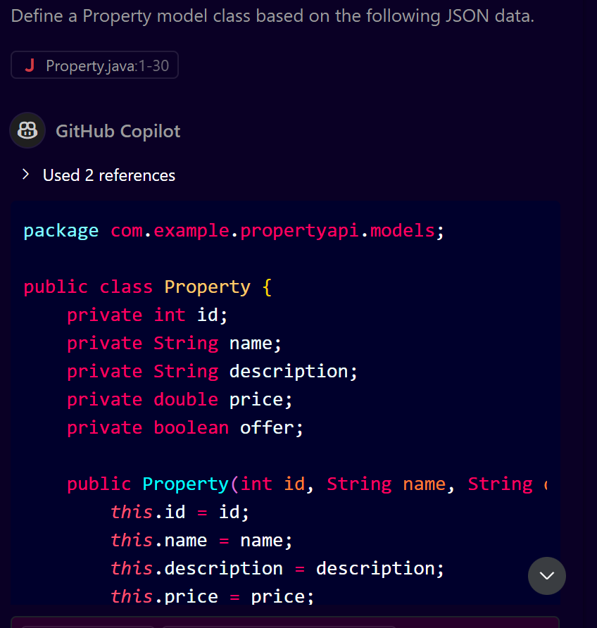
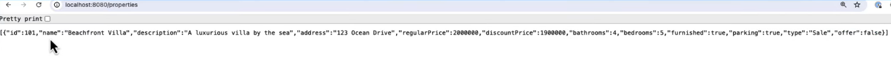

# **Building a Spring Boot API from Data Using GitHub Copilot**

## **Introduction**

This guide will help you build a complete Spring Boot API from a sample JSON data file using GitHub Copilot. We will leverage GitHub Copilot's suggestions for creating model classes, DAO (Data Access Object) classes, and controllers for your Spring Boot application.

---

## **Prerequisites**

* Basic understanding of Spring Boot.
* A Java IDE like IntelliJ IDEA or Eclipse.
* GitHub Copilot enabled in your IDE.

---

## **Step 1: Setting Up Your Spring Boot Project**

1. Open your Java IDE (IntelliJ IDEA or Eclipse).
2. Create a new Spring Boot project with the following dependencies:

   * Spring Web
   * Spring Boot Starter
3. Set the project name (e.g., `PropertyAPI`).

---

## **Step 2: Preparing Sample JSON Data**

* We will use the following sample JSON data for this guide:

```json
{
  "id": 1,
  "name": "Beach House",
  "description": "A beautiful house by the sea",
  "price": 500000,
  "offer": true
}
```

---

## **Step 3: Defining the Model (Entity) Class**

1. Go to the `models` package in your project.
2. Create a new Java class named `Property.java`.
3. Use GitHub Copilot for code completion:

### **GitHub Copilot Prompt:**

"Define a Property model class based on the following JSON data."

### **Copilot Suggestion:**



```java
package com.example.propertyapi.models;

public class Property {
    private int id;
    private String name;
    private String description;
    private double price;
    private boolean offer;

    // Getters and Setters
}
```

---

## **Step 4: Creating the DAO (Data Access Object) Class**

1. Go to the `dao` package in your project.
2. Create a new Java class named `PropertyDAO.java`.
3. Use GitHub Copilot for code completion:

### **GitHub Copilot Prompt:**

"Create a PropertyDAO class that returns a list of sample properties."

### **Copilot Suggestion:**

```java
package com.example.propertyapi.dao;

import com.example.propertyapi.models.Property;
import java.util.ArrayList;
import java.util.List;

public class PropertyDAO {
    public List<Property> getAllProperties() {
        List<Property> properties = new ArrayList<>();
        properties.add(new Property(1, "Beach House", "A beautiful house by the sea", 500000, true));
        return properties;
    }
}
```

---

## **Step 5: Building the Controller Class**

1. Go to the `controllers` package in your project.
2. Create a new Java class named `PropertyController.java`.
3. Use GitHub Copilot for code completion:

### **GitHub Copilot Prompt:**

"Create a PropertyController class that uses PropertyDAO to return property data."

### **Copilot Suggestion:**

```java
package com.example.propertyapi.controllers;

import com.example.propertyapi.dao.PropertyDAO;
import com.example.propertyapi.models.Property;
import org.springframework.web.bind.annotation.GetMapping;
import org.springframework.web.bind.annotation.RequestMapping;
import org.springframework.web.bind.annotation.RestController;

import java.util.List;

@RestController
@RequestMapping("/properties")
public class PropertyController {

    private final PropertyDAO propertyDAO = new PropertyDAO();

    @GetMapping
    public List<Property> getAllProperties() {
        return propertyDAO.getAllProperties();
    }
}
```

---

## **Step 6: Running the Application**

1. Start your Spring Boot application.
2. Access the API at: `http://localhost:8080/properties`

### **Expected Output:**



```json
[
  {
    "id": 1,
    "name": "Beach House",
    "description": "A beautiful house by the sea",
    "price": 500000,
    "offer": true
  }
]
```

---

## **Conclusion**

In this guide, you learned how to quickly build a Spring Boot API using GitHub Copilot from a sample JSON data file. You can extend this approach to any data model and API requirement.
