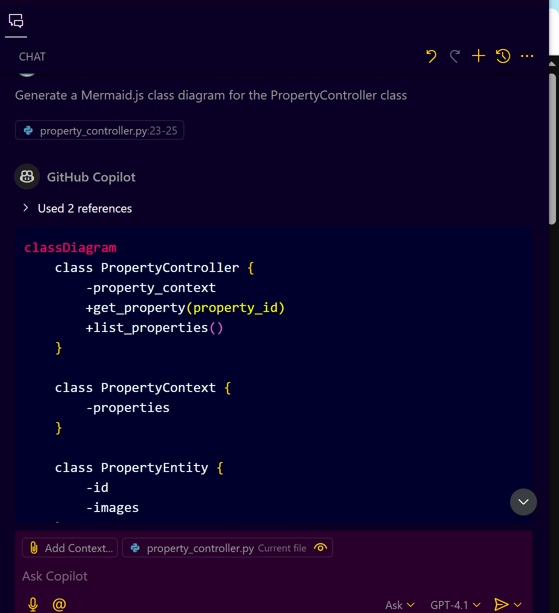
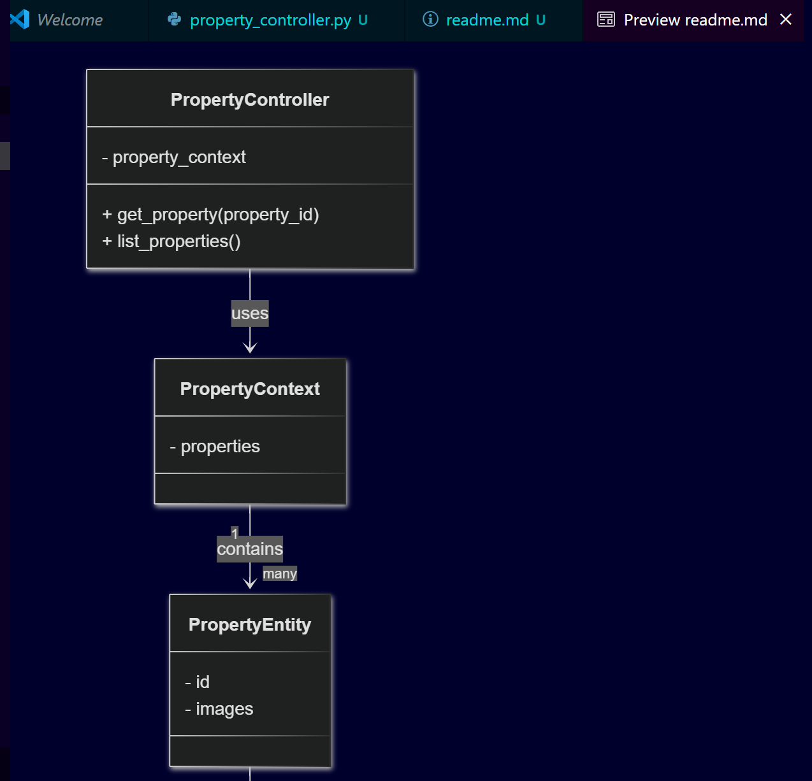
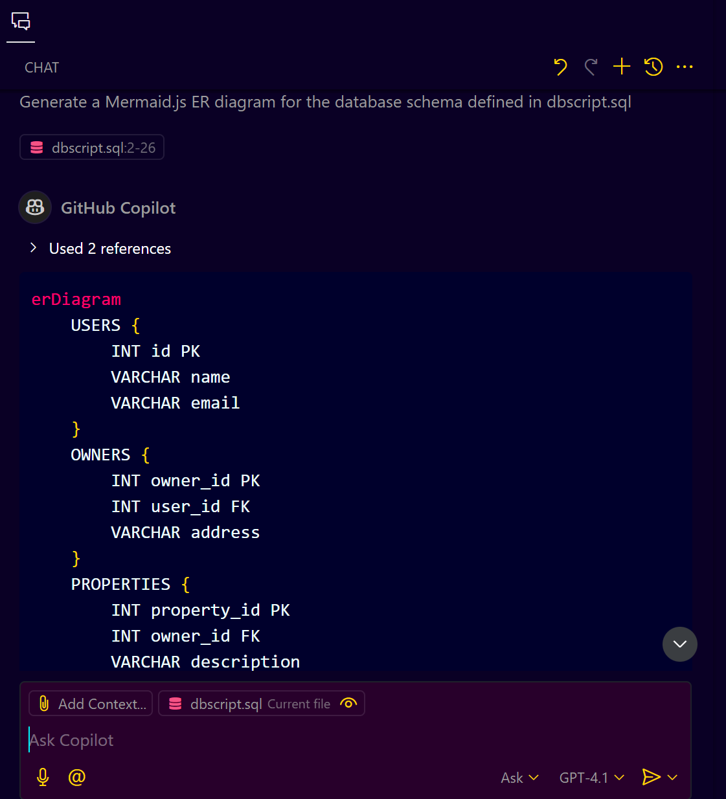

# **Generating Software Design Diagrams Using GitHub Copilot**

## **Introduction**

Software design diagrams are visual tools that help developers and stakeholders understand system architecture, workflows, and interactions. Common types include:

* Class Diagrams
* Entity Relationship (ER) Diagrams (Schema diagrams)
* User Journey Diagrams
* Sequence Diagrams

GitHub Copilot can assist in generating these diagrams by analyzing your code and producing diagram specifications, often using [Mermaid.js](https://mermaid-js.github.io/), a popular markdown-friendly diagram syntax.

---

## **1. Generating a Class Diagram from Code**

### **What is a Class Diagram?**

A class diagram represents the classes in a system, their attributes, methods, and the relationships between classes (e.g., inheritance, associations).

### **How to Use Copilot to Generate Class Diagrams**

#### **Step-by-step:**

1. **Identify the class or classes** you want to diagram. For example, a `PropertyController` REST API class in your codebase.

```python
class PropertyController:
    def __init__(self, property_context):
        self.property_context = property_context

    def get_property(self, property_id):
        # logic to fetch a property by ID
        pass

    def list_properties(self):
        # logic to list all properties
        pass

class PropertyContext:
    def __init__(self):
        self.properties = []

class PropertyEntity:
    def __init__(self, id, images):
        self.id = id
        self.images = images  # one-to-many relation

class ImageUrl:
    def __init__(self, url):
        self.url = url
```

2. **Use Mermaid.js syntax** for class diagrams. Mermaid class diagrams start with:

   ```mermaid
   classDiagram
   ```

3. **Prompt Copilot** with something like:

   ```plaintext
   Generate a Mermaid.js class diagram for the PropertyController class
   ```

4. **Copilot Suggestion Example:**



   ```mermaid
   classDiagram
    class PropertyController {
        -property_context
        +get_property(property_id)
        +list_properties()
    }

    class PropertyContext {
        -properties
    }

    class PropertyEntity {
        -id
        -images
    }

    class ImageUrl {
        -url
    }

    PropertyController --> PropertyContext : uses
    PropertyContext "1" --> "many" PropertyEntity : contains
    PropertyEntity "1" --> "many" ImageUrl : has
   ```

5. **Copy this Mermaid block into a `.md` file** or markdown cell (e.g., in GitHub README or VSCode preview).

6. **Preview the markdown** (e.g., VSCode Mermaid preview or GitHub) to see the rendered class diagram.
   

---

## **2. Generating an Entity-Relationship (ER) Diagram (Schema Diagram)**

### **What is an ER Diagram?**

An ER diagram visually represents database tables, columns (fields), primary keys, foreign keys, and relationships between tables.

### **How to Use Copilot to Generate ER Diagrams**

#### **Step-by-step:**

1. **Provide Copilot the database schema file** (e.g., `dbscript.sql`) containing table definitions.

```sql
CREATE TABLE USERS (
    id INT PRIMARY KEY,
    name VARCHAR(100),
    email VARCHAR(100)
);

CREATE TABLE OWNERS (
    owner_id INT PRIMARY KEY,
    user_id INT,
    address VARCHAR(255),
    FOREIGN KEY (user_id) REFERENCES USERS(id)
);

CREATE TABLE PROPERTIES (
    property_id INT PRIMARY KEY,
    owner_id INT,
    description VARCHAR(255),
    FOREIGN KEY (owner_id) REFERENCES OWNERS(owner_id)
);

CREATE TABLE IMAGE_URLS (
    image_id INT PRIMARY KEY,
    property_id INT,
    url VARCHAR(255),
    FOREIGN KEY (property_id) REFERENCES PROPERTIES(property_id)
);
```

2. **Prompt Copilot:**

   ```plaintext
   Generate a Mermaid.js ER diagram for the database schema defined in dbscript.sql
   ```

3. **Copilot Suggestion Example:**


   ```mermaid
   erDiagram
       USERS {
           int id PK
           string name
           string email
       }
       OWNERS {
           int owner_id PK
           int user_id FK
           string address
       }
       PROPERTIES {
           int property_id PK
           int owner_id FK
           string description
       }
       IMAGE_URLS {
           int image_id PK
           int property_id FK
           string url
       }
       USERS ||--o{ OWNERS : owns
       OWNERS ||--o{ PROPERTIES : owns
       PROPERTIES ||--o{ IMAGE_URLS : has
   ```

4. **Copy and paste** into your markdown or documentation file.

5. **Preview** to see the ER diagram showing tables, keys, and relationships.

---

## **3. Generating a User Journey Diagram**

### **What is a User Journey Diagram?**

This diagram shows the steps a user takes interacting with a particular component or feature, including decision points and error handling.

### **How to Use Copilot to Generate User Journey Diagrams**

#### **Step-by-step:**

1. **Select the component/class or method** you want to visualize the user interaction for, e.g., `PropertyDetails` component or the `loadPropertyData` method.

```typescript
import { Component, OnInit } from '@angular/core';
import { ActivatedRoute } from '@angular/router';
import { PropertyService } from './property.service';

@Component({
  selector: 'app-property-details',
  templateUrl: './property-details.component.html'
})
export class PropertyDetailsComponent implements OnInit {
  propertyId: number | null = null;
  property: any = null;
  error: string | null = null;

  constructor(
    private route: ActivatedRoute,
    private propertyService: PropertyService
  ) {}

  ngOnInit(): void {
    this.route.paramMap.subscribe(params => {
      const id = params.get('id');
      if (id && !isNaN(+id)) {
        this.propertyId = +id;
        this.loadPropertyDetails();
      } else {
        this.error = 'Invalid property ID';
        this.logError(this.error);
      }
    });
  }

  loadPropertyDetails(): void {
    if (this.propertyId !== null) {
      this.propertyService.getPropertyById(this.propertyId).subscribe({
        next: (data) => {
          this.property = data;
        },
        error: (err) => {
          this.error = 'Failed to load property details';
          this.logError(err);
        }
      });
    }
  }

  logError(message: any): void {
    // In a real app, send to logging infrastructure
    console.error('PropertyDetailsComponent error:', message);
  }
}
```

2. **Prompt Copilot:**

   ```plaintext
   Generate a Mermaid.js user journey diagram for the PropertyDetails component
   ```

3. **Copilot Suggestion Example:**

   ```mermaid
   journey
       title User Journey for PropertyDetails Component
       section Page Load
         User visits page: 5: User
         Validate property ID: 4: System
         Load property details: 4: System
         Display property details: 5: User
       section Error Handling
         Invalid ID error shown: 3: System
         Log error: 2: System
   ```

4. **Or, for a specific method:**

   ```plaintext
   Generate a Mermaid.js user journey diagram for loadPropertyData method in PropertyDetails component
   ```

5. **Copilot Suggestion:**
   Similar to above but focused on detailed steps in that method.

6. **Paste and preview** in your markdown.

---

## **4. Generating a Sequence Diagram**

### **What is a Sequence Diagram?**

Shows interaction over time between multiple components or systems, displaying method calls and responses.

### **How to Use Copilot to Generate Sequence Diagrams**

#### **Step-by-step:**

1. **Identify multiple components or files** (e.g., an Angular frontend component and a backend service).

**// ListingComponent.ts**
```typescript

import { Component } from '@angular/core';
import { PropertyService } from './property.service';

@Component({
  selector: 'app-listing',
  template: `<button (click)="selectProperty(1)">Select Property</button>`
})
export class ListingComponent {
  constructor(private propertyService: PropertyService) {}

  selectProperty(id: number) {
    // Simulate navigation to PropertyDetailsComponent
    // In a real app, use router navigation
    const details = new PropertyDetailsComponent(this.propertyService);
    details.fetchPropertyDetails(id);
  }
}
```

**// PropertyDetailsComponent.ts**

```typescript
export class PropertyDetailsComponent {
  property: any;

  constructor(private propertyService: PropertyService) {}

  fetchPropertyDetails(id: number) {
    this.propertyService.getPropertyById(id).subscribe(data => {
      this.property = data;
      // Display property details to user
    });
  }
}
```

**// PropertyService.ts**
```typescript
import { Injectable } from '@angular/core';
import { of } from 'rxjs';

@Injectable({ providedIn: 'root' })
export class PropertyService {
  getPropertyById(id: number) {
    // Simulate backend API call
    return of({ id, name: 'Sample Property' });
  }
}
```

2. **Prompt Copilot:**

   ```plaintext
   Generate a Mermaid.js sequence diagram showing interaction between ListingComponent.ts and PropertyService.ts
   ```

3. **Copilot Suggestion Example:**

   ```mermaid
   sequenceDiagram
       User->>ListingComponent: request listing
       ListingComponent->>PropertyDetailsComponent: select property
       PropertyDetailsComponent->>PropertyService: fetch property details
       PropertyService->>BackendAPI: get data
       BackendAPI-->>PropertyService: data response
       PropertyService-->>PropertyDetailsComponent: property data
       PropertyDetailsComponent-->>User: display details
   ```

4. **Paste into markdown** and preview.

---

## **5. Adding Additional Information and Security Notes**

### **What?**

Sometimes you want to augment diagrams with notes about potential security vulnerabilities or issues.

### **How to Use Copilot for This**

#### **Step-by-step:**

1. **Prompt Copilot:**

   ```plaintext
   Analyze the sequence diagram for security vulnerabilities and add notes about them in the Mermaid.js diagram
   ```

2. **Copilot Suggestion:**
   It adds notes like:

   ```mermaid
   sequenceDiagram
       ...
       Note over BackendAPI: Potential security issue: missing input validation
       Note over PropertyService: Authentication checks missing
   ```

3. **This helps document security concerns directly in the visual diagram.**

---

## **Summary of Useful Prompts for GitHub Copilot**

| **Diagram Type**          | **Example Prompt**                                                                                                     |
| --------------------- | ------------------------------------------------------------------------------------------------------------------ |
| Class Diagram         | `// Generate a Mermaid.js class diagram for the PropertyController class`                                          |
| ER Diagram            | `// Generate a Mermaid.js entity relationship diagram for the schema defined in dbscript.sql`                      |
| User Journey Diagram  | `// Generate a Mermaid.js user journey diagram for the PropertyDetails component`                                  |
| User Journey (method) | `// Generate a Mermaid.js user journey diagram for the loadPropertyData method in PropertyDetails`                 |
| Sequence Diagram      | `// Generate a Mermaid.js sequence diagram showing interaction between ListingComponent.ts and PropertyService.ts` |
| Security Notes        | `// Add security vulnerability notes to the Mermaid.js sequence diagram`                                           |

---

## **Tips for Using GitHub Copilot for Diagrams**

* Use clear, specific prompts to direct Copilot towards the diagram type.
* Mermaid.js is well-supported and renders nicely on GitHub markdown previews and many editors.
* Always review and edit generated diagrams for accuracy.
* Use diagrams as part of your project documentation to improve communication.
* You can combine multiple diagram types in README or project docs for comprehensive design insights.

