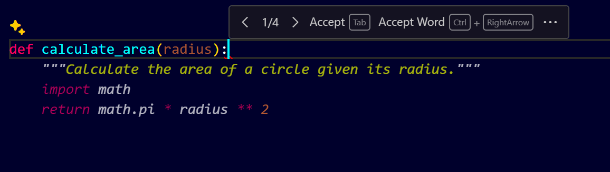
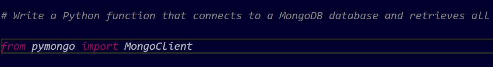
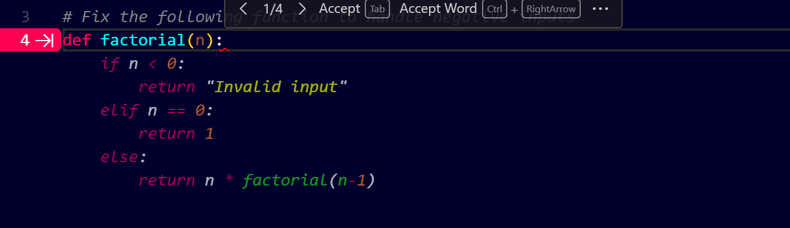

# **Comprehensive Guide to GitHub Copilot**

## **Introduction**

GitHub Copilot is an AI-powered code completion tool developed by GitHub in collaboration with OpenAI. It helps developers write code faster by providing code suggestions directly in your code editor. This guide will walk you through everything you need to know to effectively use GitHub Copilot.

---

## **Prerequisites**

* A GitHub account
* An active GitHub Copilot subscription
* Visual Studio Code (VS Code) installed (or any supported IDE)

---

## **Step 1: Setting Up GitHub Copilot**

1. **Sign in to GitHub**

   * Go to [GitHub.com](https://github.com) and log in.

2. **Activate GitHub Copilot Subscription**

   * Go to your account settings.
   * Under "Billing and plans," ensure that you have an active Copilot subscription.

3. **Install GitHub Copilot Extension in VS Code**

   * Open VS Code.
   * Go to the Extensions tab (Ctrl+Shift+X).
   * Search for "GitHub Copilot" and click "Install."

4. **Sign in to GitHub from VS Code**

   * Click on the GitHub Copilot icon in the lower right.
   * Sign in using your GitHub account.

---

## **Step 2: Basic Usage of GitHub Copilot**

### **Generating Code Suggestions**

* Start typing any code or function name, and Copilot will automatically provide suggestions.
* Use `Tab` to accept the suggestion.

### **Example:**

* Type `def calculate_area` and GitHub Copilot will automatically suggest the full function code:

```python
# Start typing
def calculate_area(radius):
```

**Copilot Suggestion:**



---

## **Step 3: Using Prompts Effectively**

### **Writing Natural Language Prompts**

* GitHub Copilot can understand natural language comments.
* Example:

```python
# Write a function to calculate factorial of a number
```

**Copilot Suggestion:**


```python
def factorial(n):
    if n == 0 or n == 1:
        return 1
    else:
        return n * factorial(n - 1)
```

### **Advanced Prompting**

* Use more descriptive prompts for complex tasks.
* Example:

```python
# Write a Python function that connects to a MongoDB database and retrieves all documents from a collection
```

**Copilot Suggestion:**


```python
from pymongo import MongoClient

def fetch_all_documents():
    client = MongoClient("mongodb://localhost:27017")
    db = client["mydatabase"]
    collection = db["mycollection"]
    return list(collection.find())
```

---

## **Step 4: Leveraging Copilot in Different Programming Languages**

* GitHub Copilot is not limited to Python. You can use it with multiple languages like JavaScript, Java, C++, and more.

### **JavaScript Example:**

```javascript
// Create a function to check if a number is even
```

**Copilot Suggestion:**

```javascript
function isEven(num) {
    return num % 2 === 0;
}
```

---

## **Step 5: Debugging with Copilot**

* If a code snippet is not working, use natural language to guide Copilot.
* Example:

```python
# Fix the following function to handle negative inputs
```

**Copilot will suggest an improved version of the function**


---

## **Step 6: Copilot Configuration and Settings**

* Go to VS Code settings (File > Preferences > Settings).
* Search for "GitHub Copilot."
* You can configure options like:

  * Enabling or disabling Copilot.
  * Setting Copilot to automatically show suggestions or wait for manual triggers.

---

## **Step 7: Best Practices for Using GitHub Copilot**

* Use clear and descriptive comments for better suggestions.
* Regularly review Copilot’s code to ensure accuracy.
* Use Copilot’s inline suggestions for speed, but always verify the logic.

---

## **Conclusion**

GitHub Copilot can significantly enhance your coding speed and efficiency. By using the right prompts and understanding how Copilot works, you can leverage its full potential.

