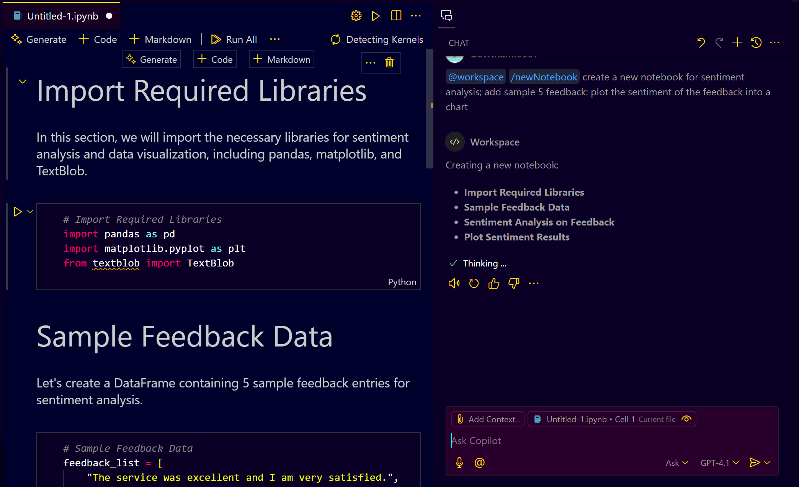
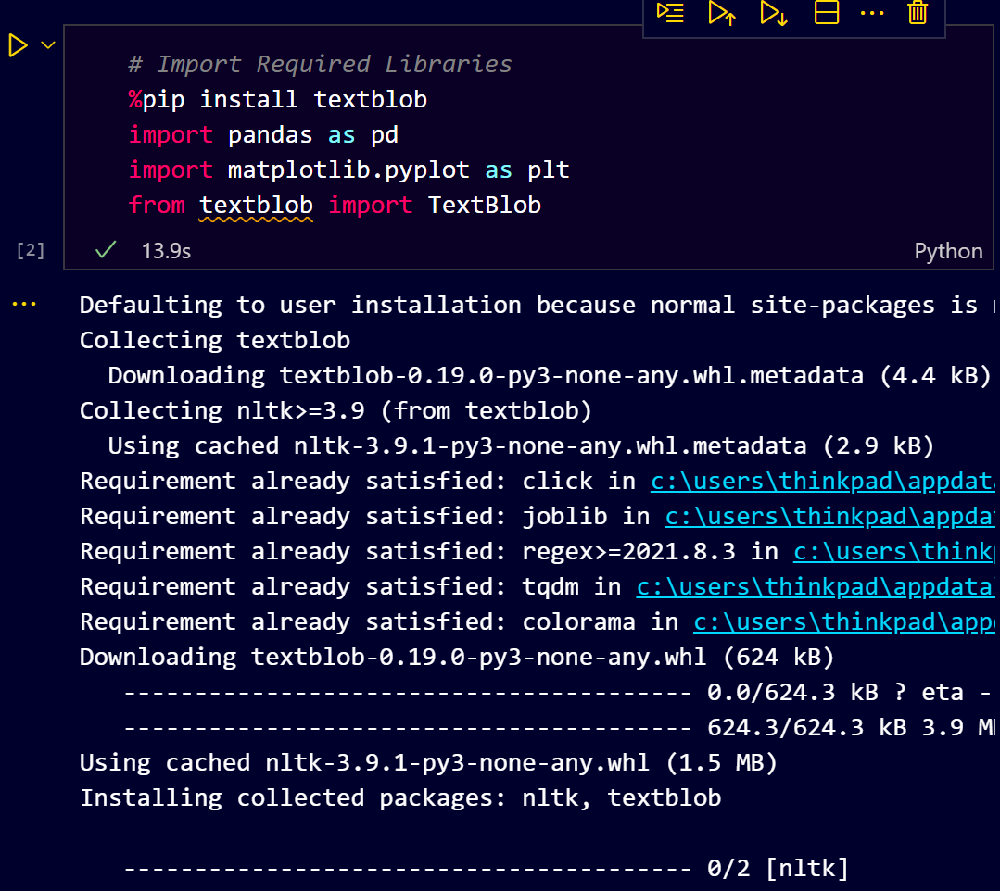
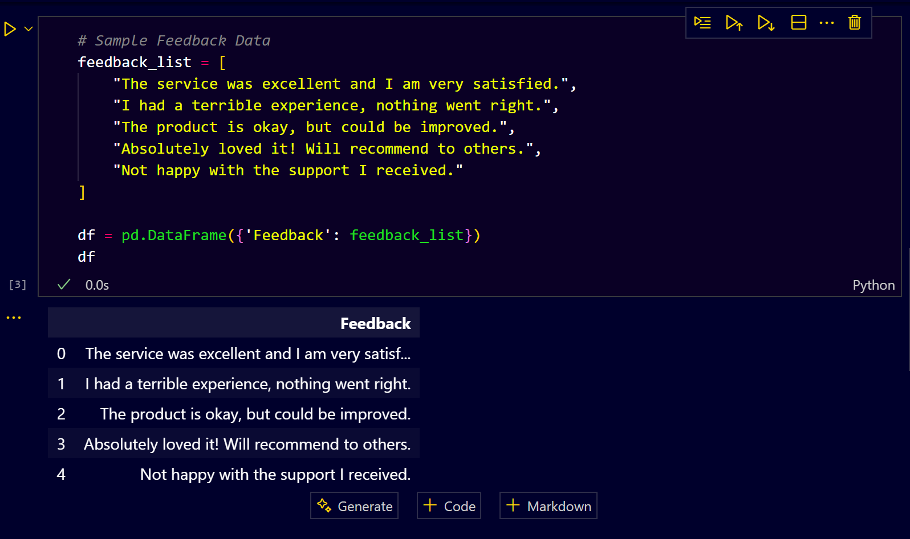
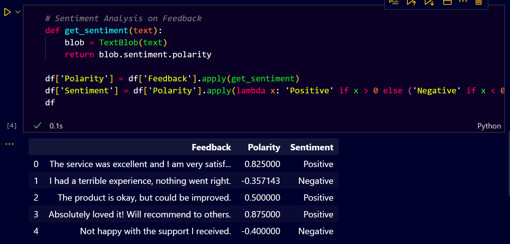
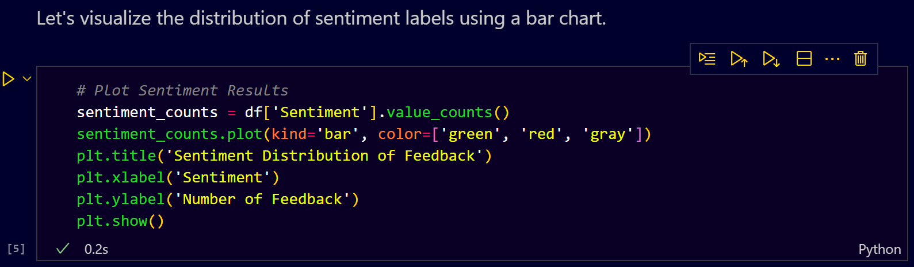
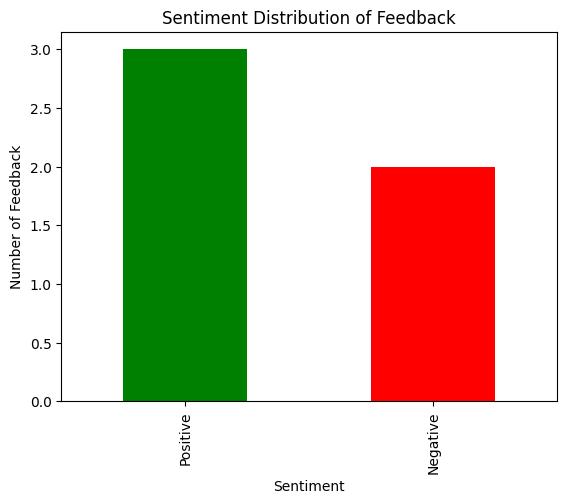

# **GitHub Copilot: Enhancing Jupyter Notebooks for Machine Learning Developers**

## **Prerequisites**

Before using GitHub Copilot with Jupyter Notebooks in Visual Studio Code (VS Code), ensure you have the following:

1. **Visual Studio Code (VS Code)**:

   * Download and install from the [official website](https://code.visualstudio.com/).

2. **Jupyter Extension for VS Code**:

   * Install the Jupyter extension by searching for "Jupyter" in the Extensions view (`Ctrl+Shift+X`).

3. **GitHub Copilot Extension**:

   * Install the GitHub Copilot extension from the Extensions view.

4. **GitHub Account**:

   * Sign in to your GitHub account within VS Code to activate Copilot.

5. **Python Environment**:

   * Ensure you have Python installed. Download it from the [official website](https://www.python.org/downloads/).

---

## **Step-by-Step Guide**

### **1. Create a New Jupyter Notebook**

* Open VS Code.

* Open Copilot Chat and type

**Prompt:** 
```plain text
@workspace /newNotebook create a new notebook for sentiment analysis; add sample 5 feedback: plot the sentiment of the feedback into a chart
```

**Copilot Suggestion**


---

### **2. Import Necessary Libraries**


---

### **3. Define Sample Feedback Data**


---

### **4. Perform Sentiment Analysis**


---

### **5. Visualize Sentiment Scores**




---

## **Using GitHub Copilot Efficiently**

### **1. Inline Suggestions**

* As you type, Copilot will provide inline suggestions. Press `Tab` to accept or `Esc` to dismiss.

### **2. Copilot Chat**

* **Prompt:** "Explain the sentiment analysis code step by step"

### **3. Hover Actions**

* Hover over a Copilot suggestion to see multiple options.
* Accept the entire suggestion, a single line, or word by word.

### **4. Context Menu**

* **Prompt:** "Explain this code" (Right-click > Copilot > Explain this code)

### **5. Optimizing Your Notebook**

* **Prompt:** "Optimize the sentiment analysis code for performance"

---

## **Conclusion**

By following this guide, you can efficiently leverage GitHub Copilot to enhance your productivity while working with Jupyter Notebooks in VS Code. 
