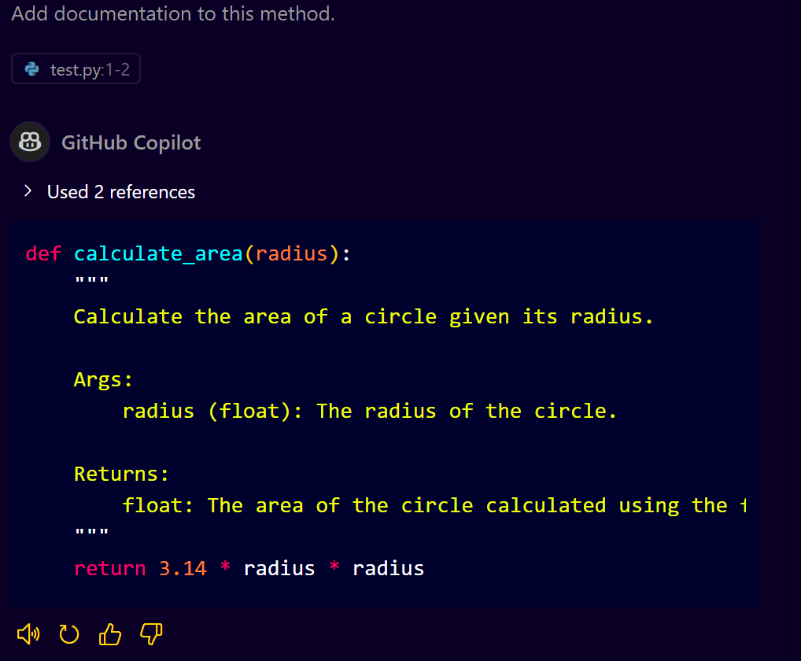
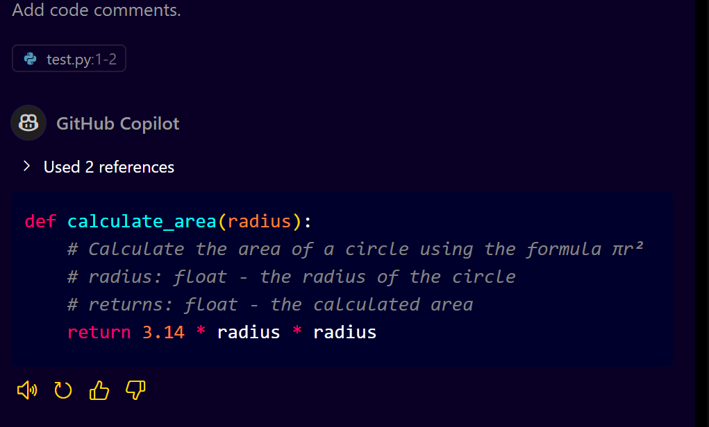
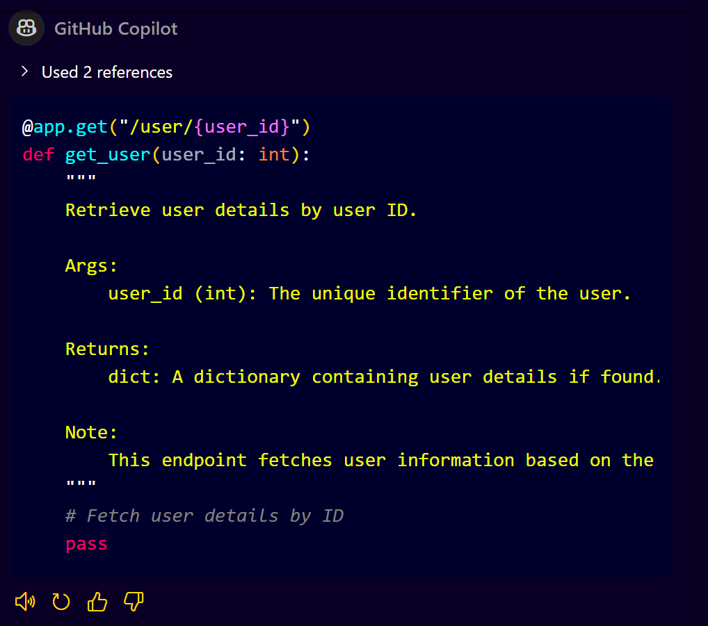
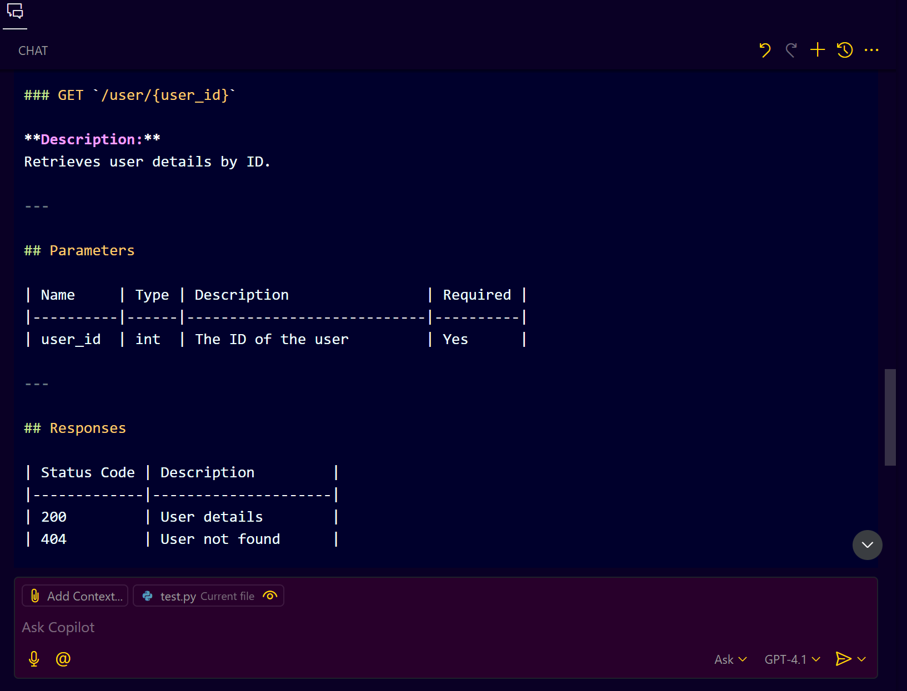
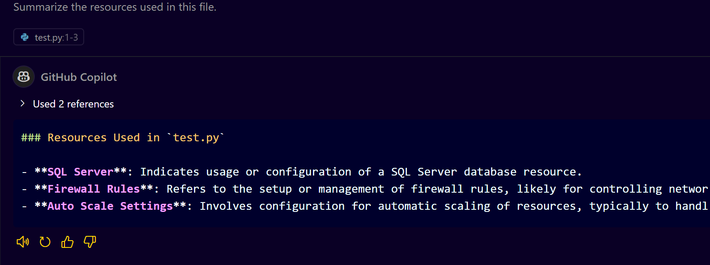

# **Step-by-Step Guide to Using GitHub Copilot for Documentation**

## **Introduction**
GitHub Copilot is an AI-powered code assistant developed by GitHub, designed to help developers write code faster and more efficiently. In addition to code generation, Copilot is highly effective for creating detailed documentation directly within your codebase. This guide will take you through the various ways you can leverage GitHub Copilot to automate and enhance your code documentation process.

---

## **1. Setting Up GitHub Copilot in VS Code**
1. Ensure you have VS Code installed.
2. Install the GitHub Copilot extension from the VS Code marketplace.
3. Sign in using your GitHub account and ensure Copilot is activated.

---

## **2. Understanding the Importance of Documentation**
* Documentation makes code more readable and maintainable.
* It helps other developers understand the code's functionality without delving into its logic.
* It is crucial for API documentation, code readability, and external integration.

---

## **3. Using GitHub Copilot for Code Documentation**

### **3.1 Method/Function Documentation**

* **Step 1:** Write your code or identify the method/function you want to document.
* **Step 2:** Place your cursor above the method.
* **Step 3:** Use the prompt:

  ```plaintext
  Add documentation to this method.
  ```
* **Example:**

  ```python
  def calculate_area(radius):
      return 3.14 * radius * radius
  ```

  **After prompting Copilot, it generates:**
  

### **3.2 In-Line Code Comments**

* **Step 1:** Identify a complex block of code.
* **Step 2:** Use the prompt:

  ```plaintext
  Add code comments.
  ```
* **Example:**

  ```python
  def calculate_discount(price, discount):
      return price - (price * discount / 100)
  ```

  **After prompting Copilot, it generates:**

  

---

## **4. API Documentation with GitHub Copilot**

### **4.1 Documenting API Methods**

* **Step 1:** Create or open an API controller file (e.g., `api_controller.py`).
* **Step 2:** Use the prompt:

  ```plaintext
  Add API documentation for all methods.
  ```
* **Example:**

  ```python
  @app.get("/user/{user_id}")
  def get_user(user_id: int):
      # Fetch user details by ID
      pass
  ```

  **After prompting Copilot, it generates:**

  

### **4.2 External API Documentation**

* **Step 1:** Identify your API file (e.g., `api_controller.py`).
* **Step 2:** Use the prompt:

  ```plaintext
  Generate external API documentation for this file.
  ```
* **Example:**

  ```plaintext
  API Name: User Management API
  Endpoint: GET /user/{user_id}
  Description: Retrieves user details by ID.
  Parameters:
  - user_id (int): The ID of the user.
  Response:
  - 200: User details.
  - 404: User not found.
  ```

* **Copilot Suggestion**
  

---

## **5. Documenting Complex Code Structures**

* **Step 1:** Identify a complex code file (e.g., a Cloud Resource Template).
* **Step 2:** Use the prompt:

  ```plaintext
  Summarize the resources used in this file.
  ```
* **Example:**

  ```plaintext
  - Resource: SQL Server
  - Resource: Firewall Rules
  - Resource: Auto Scale Settings
  ```

* **Copilot suggestion**
  

---

## **6. Best Practices for Using GitHub Copilot for Documentation**

* Use meaningful prompt phrases like "Add documentation" or "Summarize code".
* Always review and refine the documentation generated by Copilot.
* Prioritize clarity over complexity in the comments.

---

## **Conclusion**

GitHub Copilot can greatly enhance your documentation process, saving time and improving code quality. This guide provides a comprehensive overview of how to leverage Copilot for various documentation needs, from simple functions to complex API endpoints.
