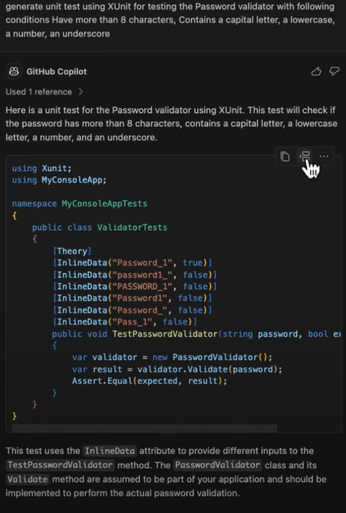
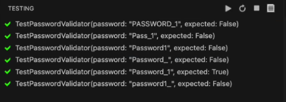

# **Master Test-Driven Development with GitHub Copilot**

## **Introduction**
Test-Driven Development (TDD) is a software development approach where test cases are written before the actual code. GitHub Copilot can significantly enhance this process by assisting in generating test cases and writing the corresponding code efficiently. In this guide, we will explore how to use GitHub Copilot to practice TDD using a Password Validator example.


## **What is Test-Driven Development (TDD)?**
TDD is a software development methodology that follows three main steps:

1. **Write Tests First:** Create unit tests that define the expected behavior of the code.
2. **Write Code:** Develop the code that meets the requirements of the tests.
3. **Refactor:** Optimize the code while ensuring that all tests still pass.

---

## **Setting Up the Project**

1. Create a new .NET project:

   ```bash
   dotnet new console -n PasswordValidator
   cd PasswordValidator
   dotnet new xunit -n PasswordValidator.Tests
   ```
2. Add a new class file `PasswordValidator.cs` in the main project directory.
3. Add a blank `PasswordValidator` class:

   ```csharp
   public class PasswordValidator
   {
   }
   ```

---

## **Step 1: Writing Unit Test Cases First**

* Open `PasswordValidator.Tests/UnitTest1.cs`.
* Start by providing a prompt to GitHub Copilot:

  ```plaintext
  Generate unit test cases for a PasswordValidator class that checks the following:
  - Password should not be null or empty.
  - Password must be at least 8 characters.
  - It should contain at least one uppercase letter, one lowercase letter, one digit, and one special character (_).
  ```

### **Copilot Suggestion**

Copilot may generate a data-driven test method like this:



```csharp
using Xunit;

public class PasswordValidatorTests
{
    [Theory]
    [InlineData("Password1_", true)]
    [InlineData("short1_", false)]
    [InlineData("nocapitals1_", false)]
    [InlineData("NOLOWERCASE1_", false)]
    [InlineData("NoDigit_", false)]
    public void ValidatePassword_ShouldValidatePasswordCorrectly(string password, bool expected)
    {
        var result = PasswordValidator.Validate(password);
        Assert.Equal(expected, result);
    }
}
```

---

## **Step 2: Generating the Password Validator Code**

* Now, provide a prompt for Copilot to generate the Password Validator code:

  ```plaintext
  Generate a PasswordValidator class that meets the unit test requirements above.
  ```

### **Copilot Suggestion**


```csharp
public static class PasswordValidator
{
    public static bool Validate(string password)
    {
        if (string.IsNullOrEmpty(password)) return false;
        if (password.Length < 8) return false;
        if (!password.Any(char.IsUpper)) return false;
        if (!password.Any(char.IsLower)) return false;
        if (!password.Any(char.IsDigit)) return false;
        if (!password.Contains("_")) return false;
        return true;
    }
}
```

---

## **Step 3: Running the Tests**

* Use the following command to run the test cases:

  ```bash
  dotnet test
  ```
* The tests should pass if the code is correctly written.
  
---

## **Step 4: Adding New Requirements and Refactoring**

* Now, add a new requirement: "Password must start with a letter."
* Provide a prompt to Copilot for the new test case:

  ```plaintext
  Generate a unit test case for PasswordValidator to ensure the password starts with a letter.
  ```

### **Copilot Suggestion**

```csharp
[InlineData("1Password_", false)]
[InlineData("_Password1", false)]
[InlineData("Password1_", true)]
```

* Update the `Validate` method in the PasswordValidator class accordingly:

```csharp
if (!char.IsLetter(password[0])) return false;
```

---

## **Conclusion**
Test-Driven Development (TDD) using GitHub Copilot can significantly speed up development by automating the generation of test cases and the corresponding code. Following this guide, you have learned how to:

* Set up a TDD project.
* Use GitHub Copilot to write test cases.
* Generate code that meets the test requirements.
* Enhance and refactor code as new requirements are added.
