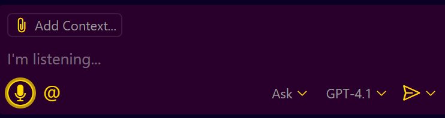
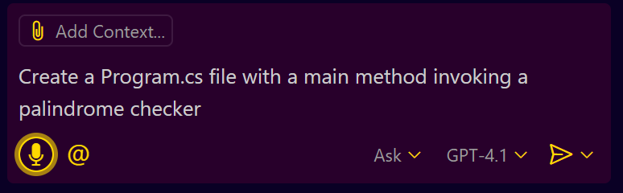
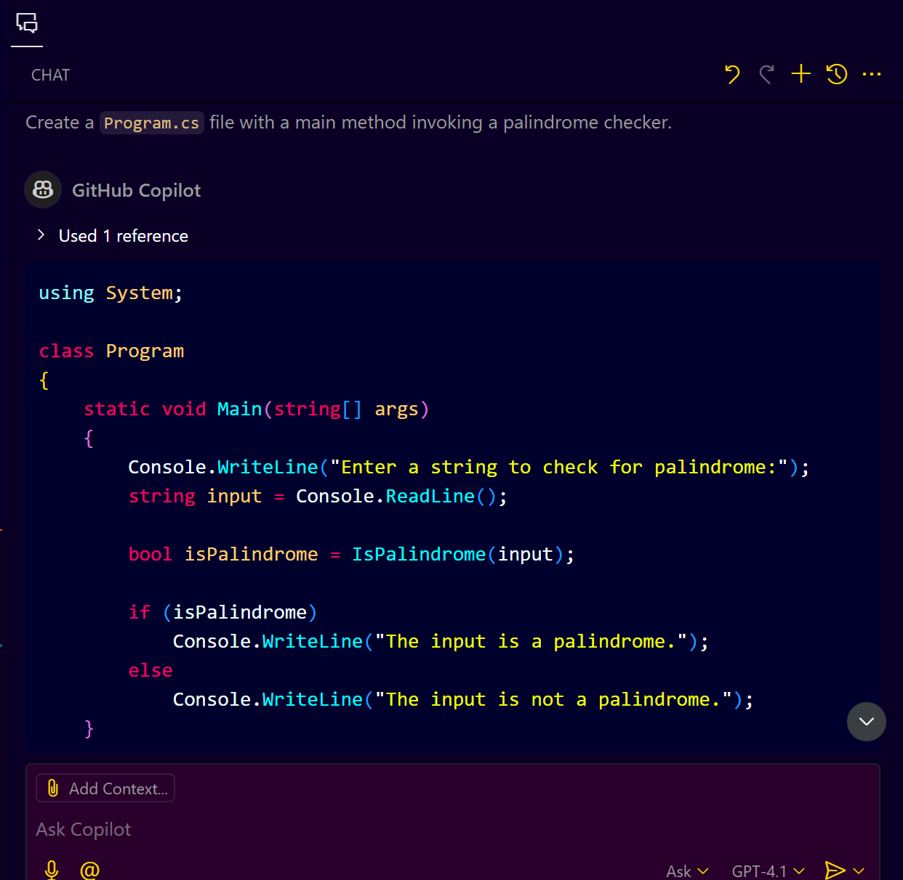
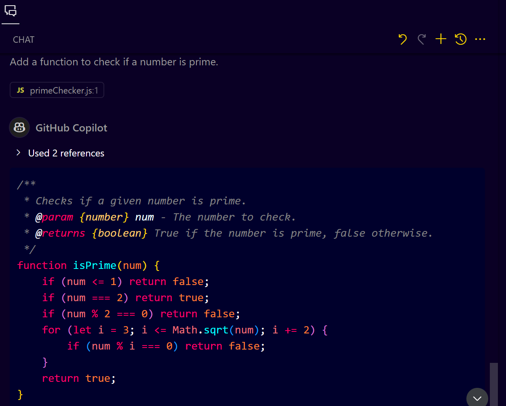
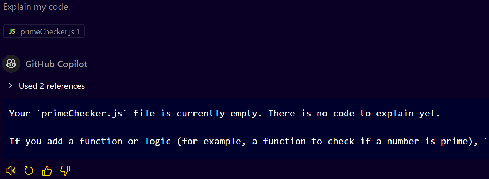
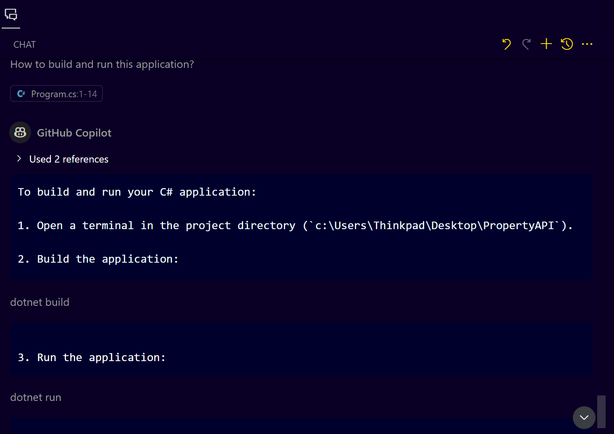
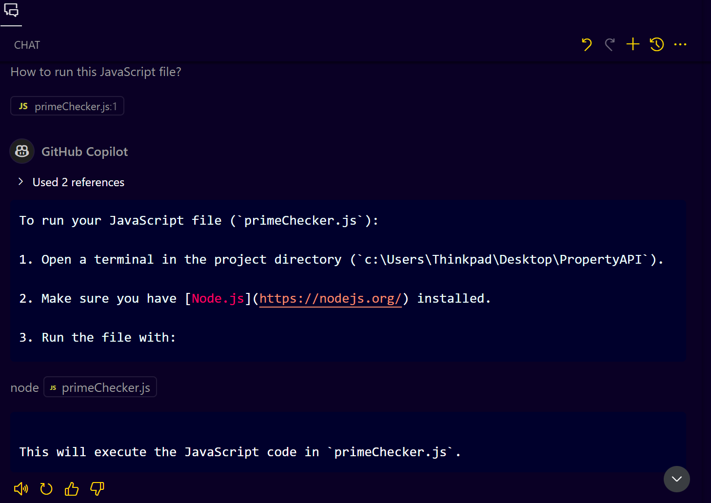

# **VS Code Speech Extension and GitHub Copilot**

## **Introduction**
This guide provides a comprehensive step-by-step approach to using the VS Code Speech Extension with GitHub Copilot. You will learn how to leverage voice commands to interact with GitHub Copilot, create code, and optimize your workflow without excessive typing.

---

## **Prerequisites**
* Visual Studio Code (VS Code) installed.
* GitHub Copilot (with Copilot Chat) enabled on your account.
* VS Code Speech Extension installed.
* A working microphone with necessary OS permissions.

---

## **Step 1: Installing VS Code Speech Extension**
1. Open VS Code.
2. Go to the Extensions tab (Ctrl+Shift+X on Windows/Linux or Cmd+Shift+X on Mac).
3. Search for "VS Code Speech" and install the extension from Microsoft.

### **Granting Microphone Permissions**
* Ensure that VS Code has microphone access:

  * **On Windows:** Settings > Privacy > Microphone > Ensure VS Code is listed.
  * **On Mac:** System Preferences > Privacy & Security > Microphone > Ensure VS Code is enabled.

---

## **Step 2: Enabling Copilot Chat**

1. Ensure GitHub Copilot is installed and activated in your VS Code.
2. Open the Copilot Chat window by clicking the Copilot icon in the sidebar.
3. Make sure "Copilot Chat" is enabled in your account settings.

---

## **Step 3: Using Voice Commands in Copilot Chat**

* In the Copilot Chat window, click the microphone icon or use the keyboard shortcut (Cmd+I on Mac or Ctrl+I on Windows).
  

### **Example 1: C# - Palindrome Checker**

1. Create a new file named `Program.cs`.
2. Use the voice command: "Create a `Program.cs` file with a main method invoking a palindrome checker."
   

3. Copilot will generate the boilerplate code.
4. Refine the code using voice prompts: "Add code to check if a string is a palindrome."
5. Copilot Suggestion: 
    
    

---

### **Example 2: JavaScript - Prime Number Checker**

1. Create a new file named `primeChecker.js`.
2. Use the voice command: "Add a function to check if a number is prime."
3. Copilot will generate the code logic.
   
   

---

## **Step 4: Configuring Voice Settings**

1. Go to VS Code Settings (Ctrl+, on Windows/Linux or Cmd+, on Mac).
2. Search for "Speech".
3. Adjust settings:

   * **Speech Language:** Choose your preferred language.
   * **Speech Timeout:** Adjust the recognition duration.

---

## **Step 5: Using Voice Commands for Documentation**

* Use voice commands to generate documentation:

  * "Explain my code."
     

---

## **Step 6: Voice Commands for Build and Run**

* **For C#:**

  * Voice Command: "How to build and run this application?"
  * Copilot Suggestion: "dotnet build" and "dotnet run".
    

* **For JavaScript:**

  * Voice Command: "How to run this JavaScript file?"
  * Copilot Suggestion: "node primeChecker.js".
    

---

## **Step 7: Optimizing Your Workflow**

* Use clear and concise voice prompts.
* Utilize inline chat for quick code explanations or modifications.
* Adjust voice settings for better recognition.

---

## **Troubleshooting**
* If the microphone icon is not visible, ensure microphone permissions are granted.
* If the voice command is not recognized, try speaking clearly and check your microphone settings.

---

## **Conclusion**
The VS Code Speech Extension combined with GitHub Copilot provides an efficient way to code using your voice. Experiment with various voice prompts to fully leverage this integration.
