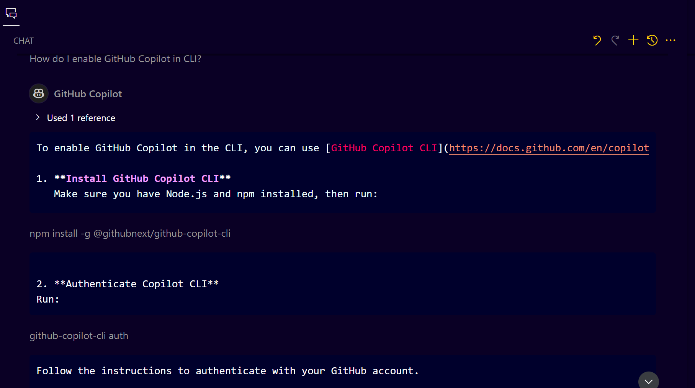
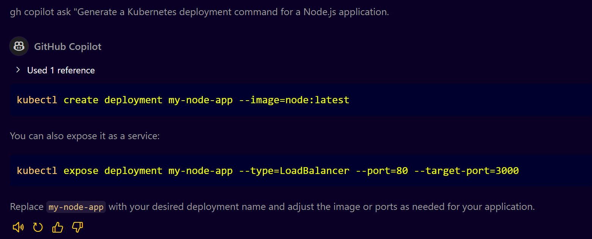
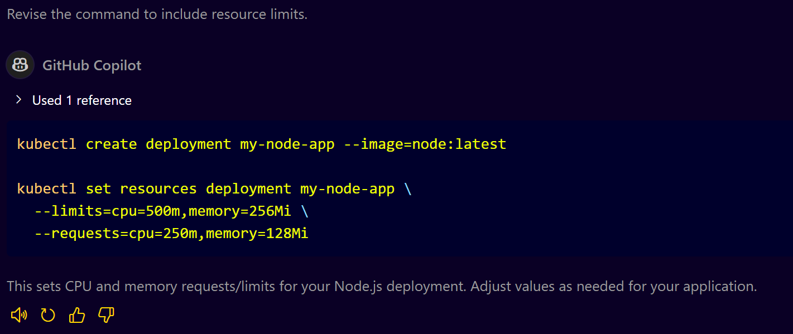
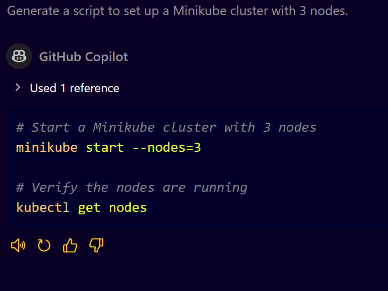
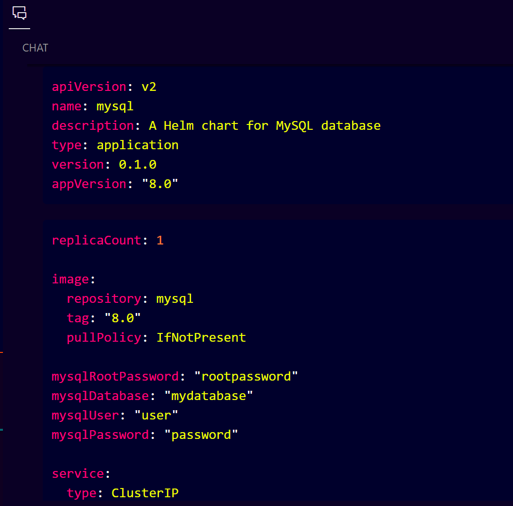
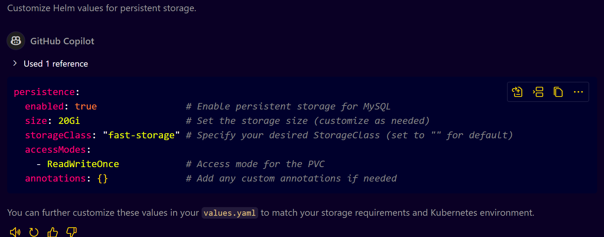

# **Kubernetes Automation with Generative AI using GitHub Copilot**

## **Introduction**
This guide provides a detailed step-by-step approach to automating Kubernetes tasks using GitHub Copilot, leveraging its generative AI capabilities. You will learn how to effectively use Copilot for CLI commands, Kubernetes cluster setup, configuration management, CI/CD, and more.

---

## **Prerequisites**
* Basic knowledge of Kubernetes and DevOps tools.
* Installed GitHub Copilot in VS Code (Visual Studio Code).
* Access to a Kubernetes cluster (local or cloud-based).
* GitHub CLI installed and authenticated (`gh` command available).

---

## **Understanding Kubernetes Automation**

### **What is Kubernetes and Why Automate It?**
Kubernetes is an open-source platform for automating the deployment, scaling, and management of containerized applications. Automation in Kubernetes helps reduce manual effort, minimize errors, and ensure consistent and reliable deployments.


### **Understanding GitHub Copilot and Its Role in Automation**
GitHub Copilot is an AI-powered code completion tool that assists with code generation, command-line tasks, and automation scripts. When integrated with Kubernetes, it can generate YAML configurations, Helm charts, and Kubernetes commands, reducing manual scripting time.


### **How GitHub Copilot Works with CLI and Code Editors**
* In CLI: Copilot can be used to generate commands, scripts, and configuration files directly from the terminal.
* In Code Editors: Copilot provides code completions, suggestions, and automated configurations.
  

### **Why Use GitHub Copilot for Kubernetes Management?**
* Automate repetitive tasks.
* Generate complex Kubernetes configurations instantly.
* Minimize human errors in scripting.
* Enhance productivity with smart AI suggestions.


### **Best Practices for Effective Prompting with GitHub Copilot**
* Use clear and precise prompts for accurate suggestions.
* Experiment with variations in prompts for better results.
* Always review and test the generated commands.

---

## **1. Setting Up GitHub Copilot**
1. Open VS Code.
2. Install the GitHub Copilot extension from the Extensions Marketplace.
3. Sign in with your GitHub account.
4. Enable Copilot for VS Code and CLI.

### **Example Prompt:**

* **Prompt:** "How do I enable GitHub Copilot in CLI?"
  
* **Copilot Suggestion:** "Use the command: `gh extension install github/copilot-cli`"
  

---

## **2. Using GitHub Copilot in CLI (Command Line Interface)**
GitHub Copilot can generate and assist with Kubernetes commands directly from the terminal.

### **Example: Generating a Kubernetes Deployment Command**
1. Run the command:

   ```bash
   gh copilot ask "Generate a Kubernetes deployment command for a Node.js application."
   ```
2. Copilot Suggestion:

   

### **Advanced Usage - Revising Commands**
* **Prompt:** "Revise the command to include resource limits."
* **Copilot Suggestion:**
  

---

## **3. Automating Kubernetes Cluster Setup**
* Use Copilot to generate cluster setup scripts, manage nodes, and set up networking.

### **Example: Cluster Setup with Minikube**
* **Prompt:** "Generate a script to set up a Minikube cluster with 3 nodes."
  
* **Copilot Suggestion:**
   

---

## **4. Configuration Management with Helm and Customization**
* Use Helm for Kubernetes configuration management and Copilot for Helm chart automation.

### **Example: Creating a Helm Chart**
* **Prompt:** "Generate a Helm chart for a MySQL database."

* **opilot Suggestion:**
   

### **Customizing Helm Values**
* **Prompt:** "Customize Helm values for persistent storage."
* **Copilot Suggestion:**
  

---

## **5. CI/CD Automation using Jenkins and GitHub Actions**
* Automate Kubernetes deployments with Jenkins and GitHub Actions.

### **Example: Jenkins Configuration**
* **Prompt:** "Generate a Jenkinsfile for Kubernetes deployment."
* **Copilot Suggestion:**

   ```groovy
   pipeline {
     agent any
     stages {
       stage('Deploy') {
         steps {
           sh 'kubectl apply -f deployment.yaml'
         }
       }
     }
   }
   ```

---

### **GitHub Actions Workflow**
* **Prompt:** "Generate a GitHub Actions workflow for Kubernetes deployment."
* **Copilot Suggestion:**

  ```yaml
  name: Deploy to Kubernetes

  on: [push]

  jobs:
    deploy:
      runs-on: ubuntu-latest
      steps:
        - name: Set up Kubernetes
          run: kubectl apply -f deployment.yaml
  ```

---

## **6. Advanced Tips**

### **Using Workspace Context**
* Prompt: "Generate Helm charts for all microservices in my project."
* Copilot can read your project structure and suggest Helm charts for each service.


### **Multi-Language Support**
* **Prompt:** "Generate a Kubernetes deployment in my local language (e.g., Malayalam)."
* **Copilot** can provide commands and explanations in your preferred language.


### **Best Practices**
* Always review and test commands suggested by Copilot.
* Use precise prompts for accurate suggestions.
* Regularly update GitHub Copilot for the latest features.

---

## **Conclusion**
GitHub Copilot is a powerful tool for automating Kubernetes tasks. With its AI-driven suggestions, you can accelerate your workflow, minimize errors, and focus on higher-level tasks. Experiment with different prompts to unlock its full potential.
