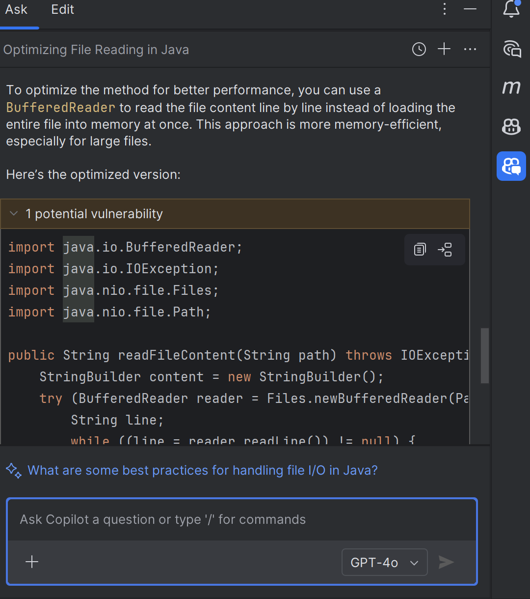

# **Introduction to GitHub Copilot Chat in IntelliJ**

GitHub Copilot Chat allows you to:

* Get code explanations
* Generate code
* Optimize performance
* Check for security issues
* Add documentation
* Manage multiple conversations efficiently

It is available in JetBrains IDEs like **IntelliJ IDEA**, **PyCharm**, **Android Studio**, etc.

---

## **Step 1: Setting Up Copilot Chat in IntelliJ**

1. **Ensure You Have:**

   * A GitHub Copilot subscription
   * IntelliJ IDEA (2023.1 or newer)
   * GitHub Copilot plugin installed (from *Settings > Plugins > Marketplace*)

2. **Enable Copilot Chat:**

   * Go to `Settings > Tools > GitHub Copilot`
   * Enable **"Copilot Chat (Preview)"**
   * Log in with your GitHub account

3. **Open the Chat Interface:**

   * Use shortcut: `Ctrl + Shift + A` → Search **"GitHub Copilot: Chat"**
   * Or open from the **Copilot Sidebar**

---

## **Step 2: Using Copilot Chat with Prompts**

### **Example 1: Explain a Method**

1. Select a code block or place cursor in method:

```java
public String readFileContent(String path) throws IOException {
    return new String(Files.readAllBytes(Paths.get(path)));
}
```

2. **Prompt:**

   ```
   /explain this method
   ```

3. **Copilot Suggestion:**
   
   
> "This method reads all bytes from the file at the given path and returns its content as a String. It throws an IOException if the file cannot be read."

---

### **Example 2: Check for Security Issues**

**Prompt:**

```
Are there any security issues in this method?
```

**Copilot Suggestion:**

> "This method may expose the application to path traversal if `path` is user-controlled. Consider validating or sanitizing the input path."

---

### **Example 3: Optimize Performance**

**Prompt:**

```
How can I optimize this method for better performance?
```

**Copilot Suggestion:**

> "Consider using a `BufferedReader` for large files instead of reading all bytes at once."

---

### **Example 4: Add Documentation**

**Prompt:**

```
/doc
```

**Or:**

```
Add JavaDoc to this method.
```

**Copilot Suggestion:**

```java
/**
 * Reads the content of a file from the given path.
 * 
 * @param path the file path
 * @return content of the file as a String
 * @throws IOException if reading fails
 */
```

---

### **Example 5: Simplify Code**

**Prompt:**

```
/simplify
```

**Copilot Suggestion:**

If the method has unnecessary complexity, Copilot will propose a simpler version with an explanation.

---

## **Step 3: Managing Conversations**

### **Start New Conversation**

* Click **“+”** in the Chat panel to start a new topic.
* Useful when switching files or tasks (e.g., from FileManager to TodoService).

### **Rename Conversations**


* Click the **three dots (⋮)** → Rename
* Helps organize topics like:

  * “File Reading Optimization”
  * “TodoService Unit Tests”

### **Delete Conversations**

* Right-click a conversation in history → **Delete**

---

## **Step 4: Maintain Context Across Files**

If you're working with multiple files (e.g., `TodoService.java` and `TodoServiceImpl.java`):

1. Chat may lack full context if the file isn’t open.
2. **Solution:** Use the **File Picker**:

* Click **“+ Add Context”** in chat
* Select the file(s) you want to include (e.g., `TodoService.java`)
* Ask:

  ```
  Explain the methods defined in TodoService.java
  ```

Copilot will now consider methods like:

```java
void addTodo(Todo todo);
List<Todo> retrieveTodos();
boolean deleteTodo(int id);
```

---

## **Step 5: View & Use Chat History**

* Click **“View All Conversations”** to see the list.
* Resume from any point by selecting the appropriate conversation.

---

## **Step 6: Copy & Use Output**

You can:

* **Copy full response:** Click “Copy Message Content”
* **Copy code block:** Hover over code → Click `Copy` or `Insert`

You can paste it into:

* Your source file
* A comment
* Documentation
* External reviews

---

## **Example Scenario: Writing Unit Tests with Context**

1. Open your test file: `TodoServiceTest.java`

2. Prompt:

   ```
   Generate JUnit test cases for TodoService
   ```

3. If context is missing, **add `TodoService.java` using the file picker**

4. Copilot now understands the service and generates:

```java
@Test
void testAddTodo() {
    TodoService service = new TodoServiceImpl();
    Todo todo = new Todo("Test Task");
    service.addTodo(todo);
    assertEquals(1, service.retrieveTodos().size());
}
```

---

## **Pro Tips**

| Feature                | Tip                                                  |
| ---------------------- | ---------------------------------------------------- |
| Slash Commands         | Try `/explain`, `/doc`, `/fix`, `/test`, `/simplify` |
| Use File Picker        | Add missing files for better context                 |
| Rename Conversations   | Use descriptive titles for easier navigation         |
| View All History       | Quickly resume older threads                         |
| Dock/Float Chat Window | Adjust layout for your comfort                       |

---

## Conclusion

GitHub Copilot Chat in IntelliJ is a **powerful AI assistant** that:

* Enhances code understanding
* Helps in debugging, testing, and documentation
* Boosts productivity with contextual awareness

