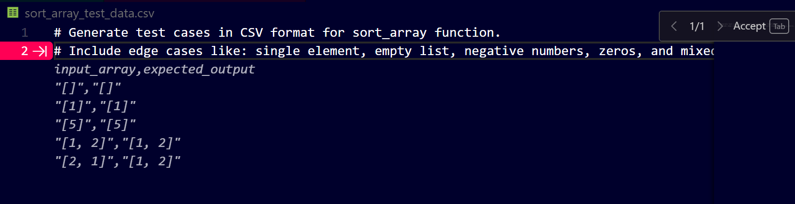

# **Step-by-Step Guide: Test Data Generation with GitHub Copilot**


## **Step 1: Understand Data-Driven Testing**

**Data-driven unit testing** means testing your function against multiple **sets of input data** using the **same test logic**. Instead of writing a new test for each input, we provide a batch of inputs (often via CSV or arrays).

---

## **Step 2: Set Up Your Function (to be Tested)**

Start with a basic function. Let’s take a simple **array sorting** function.

```python
def sort_array(arr):
    return sorted(arr)
```

---

## **Step 3: Prompt Copilot to Generate Test Data**

**Copilot Prompt (Comment)**:

```python
# Generate test cases in CSV format for sort_array function.
# Include edge cases like: single element, empty list, negative numbers, zeros, and mixed values.
```

**Copilot Suggestion**:



```csv
input_array,expected_output
"[]","[]"
"[1]","[1]"
"[5]","[5]"
"[1, 2]","[1, 2]"
"[2, 1]","[1, 2]"
"[1, 2, 3]","[1, 2, 3]"
"[3, 2, 1]","[1, 2, 3]"
"[1, 3, 2]","[1, 2, 3]"
"[2, 1, 3]","[1, 2, 3]"
"[3, 1, 2]","[1, 2, 3]"
"[1, 2, 3, 4]","[1, 2, 3, 4]"
```

> Save this as `sort_array_test_data.csv`.

---

## **Step 4: Write a Data-Driven Test Using unittest (Python)**

```python
import unittest
import csv
from your_module import sort_array

class TestSortArray(unittest.TestCase):
    def test_sort_array_data_driven(self):
        with open('sort_array_test_data.csv', newline='') as csvfile:
            reader = csv.DictReader(csvfile)
            for row in reader:
                input_data = eval(row['input'])        # Convert string to list
                expected_data = eval(row['expected'])
                self.assertEqual(sort_array(input_data), expected_data)

if __name__ == '__main__':
    unittest.main()
```

---

## **Step 5: Try a Conditional Function Example (Evaluate Grade)**

Example function with logic/branching:

```python
def evaluate_grade(score, is_owner):
    if is_owner:
        if score >= 90:
            return 'A'
        elif score >= 80:
            return 'B'
        elif score >= 70:
            return 'C'
        elif score >= 60:
            return 'D'
        else:
            return 'F'
    else:
        return 'Not Owner'
```

---

### **Prompt Copilot for This Function:**

**Prompt:**

```python
# Generate test data in CSV format for evaluate_grade(score, is_owner).
# Include boundary values (89, 90), owner=True/False, and invalid cases.
```

**Copilot Suggestion**:

```csv
score,is_owner,expected
95,True,"A"
85,True,"B"
75,True,"C"
65,True,"D"
50,True,"F"
90,False,"Not Owner"
70,False,"Not Owner"
```

---

### **Unit Test for Evaluate Grade:**

```python
class TestEvaluateGrade(unittest.TestCase):
    def test_evaluate_grade_data_driven(self):
        with open('evaluate_grade_test_data.csv', newline='') as csvfile:
            reader = csv.DictReader(csvfile)
            for row in reader:
                score = int(row['score'])
                is_owner = row['is_owner'].lower() == 'true'
                expected = row['expected']
                self.assertEqual(evaluate_grade(score, is_owner), expected)
```

---

## **Step 6: File Reading Example with IO Handling**

```python
def read_file(file_path):
    try:
        with open(file_path, 'r') as f:
            return f.read()
    except FileNotFoundError:
        return "File Not Found"
```

**Prompt:**

```python
# Generate test data for read_file(file_path) including:
# valid path, invalid path, empty file, large file.
```

**Copilot Suggestion**:

```csv
file_path,expected
"valid_file.txt","Hello, World!"
"missing_file.txt","File Not Found"
"empty.txt",""
```

> You’ll need to **create dummy files** (`valid_file.txt`, `empty.txt`) and **omit** `missing_file.txt`.

---

## **Step 7: Prime Number Function**

```python
def is_prime(n):
    if n < 2:
        return False
    for i in range(2, int(n**0.5) + 1):
        if n % i == 0:
            return False
    return True
```

**Prompt:**

```python
# Generate test cases in CSV format for is_prime function with edge cases: 0, 1, 2, negative, prime, non-prime.
```

**Copilot Suggestion**:

```csv
input,expected
-1,False
0,False
1,False
2,True
3,True
4,False
5,True
16,False
17,True
```

---

### **Test Case:**

```python
class TestIsPrime(unittest.TestCase):
    def test_is_prime_data_driven(self):
        with open('is_prime_test_data.csv', newline='') as csvfile:
            reader = csv.DictReader(csvfile)
            for row in reader:
                number = int(row['input'])
                expected = row['expected'].lower() == 'true'
                self.assertEqual(is_prime(number), expected)
```

---

## **Summary**

| Step | Description                           |
| ---- | ------------------------------------- |
| 1    | Define your function                  |
| 2    | Add prompt comments for Copilot       |
| 3    | Generate CSV-format test data         |
| 4    | Write unit tests to read CSV and test |
| 5    | Run and validate                      |

