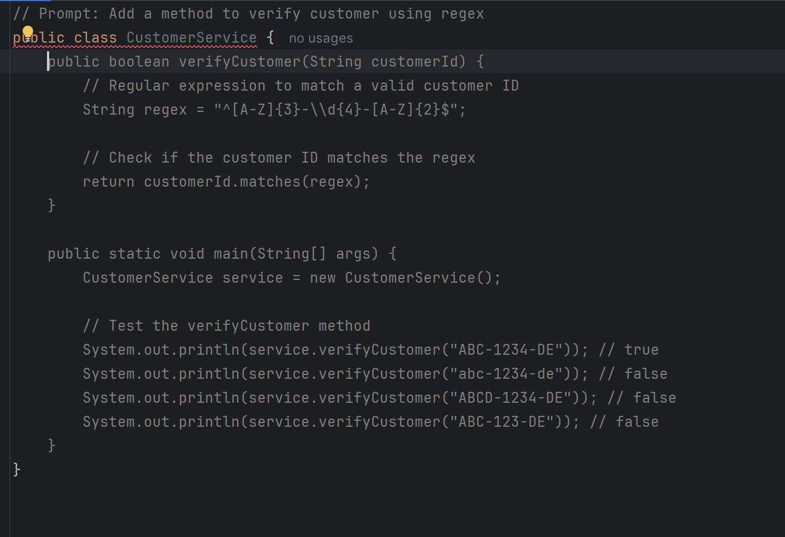
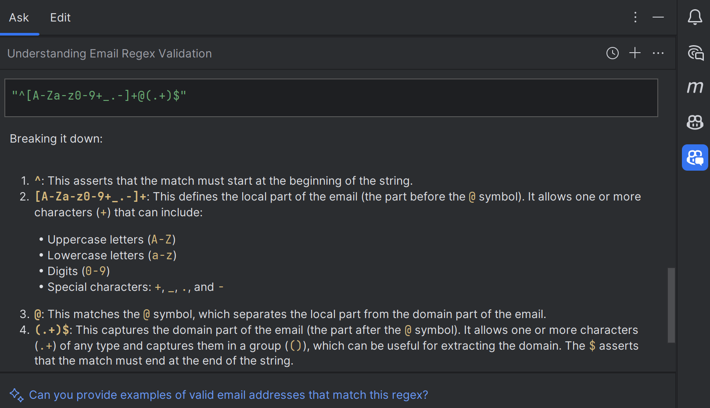
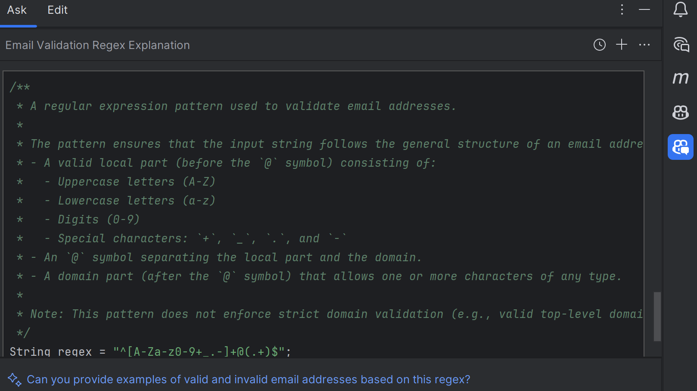
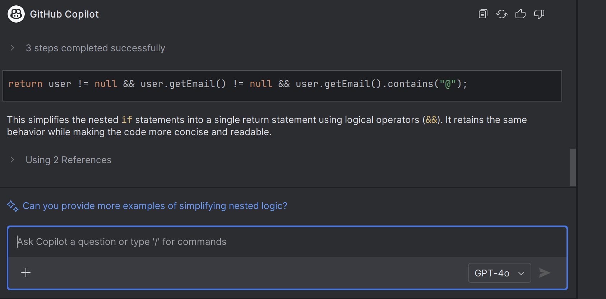
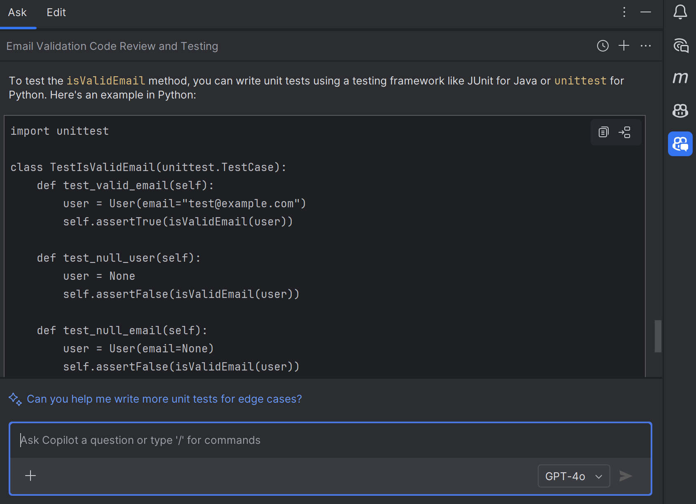

# **Github Copilot Basics For IntelliJ Users**

## **Install GitHub Copilot Plugin in IntelliJ**

1. **Open IntelliJ IDEA**.
2. Go to: `File > Settings > Plugins` (or use `Ctrl + Alt + S`).
3. Switch to the **Marketplace** tab.
4. **Search for "GitHub Copilot"**.

   * Make sure you select the **official GitHub Copilot plugin** with the recognizable **Copilot icon**.
5. Click **Install**.
6. Once installed, it will prompt you to **restart IntelliJ**. Accept and restart.

✅ After restart, GitHub Copilot will be activated in IntelliJ.

---

## **Login to GitHub Copilot**

1. Navigate to `Tools > GitHub Copilot > Log In`.
2. Authenticate with your **GitHub account**.
3. Once logged in, `Tools > GitHub Copilot` will show the **“Log Out”** option instead of “Log In”.

---

## **Explore Copilot Settings**

Go to `Tools > GitHub Copilot > Settings`

Key Options:

* ✅ **Enable/Disable Auto-Completion**
* ✅ **Enable Suggestions for Specific Languages**
* ✅ **Set Proxy Configuration**
* ✅ **Enable Plugin Auto-Updates**

---

## **Keyboard Shortcuts**

To configure Copilot shortcuts:

* Navigate to: `File > Settings > Keymap`
* In the search box, type `GitHub Copilot`

Key mappings to consider:

* **Next Suggestion**: `Alt + ]`
* **Previous Suggestion**: `Alt + [`
* **Accept Suggestion**: `Tab`
* **Trigger Inline Suggestion**: `Ctrl + Enter` or `Alt + Enter`

---

## **Using Copilot Suggestions in Code**

Copilot automatically gives suggestions as you type.

### **Example 1: Generate a Method**

```java
// Prompt: Add a method to verify customer using regex
public class CustomerService {
```

**Copilot Suggestion**

You can improve or simplify this using **Copilot Chat**, explained below.

---

## **Using GitHub Copilot Chat**

Copilot Chat is available from:

* `Tools > GitHub Copilot > Chat`
* Or via side panel in IntelliJ

### **Example Slash Commands**

| Command     | Purpose                                  |
| ----------- | ---------------------------------------- |
| `/explain`  | Explains a piece of code or regex        |
| `/doc`      | Adds documentation/comments to your code |
| `/fix`      | Suggests bug fixes                       |
| `/simplify` | Simplifies a complex method              |
| `/test`     | Generates unit tests for a function      |

---

### **Example 2: Explain Regex Using `/explain`**

**Code:**

```java
String regex = "^[A-Za-z0-9+_.-]+@(.+)$";
```

**Prompt in Copilot Chat:**

```
/explain this regex
```

**Copilot Chat Output:**



> This regex checks if the string is a valid email.
>
> * `^` asserts the start
> * `[A-Za-z0-9+_.-]+` matches one or more valid characters
> * `@` ensures presence of @
> * `(.+)$` ensures characters after @

---

### **Example 3: Add Documentation Using `/doc`**

**Prompt:**

```
/doc this method
```

**Copilot Output:**


---

### **Example 4: Simplify Complex Code**

```java
// Original Code:
if (user != null) {
    if (user.getEmail() != null) {
        if (user.getEmail().contains("@")) {
            return true;
        }
    }
}
return false;
```

**Prompt:**

```
/simplify this logic
```

**Copilot Output:**


```java
return user != null && user.getEmail() != null && user.getEmail().contains("@");
```

---

### **Example 5: Generate Unit Tests**

**Prompt:**

```
/test isValidEmail method
```

**Copilot Suggestion:**



---

## **Inspect Copilot Logs**

Navigate to:

* `Tools > GitHub Copilot > Diagnostics`

Use this when:

* You want to troubleshoot issues
* Copilot is not responding
* You want to analyze logs or SSL certs

---

## **Start New Chat Session**

Click the `+` icon in Copilot Chat pane to begin a fresh conversation.

You can:

* Ask contextual questions
* Load additional files for better answers
* Move the panel to left/right (drag UI)

---

## **Example Prompts to Use**

| Purpose        | Prompt                                                  |
| -------------- | ------------------------------------------------------- |
| Add Method     | “Add a method to calculate age from date of birth”      |
| Explain Code   | “/explain this method”                                  |
| Simplify       | “/simplify this block”                                  |
| Generate Tests | “/test the method getUserDetails”                       |
| Check Usage    | “Is the method `getCustomer()` used in any controller?” |
| Show Flow      | “Define the user flow of the method `getCustomer()`”    |

---

## Summary

| Feature           | Action                                           |
| ----------------- | ------------------------------------------------ |
| 🔌 Install Plugin | IntelliJ > Plugins > GitHub Copilot              |
| 🔐 Login          | Tools > GitHub Copilot > Log In                  |
| ⚙️ Configure      | Tools > GitHub Copilot > Settings                |
| 💬 Chat Usage     | Tools > GitHub Copilot > Chat                    |
| 💡 Slash Commands | `/doc`, `/explain`, `/test`, `/simplify`, `/fix` |
| 🔍 Diagnostics    | View logs if issues arise                        |

