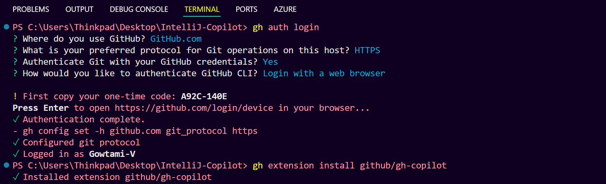
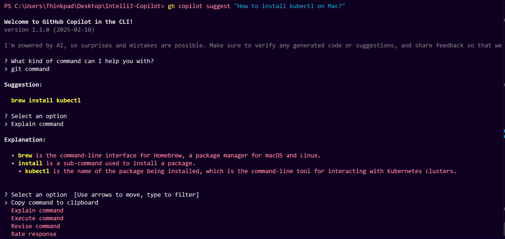
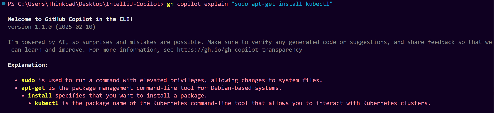
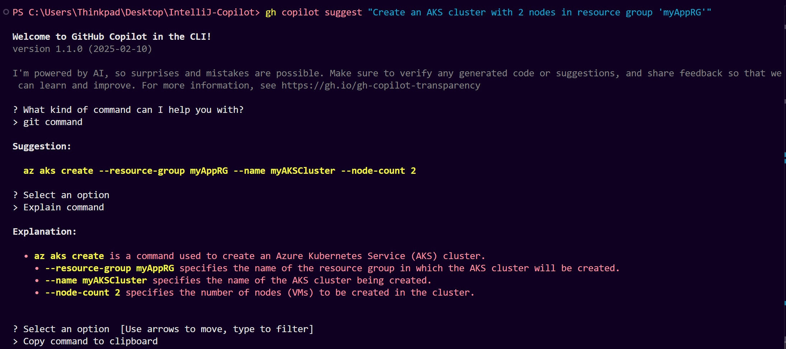
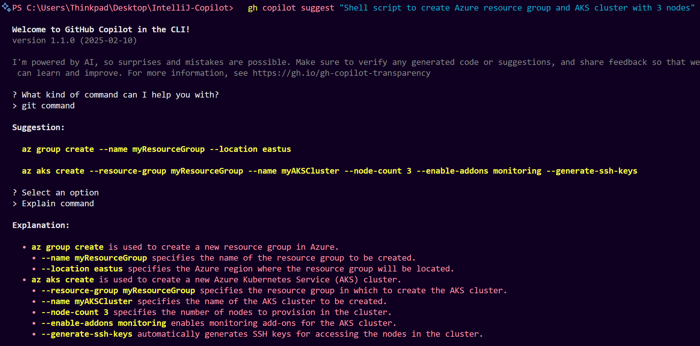

# **GitHub Copilot - Streamlining Kubernetes Development with Intelligent Assistance**

## **Introduction**

The session explores how **GitHub Copilot** enhances **Kubernetes development** by automating:

* Cluster provisioning
* Application deployment
* Configuration management
* CI/CD integration
* Monitoring/logging

---

## **To install the GitHub CLI (`gh`) on Windows, follow these steps:**

1. **Go to the official GitHub CLI download page**:
   👉 [https://cli.github.com/](https://cli.github.com/)

2. Click **"Windows"** to download the `.msi` installer.

3. **Run the installer** and follow the setup steps.

4. After installation, **restart your terminal** (PowerShell, Command Prompt, or Git Bash).

5. Verify installation:

   ```powershell
   gh --version
   ```
   

---

## **Install GitHub Copilot CLI Extension**

1. **Ensure you have GitHub CLI (`gh`) installed** and authenticated:

   ```bash
   gh auth login
   ```

2. **Install the Copilot CLI extension**:

   ```bash
   gh extension install github/gh-copilot
   ```



---

## **Provisioning & Cluster Setup Using Terminal + Copilot**

### **Terminal-Based Support**

* Copilot CLI (`gh copilot`) works directly in the terminal.
* Prompts can be shell, GitHub, or Git-related.

### **Example Prompts**

* **Install kubectl**:

  ```
  gh copilot suggest "How to install kubectl on Mac?"
  ```
  

* **Explain commands**:

  ```
  gh copilot explain "sudo apt-get install kubectl"
  ```
  

* **Create AKS cluster**:

  ```
  gh copilot suggest "Create an AKS cluster with 2 nodes in resource group 'myAppRG'"
  ```
  


* **Multi-step provisioning**:

  ```
  gh copilot suggest "Shell script to create Azure resource group and AKS cluster with 3 nodes"
  ```
  

---

## **2. Copilot in VS Code**

### **Usage in Editor**

* Same Copilot prompts work inside **VS Code**.
* Suggests shell, kubectl, Azure CLI commands.
* Replace placeholders (resource group, cluster name, region) with actual values.

### **Deployment YAML**

**Prompt:**

  ```
  Create a Kubernetes deployment YAML for a Node.js app named 'dashboard-app'
  ```

**Copilot generates:**

  * `Deployment`
  * `Service` with exposed port
  * Instructions for image, ports, and replicas

---

## **3. Creating Scripts (PowerShell, Shell)**

### **Reusable Scripts**

**Prompt:**

```
Create PowerShell script to provision AKS cluster and deploy Node.js app
```

* Output: `.ps1` script with commands
* Allows developers to save and rerun with modified values

---

## **4. Infrastructure as Code (IaC) Support**

### **Terraform**

**Prompt:**

```
Create Terraform configuration to provision AKS with 3 nodes and deploy a Node.js app. Return public URL.
```

**Copilot generates:**

* `main.tf` with AKS cluster & Node app deployment
* `variables.tf` for customizable inputs
* `outputs.tf` for cluster info
* Node.js sample app for deployment

✅ Suitable for **multi-cloud** setups.

---

### **Bicep (Azure Native IaC)**

**Prompt:**

```
Create a Bicep file to provision AKS cluster with 2 nodes
```

**Copilot generates:**
* Copilot outputs Bicep code for Azure resource provisioning
* Ideal for **Azure-only** environments

---

## **Conclusion**

GitHub Copilot significantly **streamlines Kubernetes workflows** by:

* Auto-generating shell/CLI commands
* Creating YAML and IaC files (Terraform, Bicep)
* Explaining and revising commands
* Assisting both CLI & VS Code users

> Developers retain control — Copilot assists, but **manual adjustments** are often necessary.
