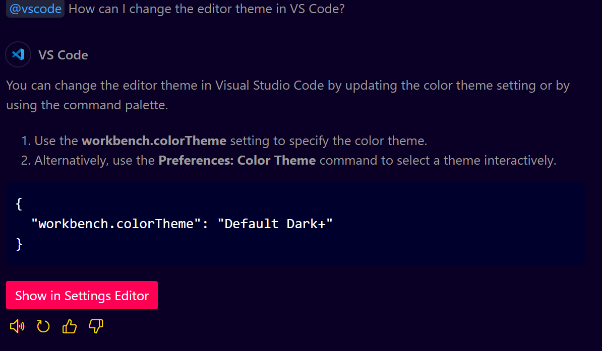
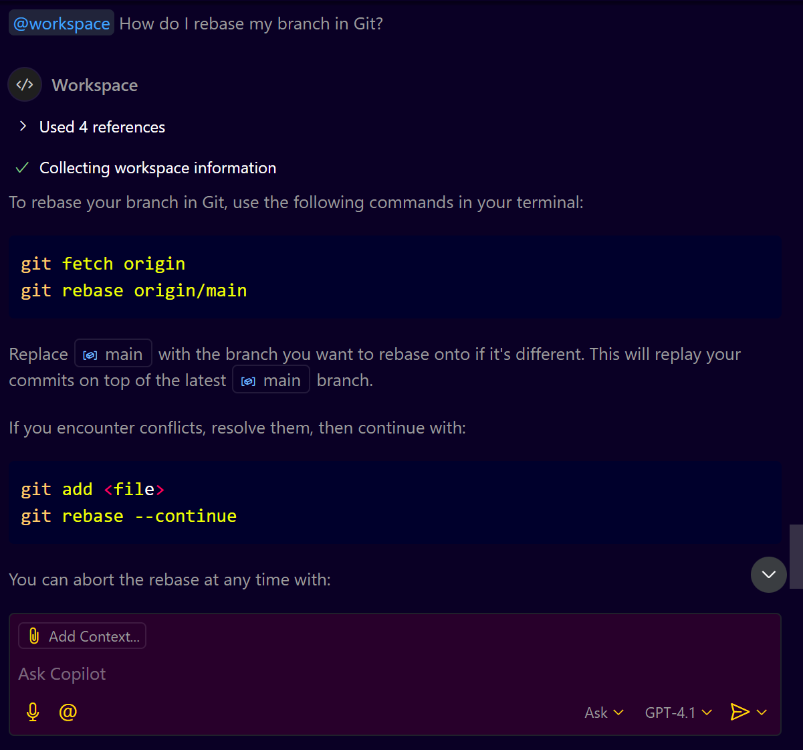

# **GitHub Copilot Agents in VS Code**

## **Prerequisites**

Before you start:

1. **VS Code installed**: [Download VS Code](https://code.visualstudio.com/)
2. **GitHub Copilot Chat Extension installed**:
   * Go to Extensions (Ctrl+Shift+X) → Search for “GitHub Copilot Chat” → Install it.
3. **Logged into GitHub** with Copilot subscription.

---

## **What Are Copilot Agents?**

GitHub Copilot Chat supports **3 built-in agents**, each with a different purpose:

| Agent        | Use Case                                  | Syntax to invoke           |
| ------------ | ----------------------------------------- | -------------------------- |
| `@workspace` | Ask questions about the project workspace | `@workspace your-question` |
| `@vscode`    | Ask about VS Code usage/settings          | `@vscode your-question`    |
| `@terminal`  | Get CLI commands for Git, AWS, etc.       | `@terminal your-question`  |

---

## **Workspace Agent (`@workspace`)**

Use this when you want help related to **project code**, like:

* Finding method usages
* Locating components or files
* Understanding how APIs are invoked
* Listing configurations like charts or environment files

---

### **Example 1: Where is a method used?**

**Prompt:**

```
@workspace Where is the method `getCopilotUsageData()` used in this project?
```

**Expected Copilot Response:**

* Shows all file names where the method is invoked.
* Clickable links to navigate directly to those files/lines.

---

### **Example 2: Which charts are created in the app?**

**Prompt:**

```
@workspace List all chart components used across the project and their files.
```

**Copilot Suggestion:**

* It lists components like `UserChart`, `EditorChart`, `LanguageChart`.
* Shows locations such as `OrgLevelComponent.ts`.

---

### **Example 3: What are the environment config files?**

**Prompt:**

```
@workspace Show me all environment files in this Angular project.
```

You can then open `environment.prod.ts`, `environment.ts`, etc., and modify configs as needed.

---

### **Example 4: Where are APIs invoked?**

**Prompt:**

```
@workspace Show me all API invocations in the service classes.
```

**Copilot Suggestion:**

* Lists classes/methods that make HTTP calls.
* Great for understanding service logic when adding new APIs.

---

## **VS Code Agent (`@vscode`)**

Use this agent for anything **VS Code UI or settings-related**, such as themes, keybindings, Copilot config, etc.

---

### **Example 1: How to change theme?**

**Prompt:**

```
@vscode How can I change the editor theme in VS Code?
```

**Copilot Suggestion:**

* Navigate to: `Command Palette → Preferences: Color Theme`
* Shows examples like `Dark+`, `Light+`, `Monokai`.

---

### **Example 2: Change GitHub Copilot settings**

**Prompt:**

```
@vscode How to configure GitHub Copilot in VS Code?
```

**Copilot Suggestion:**
* Opens `settings.json`
* Shows options like:

```json
"editor.inlineSuggest.enabled": true,
"github.copilot.enable": true
```

---

### **Example 3: Set file language mode**

**Prompt:**

```
@vscode How do I set the language mode for a file?
```

**Suggestion:**

* `Command Palette → Change Language Mode`

---

## **Terminal Agent (`@terminal`)**

Use this for **command-line tasks** like Git, AWS, Kubernetes, etc.

---

### **Example 1: Rebase Git branch**

**Prompt:**

```
@terminal How do I rebase my branch in Git?
```

**Copilot Suggestion:**

```bash
git checkout my-feature-branch
git rebase main
```

---

### **Example 2: Provision an AKS cluster in Azure**

**Prompt:**

```
@terminal How do I provision a single-node AKS cluster in Azure?
```

**Suggestion:**

```bash
az aks create --resource-group myResourceGroup --name myAKSCluster --node-count 1 --enable-addons monitoring --generate-ssh-keys
```

---

### **Example 3: Create an S3 bucket in AWS**

**Prompt:**

```
@terminal How to provision an S3 bucket using AWS CLI?
```

**Copilot Suggestion:**

```bash
aws s3 mb s3://my-new-bucket
```

---

### **Example 4: List files and check disk usage**

**Prompt:**

```
@terminal How do I list all files and show disk usage in the terminal?
```

**Copilot Suggestion:**

```bash
ls -lah
du -sh *
```

---

## **Summary Table**

| Agent        | Example Prompt                        | Purpose                   |
| ------------ | ------------------------------------- | ------------------------- |
| `@workspace` | `Where is getUserData used?`          | Analyze codebase/project  |
| `@vscode`    | `How to change color theme?`          | VS Code settings/features |
| `@terminal`  | `How to create S3 bucket in AWS CLI?` | Get shell/CLI commands    |
