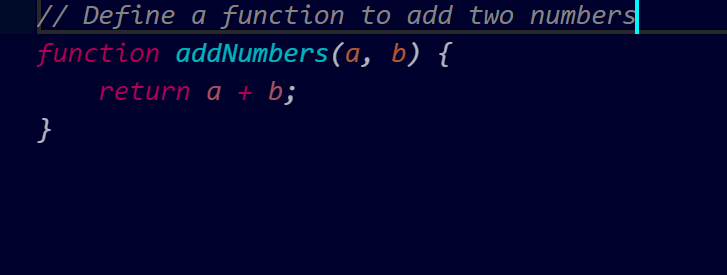

# **GitHub Copilot Content Exclusion**

**Feature Purpose:**
Prevent Copilot from using specific files or directories for **code suggestion context**, especially:

* Environment files (`.env`, secrets, tokens)
* Sensitive configurations (e.g., API keys)
* Intellectual property or private data

**Availability:**
✅ Available as **Public Beta**
🔒 Only for **GitHub Copilot for Business** accounts

---

## **Step-by-Step Guide**

### **Step 1: Navigate to Copilot Settings in Your GitHub Repository**

1. Go to your **GitHub repository**.
2. Click on **Settings** (top navigation).
3. Scroll to the **“Code & automation”** section.
4. Click **“Copilot”**.
5. Locate the **Content Exclusion** section.

---

### **Step 2: Define Content Exclusion Patterns**

You can define file exclusion patterns in the UI using glob-style patterns.

#### **Common Exclusion Examples:**

| Pattern            | Description                                 |
| ------------------ | ------------------------------------------- |
| `**/*.env`         | All `.env` files across the repo            |
| `releases/**`      | All files under the `releases/` folder      |
| `env/**.ts`        | Only `.ts` files under the `env/` directory |
| `pm-collection/**` | All files under `pm-collection` directory   |

---

### **Example Setup**

#### **Suppose your project looks like this:**

```
my-repo/
├── env/
│   ├── dev.env
│   ├── config.ts ← want to exclude
│   └── debug.js  ← don’t exclude
├── pm-collection/
│   ├── data.json
│   └── logic.js
```

**You want to:**

* Exclude all `.ts` files inside `env/`
* Exclude all files in `pm-collection/`

#### **Exclusion Configuration:**

```
env/*.ts
pm-collection/**
```

>💡 These patterns must be added in the **Copilot > Content Exclusion** section.

---

### **Step 3: Observe Copilot Suggestions in VS Code**

Once exclusions are configured:

✅ **Allowed File (`debug.js`)**

Prompt:

```javascript
// Define a function to add two numbers
```

**Copilot Suggestion:**


---

❌ Blocked File (`config.ts`)

Prompt:

```ts
// Create a service class to handle config
```

**Copilot Response:**
🚫 **No suggestion shown**
🟡 Copilot icon shows as **disabled**

---

### **Step 4: Confirm via Output Panel**

In **VS Code**, go to:

* **View → Output**
* Choose `GitHub Copilot` in the dropdown
* You’ll see messages like:

```
Copilot content exclusion: File is blocked by exclusion rules.
```

---

### **Step 5: Test Edge Cases**
Try adding a **new file** in the excluded folder to validate if it’s also blocked.

**Example:**

1. Create `pm-collection/test.txt`
2. Prompt inside:

```txt
// Explain how token-based auth works
```

🟡 Result: **Copilot icon is disabled** → New files in excluded paths are also affected.

---

### **Step 6: What Still Works (Limitations)**

* **Copilot Chat still works**:
  You can **ask Copilot questions** using chat, even inside excluded files.

  ❗️**Exclusion applies only to in-line code completions**, not to chat-based AI support.

---

## **Prompts and Copilot Behavior Summary**

| Prompt                                      | File                      | Copilot Behavior |
| ------------------------------------------- | ------------------------- | ---------------- |
| `// Create a React component for dashboard` | `env/debug.js`            | ✅ Suggests code  |
| `// Define a config service`                | `env/config.ts`           | ❌ No suggestion  |
| `// Validate email format`                  | `pm-collection/logic.js`  | ❌ No suggestion  |
| `// Create a JSON sample`                   | `pm-collection/data.json` | ❌ No suggestion  |

