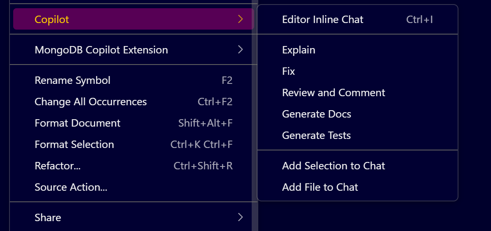

# **GitHub Copilot: Basics for VS Code Users**

## **Install GitHub Copilot in VS Code**

1. **Open VS Code**.
2. **Go to Extensions** panel (shortcut: `Ctrl+Shift+X`).
3. **Search for `GitHub Copilot`** in the extension marketplace.
4. **Click `Install`** on the official **GitHub Copilot** extension.
5. **Optionally**, install **GitHub Copilot Chat** (recommended for chat-based interactions).

> After installation, you’ll see a **Copilot icon** in the **bottom bar** of VS Code.

---

## **Step 2: Sign In with GitHub**

1. If prompted, **sign in with your GitHub account**.
2. Make sure the GitHub account you're using has **Copilot access/license**.
3. Go to **Settings** (click gear icon at bottom-left → `Accounts`) to confirm login info.

> If you use multiple GitHub accounts in VS Code, ensure the one with **Copilot access** is active.

---

## **Step 3: Configure Copilot Settings**

1. Go to **Settings** (`Ctrl+,`) → search `Copilot`.
2. You’ll find options under:

   * **Copilot**
   * **Copilot Chat**
   * **Copilot Labs** (if installed)

### **Key Settings:**

| **Setting**              | **Description**                                           |
| ------------------------ | --------------------------------------------------------- |
| Enable/disable languages | Enable or disable Copilot per file type.                  |
| Inline suggestions       | Turn auto-suggestions on/off.                             |
| Copilot Chat Welcome Msg | Show welcome message on every session or only once.       |
| Locale override          | Set language for responses (e.g., English, French, etc.). |

---

## **Example: Disable Copilot for Plain Text**

1. Open Settings → Extensions → GitHub Copilot → `Advanced: Language Support`.
2. Find **Plain Text** and toggle it off.
3. Open a `.txt` file and type – notice **Copilot is disabled** (icon is grey).
4. Toggle back ON → suggestions resume.

---

## **Step 4: Use Copilot in Code (Inline Suggestions)**

1. Open any code file (e.g., `.js`, `.py`, `.java`).
2. Start typing a function or comment.

### **Example Prompt:**

```js
// Function to validate a phone number
```

### **Copilot Suggestion:**

```js
function validatePhoneNumber(phone) {
  const regex = /^\d{10}$/;
  return regex.test(phone);
}
```

* Press `Tab` to accept.
* Press `Esc` to reject.
* Use `Ctrl+Enter` to open **multiple suggestions**.

---

## **Step 5: Copilot Chat (Interactive AI)**

**Open Copilot Chat:**

   * Use shortcut: `Ctrl+I`
   * Or click on **Copilot icon > Chat**

**Example Prompt:**

```text
Explain the difference between == and === in JavaScript
```

**Output:**

Copilot responds with explanation in **your configured language** (English/French, etc.).

---

## **Step 6: Generate Unit Tests with Copilot**


1. Right-click on a function.
2. Click `Copilot` → `Generate Tests`.
   
**Example:**

```js
function isEven(num) {
  return num % 2 === 0;
}
```

**Copilot Suggestion:**

```js
test('isEven returns true for even numbers', () => {
  expect(isEven(4)).toBe(true);
});

test('isEven returns false for odd numbers', () => {
  expect(isEven(5)).toBe(false);
});
```

---

## **Step 7: Fix Code with Copilot**

### **Steps:**

1. Right-click the code → `Copilot > Fix`.
2. Copilot analyzes and suggests fixes.

### **Example (Buggy Code):**

```js
function isPositive(num) {
  if (num > 0) return true;
  if (num < 0) return true; // ⚠️ Wrong
}
```

**Copilot Suggestion:**

```js
function isPositive(num) {
  if (num > 0) return true;
  if (num < 0) return false;
}
```

---

## **Step 8: Generate Documentation**

* Right-click function → `Copilot > Generate Docs`.

**Example:**

```js
function add(a, b) {
  return a + b;
}
```

**Copilot Suggestion:**

```js
/**
 * Adds two numbers.
 *
 * @param {number} a - First number
 * @param {number} b - Second number
 * @returns {number} Sum of a and b
 */
function add(a, b) {
  return a + b;
}
```

---

## **Step 9: Ask Questions Using Inline Chat**

1. Highlight code or place cursor.
2. Right-click → `Copilot > Explain`.
3. Copilot explains in context.

---

## **Step 10: Regenerate Suggestions**

When suggestions don’t fit:

* Press `Ctrl+Enter` → Opens Copilot panel.
* Click **Regenerate** to get alternative code completions.
* Useful for exploring better implementations or formats.

---

## **Summary of Useful Prompts**

| **Scenario**         | **Prompt or Action**                      |
| -------------------- | ----------------------------------------- |
| Generate a function  | `// Function to calculate factorial`      |
| Explain code         | Right-click → Copilot → Explain           |
| Fix errors           | Right-click → Copilot → Fix               |
| Add docs             | Right-click → Copilot → Generate Docs     |
| Write tests          | Right-click → Copilot → Generate Tests    |
| Language override    | Settings → Copilot Chat → Locale Override |
| Multiple suggestions | `Ctrl+Enter` in editor                    |

---

## **✅ Checklist for First-Time Setup**

* [x] **Install Copilot & Chat extension**
* [x] **Sign in with GitHub account**
* [x] **Configure file/language support**
* [x] **Enable inline suggestions**
* [x] **Explore Copilot Chat**
* [x] **Test prompt completions**
* [x] **Use context menu (Explain, Fix, Docs)**
* [x] **Try language override setting**

